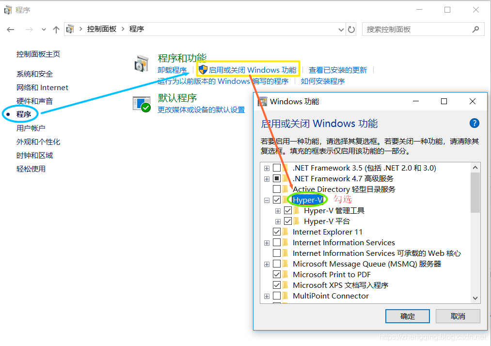
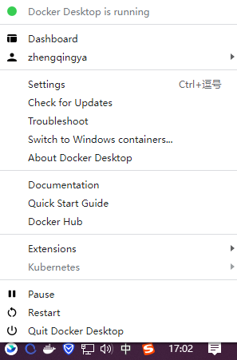

# Windows使用Docker安装开发环境系列

## 一、开启Hyper-V

> 基于win10专业版

依次进入 `控制面板` -> `程序` -> `启用或关闭Windows功能` -> 勾选上 `Hyper-V` -> 确定开启之后重启电脑


## 二、安装 Docker Desktop

下载`Docker Desktop Installer.exe` https://docs.docker.com/desktop/install/windows-install

双击安装

```shell
# 验证安装
docker --version
```



## 三、安装开发环境系列

环境准备

> 注：建议使用`Git Bash Here`执行以下命令

```shell
# 创建文件夹
mkdir -p E:/zhengqingya/soft/soft-dev/Docker
cd E:/zhengqingya/soft/soft-dev/Docker
```

见[各环境安装目录](./各环境)
