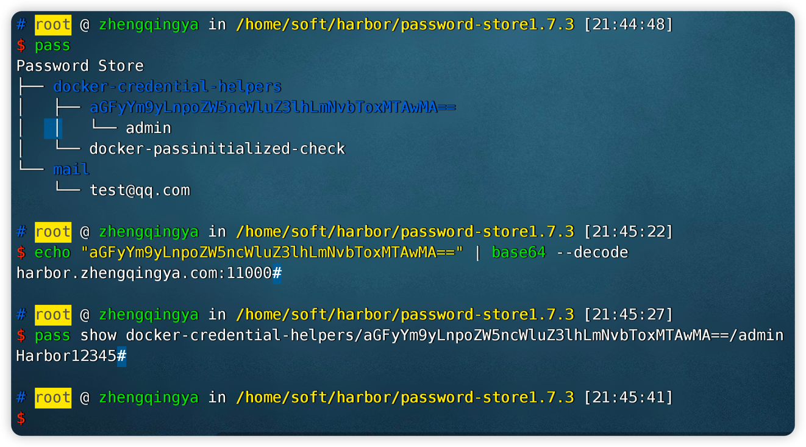

# 密码安全

> 解决Docker凭证安全风险

Docker提供`credentials store`，可以将用户凭证保存在外部凭证存储中。 

https://docs.docker.com/engine/reference/commandline/login/#credentials-store

目前支持如下几种：

- D-Bus Secret Service
- Apple macOS keychain
- Microsoft Windows Credential Manager
- pass

#### 使用pass保护仓库登录凭证

https://www.passwordstore.org

```shell
# 安装密码仓库
yum install -y gpg pass rng-tools
# pass无法直接yum安装，需要下载源码包进行安装
curl -o password-store1.7.3.tar.xz https://git.zx2c4.com/password-store/snapshot/password-store1.7.3.tar.xz
tar Jxf password-store1.7.3.tar.xz
cd password-store1.7.3 && make install

# 使用GPG生成KEY
rngd -r /dev/urandom
gpg --gen-key # 根据相关提示操作，并设置密码 ☆☆☆

# 查看
gpg --list-keys
# /root/.gnupg/pubring.gpg
# ------------------------
# pub   2048R/AFB41BCF 2023-02-14
# uid                  testzq (zq) <testzq@qq.com>
# sub   2048R/FF7F9164 2023-02-14
pass init "AFB41BCF"    # pub的id


# 验证测试
pass insert mail/test@qq.com
# 查看密码 -- 需要输入之前设置的密码 ☆☆☆
pass show mail/test@qq.com
```

```shell
# 安装docker辅助工具 docker-credential-pass
wget https://github.com/docker/docker-credential-helpers/releases/download/v0.6.3/docker-credential-pass-v0.6.3-amd64.tar.gz
tar xvzf docker-credential-pass-v0.6.3-amd64.tar.gz
chmod a+x docker-credential-pass
cp docker-credential-pass /usr/local/bin/
docker-credential-pass
# Usage: docker-credential-pass <store|get|erase|list|version> 
docker-credential-pass version
```

```shell
# 替换配置内容
cat> /root/.docker/config.json <<EOF
{
	"credsStore": "pass"
}
EOF
```

```shell
# 初始化docker的存储密码
pass insert docker-credential-helpers/docker-passinitialized-check

# 验证初始化结果
pass show docker-credential-helpers/docker-passinitialized-check
docker-credential-pass list


# 查看验证信息
docker login -u admin -p Harbor12345 harbor.zhengqingya.com:11000

# 查看配置
cat /root/.docker/config.json
# 可以看到密码信息没有保存在json文件中，那我们去验证一下密码仓库是否有保存
# 查看密码仓库存储信息
docker-credential-pass list
# {"harbor.zhengqingya.com:11000":"admin"}

pass
# Password Store
# /usr/bin/pass:行384: tree: 未找到命令
# 安装tree
yum install -y tree

pass
echo "xxx" | base64 --decode
# 查看私有仓库密码
pass show docker-credential-helpers/aGFyYm9yLnpoZW5ncWluZ3lhLmNvbToxMTAwMA==/admin
```


