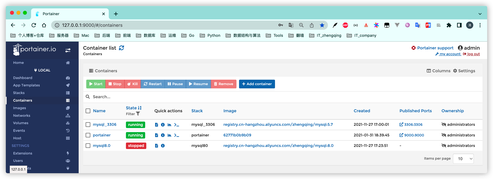

# Docker可视化管理工具 – Portainer

```shell
docker run -d -p 9000:9000 --restart=always --name portainer -v /var/run/docker.sock:/var/run/docker.sock registry.cn-hangzhou.aliyuncs.com/zhengqing/portainer:1.24.1
```


