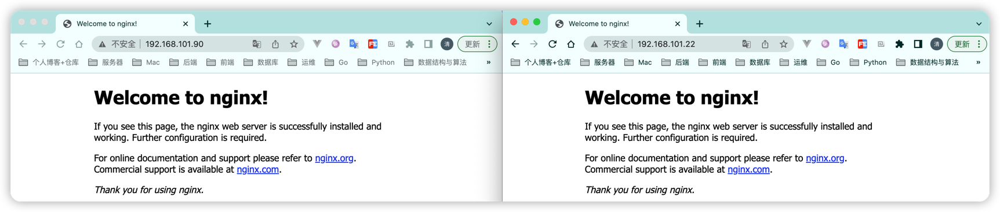
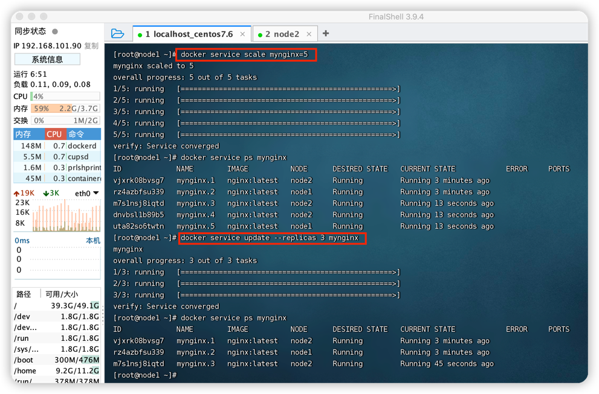

# Docker Swarm

- `Docker Compose`: 在单机上创建多个容器
- `Docker Swarm`: 在多服务器上创建容器集群服务 => 更有利于微服务的部署

### 环境准备

| 机器           | 说明       |
| -------------- | ---------- |
| 192.168.101.90 | node1 |
| 192.168.101.22 | node2  |

#### Docker安装

[02-Docker安装与卸载.md](02-Docker安装与卸载.md)

#### 配置docker远程连接2375端口

> Swarm是通过监听2375端口进行通信的

[10-Docker配置远程连接2375端口.md](10-Docker配置远程连接2375端口.md)

### Swarm集群部署

> 防火墙开启以下端口或者关闭防火墙：
> - TCP端口2377，用于集群管理通信；
> - TCP和UDP端口7946，用于节点之间通信；
> - UDP端口4789，用于覆盖网络。

#### 初始化Swarm

```shell
docker pull swarm
# `--advertise-addr`参数表示其它swarm中的worker节点使用此ip地址与manager联系。命令的输出包含了其它节点如何加入集群的命令。
docker swarm init --advertise-addr 192.168.101.90

# 查看管理节点的 token
docker swarm join-token manager
# 查看工作节点的 token
docker swarm join-token worker
```


#### 添加集群节点

```shell
docker swarm join --token SWMTKN-1-5xqun1zp8r8vs96ebvg0h9md8bgzca574aefa0yuonja974klt-4vojkqztakadjjv688anzr30e 192.168.101.90:2377
```

#### 查看集群节点

```shell
# AVAILABILITY列说明：
#                     Active -> 调度程序可以将任务分配给节点。
#                     Pause -> 调度程序不会将新任务分配给节点，但现有任务仍在运行。
#                     Drain -> 调度程序不会向节点分配新任务。调度程序关闭所有现有任务并在可用节点上调度它们。
# MANAGER STATUS列说明：
#                     没有值 -> 表示不参与群管理的工作节点。
#                     Leader -> 该节点是使得群的所有群管理和编排决策的主要管理器节点。
#                     Reachable -> 节点是管理者节点正在参与Raft共识。如果领导节点不可用，则该节点有资格被选为新领导者。
#                     Unavailable -> 节点是不能与其他管理器通信的管理器。如果管理器节点不可用，您应该将新的管理器节点加入群集，或者将工作器节点升级为管理器。
docker node ls
# 查看节点详情
docker node inspect 节点名称|节点ID
```


#### 删除节点

##### 删除Manager节点

```shell
# 删除节点之前需要先将该节点的 AVAILABILITY 改为 Drain。其目的是为了将该节点的服务迁移到其他可用节点上，确保服务正常。最好检查一下容器迁移情况，确保这一步已经处理完成再继续往下。
docker node update --availability drain 节点名称|节点ID

# 节点降级，由管理节点降级为工作节点
docker node demote 节点名称|节点ID

# 在已经降级为 Worker 的节点中运行以下命令，离开集群
docker swarm leave

# 删除节点（-f强制删除）
docker node rm 节点名称|节点ID
```

##### 删除Worker节点

```shell
# 删除节点之前需要先将该节点的 AVAILABILITY 改为 Drain。其目的是为了将该节点的服务迁移到其他可用节点上，确保服务正常。最好检查一下容器迁移情况，确保这一步已经处理完成再继续往下。
docker node update --availability drain 节点名称|节点ID

# 在准备删除的 Worker 节点中运行以下命令，离开集群。
docker swarm leave

# 删除节点（-f强制删除）
docker node rm 节点名称|节点ID
```

### Swarm实战

#### 创建服务

```shell
# --replicas：指定一个服务有几个实例运行
# --name：服务名称
docker service create --replicas 2 --name mynginx -p 80:80 nginx

# 查看所有服务
docker service ls

# 查看服务详情
docker service inspect mynginx

# 查看服务运行在哪些节点上
docker service ps mynginx

# 测试删除其中1个nginx容器后，会自动创建1个新的nginx来保证一直运行上面指定的2个实例
docker rm -f 容器ID/容器名
```


访问 `集群任意IP:80`



#### 弹性服务（动态扩缩容）

```shell
# 扩容到5个
docker service scale mynginx=5

# 查看服务运行在哪些节点上
docker service ps mynginx

# 缩容到3个
docker service update --replicas 3 mynginx

# 查看服务运行在哪些节点上
docker service ps mynginx
```



#### 删除服务

```shell
docker service rm mynginx

# 查看所有服务
docker service ls
```

#### 滚动更新&版本回滚

```shell
# 创建 5 个副本，每次更新 2 个，更新间隔 10s，20% 任务失败继续执行，超出 20% 执行回滚，每次回滚 2 个
#   --update-delay：定义滚动更新的时间间隔；
#   --update-parallelism：定义并行更新的副本数量，默认为 1；
#   --update-failure-action：定义容器启动失败之后所执行的动作；
#   --rollback-monitor：定义回滚的监控时间；
#   --rollback-parallelism：定义并行回滚的副本数量；
#   --rollback-max-failure-ratio：任务失败回滚比率，超过该比率执行回滚操作，0.2 表示 20%。
docker service create --replicas 5 --name redis \
    --update-delay 10s \
    --update-parallelism 2 \
    --update-failure-action continue \
    --rollback-monitor 20s \
    --rollback-parallelism 2 \
    --rollback-max-failure-ratio 0.2 \
    redis:5
    
# 查看服务运行情况
docker service ps redis
```


滚动更新

```shell
docker service update --image redis:6 redis

# 查看服务运行情况
docker service ps redis
```

回滚服务，只能回滚到上一次操作的状态，并不能连续回滚到指定操作

```shell
docker service update --rollback redis
```

---

### Swarm常用命令

```shell
# 初始化集群
docker swarm init 	
 
# 查看工作节点的 token
docker swarm join-token worker 	
 
# 查看管理节点的 token
docker swarm join-token manager
 
# 加入集群
docker swarm join 	

# 查看集群所有节点
docker node ls 
	
# 查看当前节点所有任务
docker node ps
 
# 删除节点（-f强制删除）
docker node rm 节点名称|节点ID
 
# 查看节点详情
docker node inspect 节点名称|节点ID
	
# 节点降级，由管理节点降级为工作节点
docker node demote 节点名称|节点ID
 
# 节点升级，由工作节点升级为管理节点
docker node promote 节点名称|节点ID
 
# 更新节点
docker node update 节点名称|节点ID

# 创建服务
docker service create
 
# 查看所有服务
docker service ls 	
 
# 查看服务详情
docker service inspect 服务名称|服务ID
 	
# 查看服务日志
docker service logs 服务名称|服务ID
 	
# 删除服务（-f强制删除）
docker service rm 服务名称|服务ID
 	
# 设置服务数量
docker service scale 服务名称|服务ID=n 	
 
# 更新服务
docker service update 服务名称|服务ID 	
```
