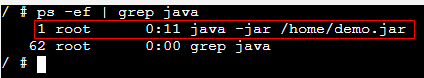
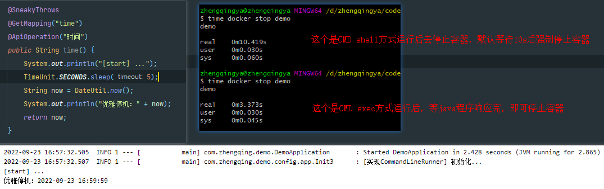
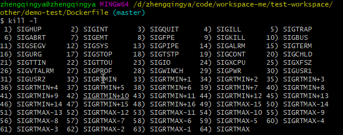

# 优雅停止容器

`docker stop`: 先请求容器进程停止，如果10秒后未停止，将会强制kill该进程。

> `docker stop`命令试图向容器内的根进程（PID1）发送`SIGTERM`信号来停止正在运行中的容器。如果根进程在超时时间（默认10s）内没有退出，便会发出SIGKILL信号

```shell
# 指定超时时间去停止容器
docker stop --time=30  容器名
```

### Dockerfile中配置优雅停止容器

```shell
# 以exec格式的CMD指令 -- 可实现优雅停止容器服务
CMD ["java", "-jar", "/home/demo.jar"]
```

查看pid为1


测试优雅停止容器耗时


### 处理信号

> 不同的应用处理方式不一致。



- `1) SIGHUP` 当终端断开（挂机）时，将发送该信号给终端控制进程。SIGHUP 信号还可用于守护进程（比如，init 等）。许多守护进程会在收到 SIGHUP 信号时重新进行初始化并重读配置文件。
- `2) SIGINT` 当用户键入终端中断字符（通常为 Control-C ） 时，终端驱动程序将发送该信号给前台进程组。该信号的默认行为是终止进程。
- `3) SIGQUIT` 当用户在键盘上键入退出字符（通常为 Control-\ ）时，该信号将发往前台进程组。默认情况下，该信号终止进程，并生成用于调试的核心转储文件。进程如果陷入无限循环，或者不再响应时，使用 SIGQUIT
  信号就很合适。
- `9) SIGKILL` 此信号为 “必杀（sure kill）” 信号，处理器程序无法将其阻塞、忽略或者捕获，故而 “一击必杀”，总能终止程序。
- `15) SIGTERM` 这是用来终止进程的标准信号，也是 kill 、 killall 、 pkill 命令所发送的默认信号。精心设计的应用程序应当为 SIGTERM
-     信号设置处理器程序，以便其能够预先清除临时文件和释放其它资源，从而全身而退。因此，总是应该先尝试使用 SIGTERM 信号来终止进程，而把 SIGKILL 作为最后手段，去对付那些不响应 SIGTERM 信号的失控进程。
- `20) SIGTSTP` 这是作业控制的停止信号，当用户在键盘上输入挂起字符（通常为 Control-Z ）时，将该信号给前台进程组，使其停止运行

```shell
# 向容器发送SIGINT信号（等于在终端执行Ctrl-C）至容器
# docker kill --signal=SIGINT 容器名

# 优雅关闭nginx服务 
docker kill --signal=SIGQUIT nginx

# 优雅关闭Apache服务
docker kill --signal=SIGWINCH apache
```
