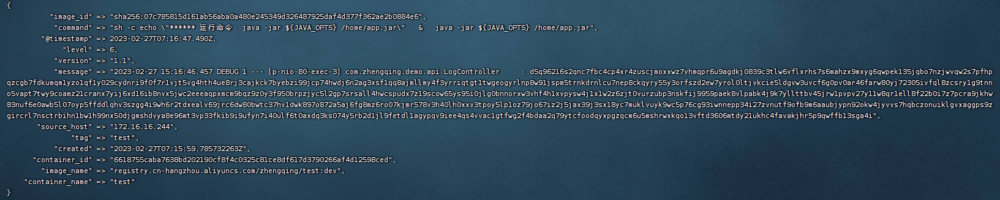
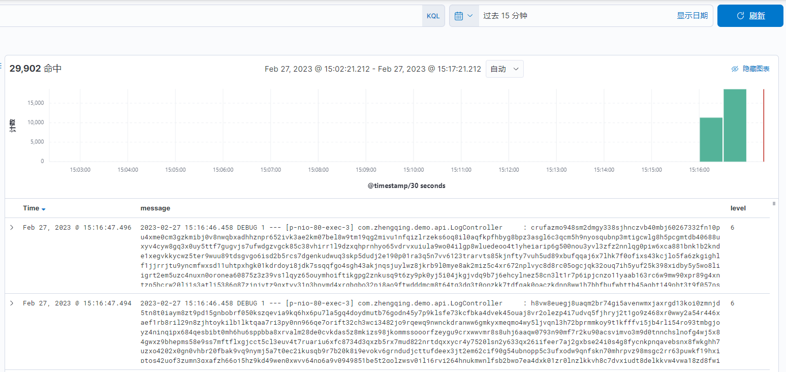

# Docker日志驱动

```shell
# 查看docker默认容器日志驱动
docker info|grep 'Logging Driver'
# Logging Driver: json-file
```

### 配置指定日志驱动

ex：推送日志到`logstash`

#### 1、logstash配置

##### `docker-compose.yml`

```
version: '3'

services:
  logstash:
    image: registry.cn-hangzhou.aliyuncs.com/zhengqing/logstash:7.14.1     # 原镜像`logstash:7.14.1`
    container_name: elk_logstash
    restart: unless-stopped
    environment:
      LS_JAVA_OPTS: "-Xmx512m -Xms512m"
    volumes:
      - "./elk/logstash/data:/usr/share/logstash/data"
      - "./elk/logstash/config/logstash.yml:/usr/share/logstash/config/logstash.yml"
      - "./elk/logstash/config/logstash.conf:/usr/share/logstash/config/logstash.conf"
#      - "./elk/logstash/config/small-tools:/usr/share/logstash/config/small-tools"
    command: logstash -f /usr/share/logstash/config/logstash.conf    # 指定logstash启动时使用的配置文件 - 指定单个文件
#    command: logstash -f /usr/share/logstash/config/small-tools       # 指定logstash启动时使用的配置文件 - 指定目录夹（系统会自动读取文件夹下所有配置文件，并在内存中整合）
    ports:
      - "12201:12201/udp"
```

##### `/elk/logstash/config/logstash.conf`

```
# 日志输入
input {
  gelf {
    use_udp => true
    port_tcp => 12202
  }
}


filter {
    mutate {
        # 导入之过滤字段
        remove_field => ["LOG_MAX_HISTORY_DAY", "LOG_HOME", "APP_NAME"]
        remove_field => ["@version", "_score", "port", "level_value", "tags", "_type", "host"]
    }
}

# 日志输出-控制台
output {
    stdout{
        codec => rubydebug
    }
}

# 日志输出-es
output {
   elasticsearch {
       action => "index"                       # 输出时创建映射
       hosts  => "http://elasticsearch:9200"   # ES地址和端口
       user => "elastic"                       # ES用户名
       password => "123456"                    # ES密码
       index  => "demo-%{+YYYY.MM.dd}"         # 指定索引名-按天
       codec  => "json"
   }
}
```

#### 2、docker容器配置

##### 方式一：docker

```shell
docker run -d --name test -p 666:80 --log-driver gelf --log-opt gelf-address=udp://127.0.0.1:12201 --log-opt tag=test registry.cn-hangzhou.aliyuncs.com/zhengqing/test:dev
# 发起请求
curl 127.0.0.1:666/api/log
```

##### 方式二：docker-compose.yml

```shell
version: '3'

services:
  test:
    image: registry.cn-hangzhou.aliyuncs.com/zhengqing/test:dev
    container_name: test
    ports:
      - "666:80"
    # 日志
    logging:
      driver: gelf # 配置日志驱动
      options:
        gelf-address: udp://127.0.0.1:12201
        tag: test
```

查看日志


