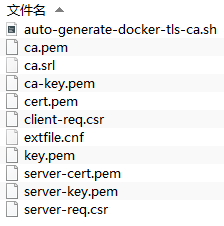
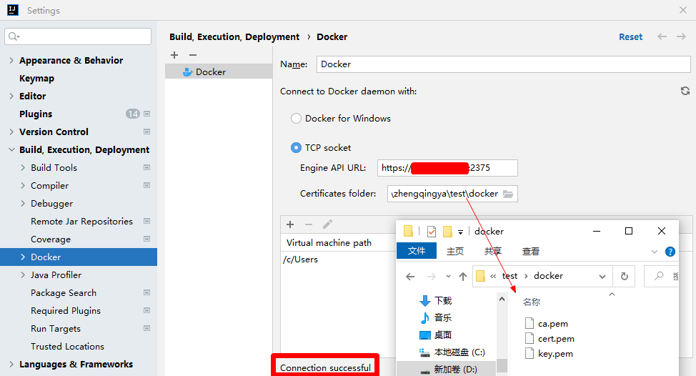

# Docker开启TLS和CA认证

> https://docs.docker.com/engine/security/protect-access/#create-a-ca-server-and-client-keys-with-openssl

### 一、生成证书

```shell
# 生成证书
mkdir -p /home/soft/docker/ca
cd /home/soft/docker/ca

cat> /home/soft/docker/ca/auto-generate-docker-tls-ca.sh <<EOF
# !/bin/bash
# 一键生成TLS和CA证书
SERVER="192.168.101.90" # 服务器外网IP或域名 TODO
PASSWORD="\${SERVER}123456" # 密码
COUNTRY="CN" # 国家
STATE="四川省" # 省份
CITY="成都市" # 城市
ORGANIZATION="科技公司" # 机构名称
ORGANIZATIONAL_UNIT="好好学习" # 机构单位
EMAIL="zhengqingya@it.com" # 邮箱

# 生成CA密钥
openssl genrsa -aes256 -passout pass:\$PASSWORD  -out ca-key.pem 2048
# 生成CA证书
openssl req -new -x509 -passin "pass:\$PASSWORD" -days 3650 -key ca-key.pem -sha256 -out ca.pem -subj "/C=\$COUNTRY/ST=\$STATE/L=\$CITY/O=\$ORGANIZATION/OU=\$ORGANIZATIONAL_UNIT/CN=\$SERVER/emailAddress=\$EMAIL"

# 生成服务端密钥
openssl genrsa -out server-key.pem 2048
# 生成服务端证书签名的请求文件
openssl req -subj "/CN=\$SERVER" -new -key server-key.pem -out server-req.csr
# 生成服务端证书
openssl x509 -req -days 3650 -in server-req.csr -CA ca.pem -CAkey ca-key.pem -passin "pass:\$PASSWORD" -CAcreateserial -out server-cert.pem
# 生成客户端密钥
openssl genrsa -out key.pem 2048
# 生成客户端证书签名的请求文件
openssl req -subj '/CN=client' -new -key key.pem -out client-req.csr
# 生成客户端证书
sh -c 'echo "extendedKeyUsage=clientAuth" >> extfile.cnf'
openssl x509 -req -days 3650 -in client-req.csr -CA ca.pem -CAkey ca-key.pem  -passin "pass:\$PASSWORD" -CAcreateserial -out cert.pem -extfile extfile.cnf
# 更改密钥权限 -- 为保护您的密钥免受意外损坏，请删除其写入权限。
chmod 0400 ca-key.pem server-key.pem key.pem
# 更改证书权限
chmod 0444 ca.pem server-cert.pem cert.pem
# 删除无用文件
# rm ca-cert.srl client-req.csr server-req.csr extfile.cnf
EOF

sh auto-generate-docker-tls-ca.sh
```



### 二、开启远程访问与配置认证

```shell
vim /lib/systemd/system/docker.service
# 在 `ExecStart=/usr/bin/dockerd` 这行最后追加
--tlsverify --tlscacert=/home/soft/docker/ca/ca.pem --tlscert=/home/soft/docker/ca/server-cert.pem --tlskey=/home/soft/docker/ca/server-key.pem -H tcp://0.0.0.0:2375 -H unix:///var/run/docker.sock 

# 显示防火墙状态
firewall-cmd --state

# 如果防火墙开启的话，需要开放2375端口
firewall-cmd --zone=public --add-port=2375/tcp --permanent
firewall-cmd --reload

# 重载服务并重启docker
systemctl daemon-reload && systemctl restart docker


# 测试 -- 加上密钥和证书并且使用上面生成证书时配置的SERVER值才能访问
curl https://192.168.101.90:2375/info --cert ./cert.pem --key ./key.pem --cacert ./ca.pem
```

### 三、本地测试

```shell
# 将以下三个文件拷贝到本地，作为公钥使用
tar -cvf docker-ca.tar ca.pem cert.pem key.pem

# 测试 -- tips: windows上用 git bash 打开测试
curl https://192.168.101.90:2375/version --cert ./cert.pem --key ./key.pem --cacert ./ca.pem
```

### 四、IDEA配置


