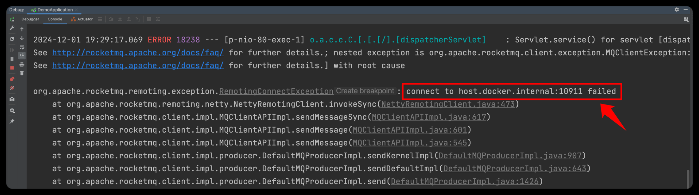
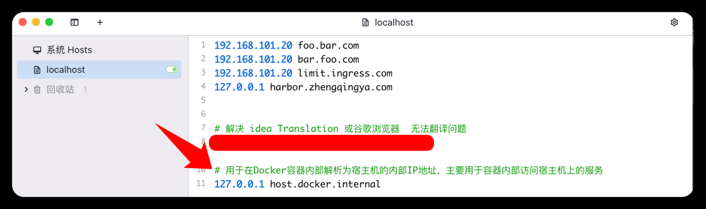

# docker-compose自动识别主机IP

如果您在 Windows 或 Mac 上运行 Docker，可以使用特殊的 DNS 名称来访问主机，即 `host.docker.internal`。

eg: 

```yml
version: '3'

services:
  kafka:
    image: registry.cn-hangzhou.aliyuncs.com/zhengqing/kafka:3.4.1
    container_name: kafka
    environment:
      ALLOW_PLAINTEXT_LISTENER: yes
      KAFKA_CFG_ZOOKEEPER_CONNECT: zookepper:2181                        
      KAFKA_CFG_ADVERTISED_LISTENERS: PLAINTEXT://host.docker.internal:9092
    ports: 
      - "9092:9092"
```

---

在java程序中如果报错：`connect to host.docker.internal:10911 failed`



可以在hosts文件中配置



```shell
# 用于在Docker容器内部解析为宿主机的内部IP地址，主要用于容器内部访问宿主机上的服务
127.0.0.1 host.docker.internal
```