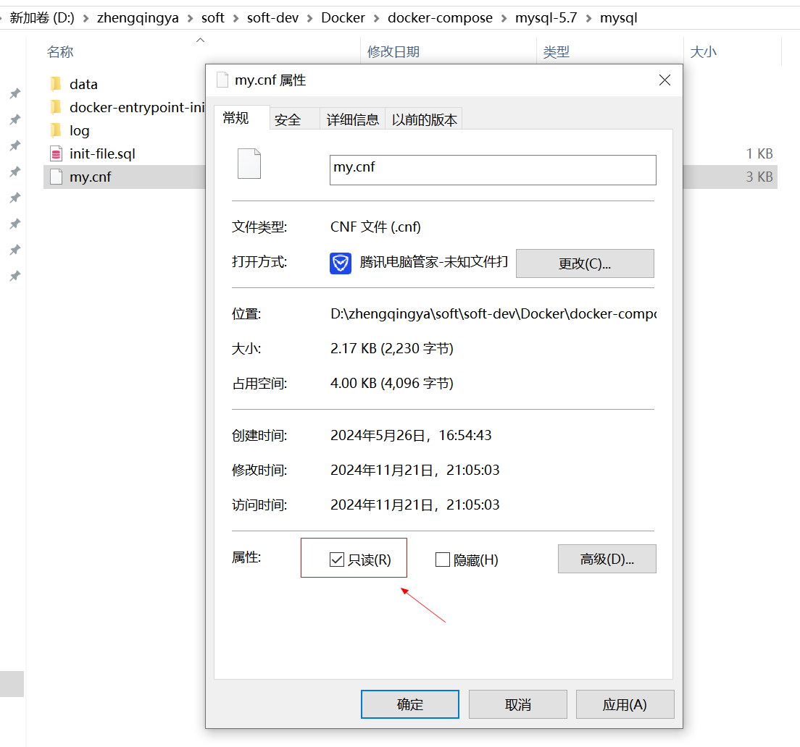

# my.cnf在windows环境下的权限问题

换了新的电脑，发现`my.cnf`配置文件中设置`sql_mode`一直无法生效，观察mysql服务启动日志，提示如下：

`mysqld: [Warning] World-writable config file '/etc/mysql/my.cnf' is ignored.`

说明`my.cnf`配置文件被忽略了...

原因：MySQL 在启动时检测到配置文件 `/etc/mysql/my.cnf` 的权限设置不安全，即该文件对所有用户都是可写的。
为了安全起见，MySQL 忽略了这个配置文件。

解决：`my.cnf`设置`只读`，然后重启mysql容器 与 本地java服务。

