# Confluence

https://www.atlassian.com/zh/software/confluence

企业知识管理与协同软件，也可以用于构建企业wiki。

```shell
# 运行
docker-compose -f docker-compose.yml -p confluence up -d

# 若运行之后，启动日志报相关权限问题，给新产生的文件赋予权限
chmod -R 777 ./app/confluence/data
chmod -R 777 ./app/postgresql/data
```

访问地址：[`http://ip地址:8090`](http://127.0.0.1:8090)

---

### 配置

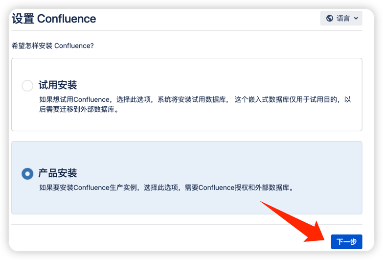
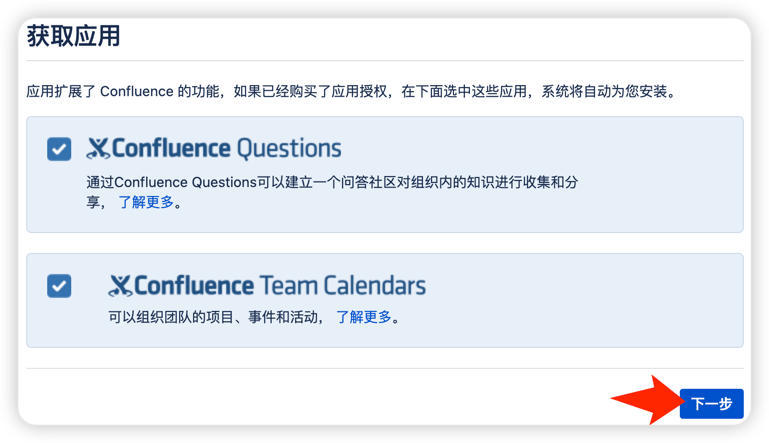

下一步填写授权码
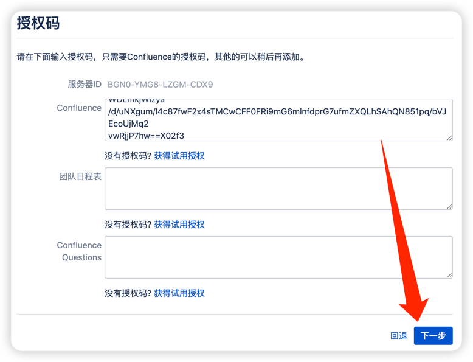

```
AAABKw0ODAoPeJxtUG1LwzAQ/p5fEfBzxtogyiBgl0aYa9phW3Ufs3rTQJaOJC3u35u9MRC/3d1zz
8vdnewtlsrhhOJ0OkvpLHnEvG5ik1KUg++c3gfdW8Z7uzUD2A5QOew24Kpt68F5RhLEHajjUq4Cs
COTTClJKIqcoLpQqh2w7sY/lpM41yOw4Aa47gmptGHajtrrjYEn34GFiTVIjMoMJwe2VcZfFAodc
Q/NYQ8nB15JKV75IitQFLIBrIpu4mev3eGcjNIHkqQkvT8LXO/gZvABXNl/gmdTVIuSrasWy2wps
BQ4w3WW41VW5tkEVe5LWe3PYXT5pms9LwRuRCZRDW4Et8jZPG1r0n7IJeFSvpPnl3WDLmkjWizya
/d/uNXgum/l4c87fwF2x4sTMCwCFF0FRi9mG6mlnfdprG7ufmZXQLhSAhQN851pq/bVJEcoUjMq2
vwRjjP7hw==X02f3
```

### 授权码问题

> tips: 仅用于学习！
> 记录下授权码处理步骤，也可以直接使用上面处理好提供的授权码，这里的操作就可以忽略了。

```shell
# 拷贝出atlassian的jar包
docker cp confluence:/opt/atlassian/confluence/confluence/WEB-INF/lib/atlassian-extras-decoder-v2-3.4.1.jar  ./app/confluence/atlassian-extras-2.4.jar
```

解压`./激活/confluence-Keygen-for-2.4.rar`
运行`sh keygen.sh`

点击`.patch!`选择上面拷贝出来的jar -> `.gen!`生成授权码
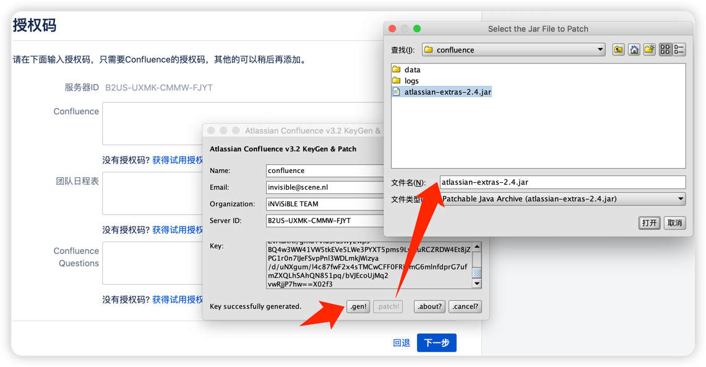

再将jar包拷贝回容器后重启服务，然后填入`Confluence`授权码 下一步
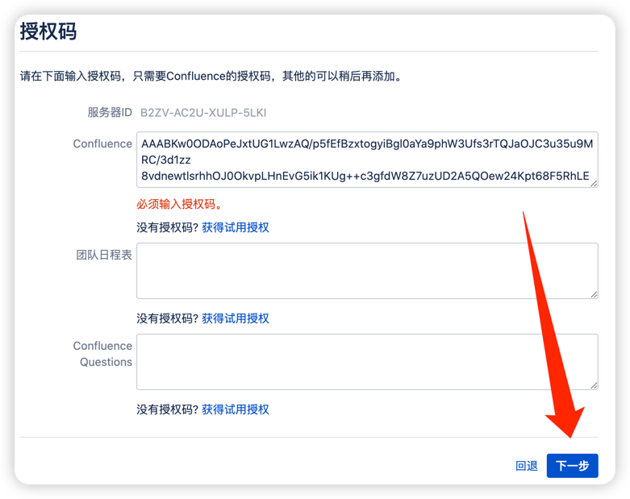

### 配置数据库

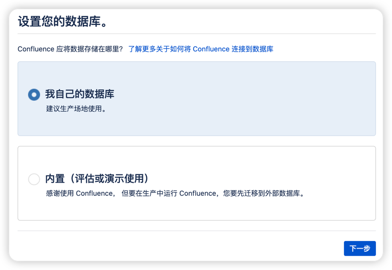

#### eg: PostgreSQL

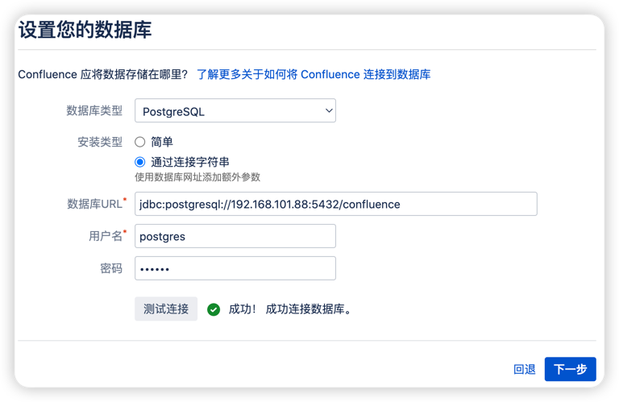

#### eg: MySQL

> 1. 创建`confluence`数据库  eg: 建库sql `create database confluence default character set utf8mb4 collate utf8mb4_bin;`
> 2. 数据库URL连接地址 eg: `jdbc:mysql://192.168.101.88/confluence?sessionVariables=tx_isolation='READ-COMMITTED'&useUnicode=true&characterEncoding=UTF-8&useSSL=false`

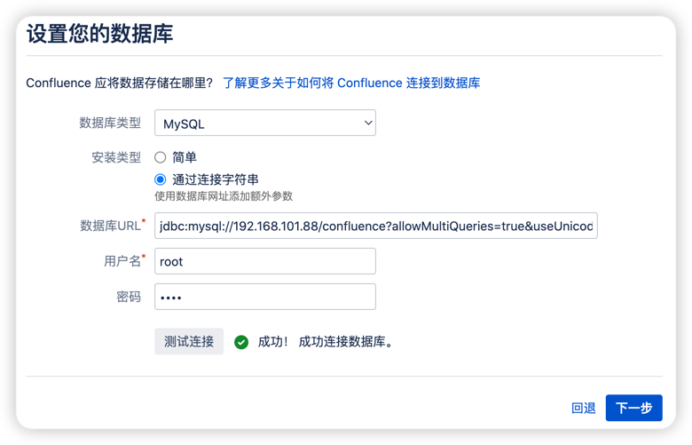

### 其它配置

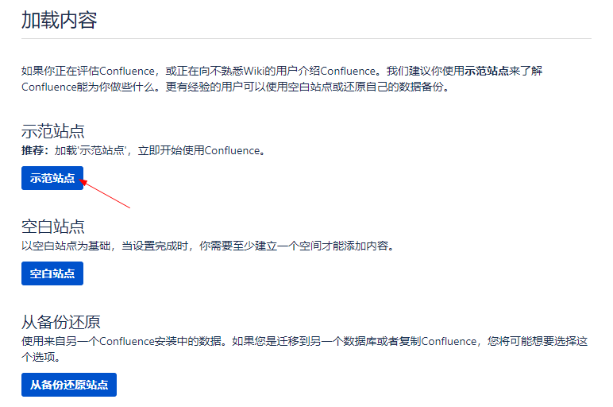
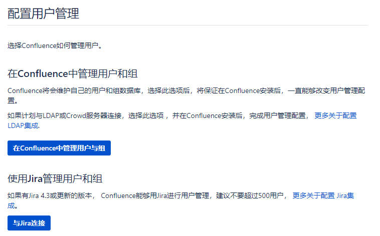
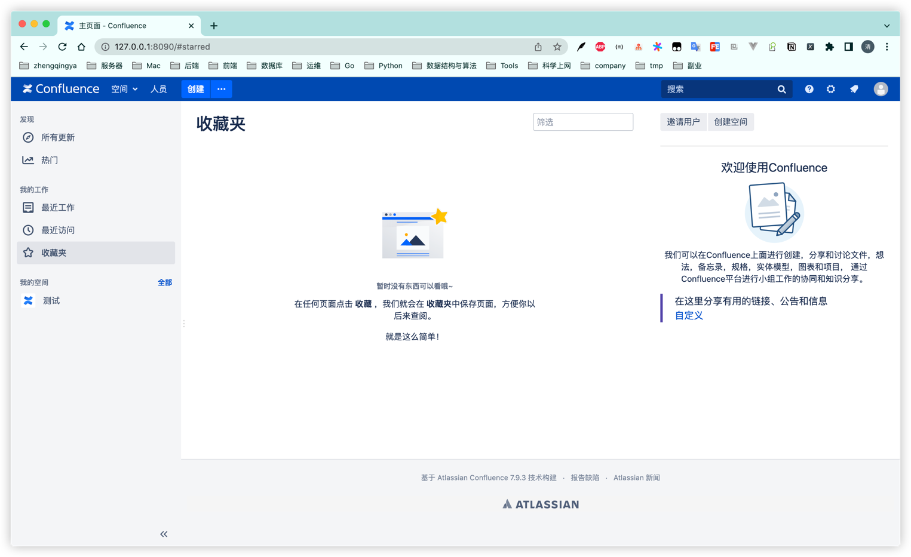
