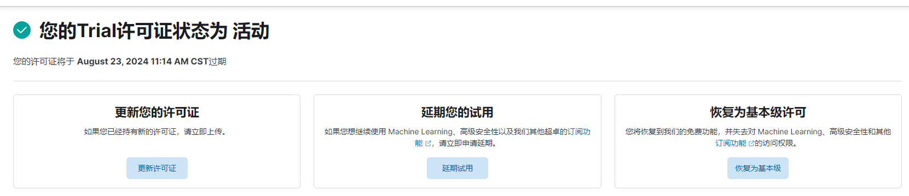
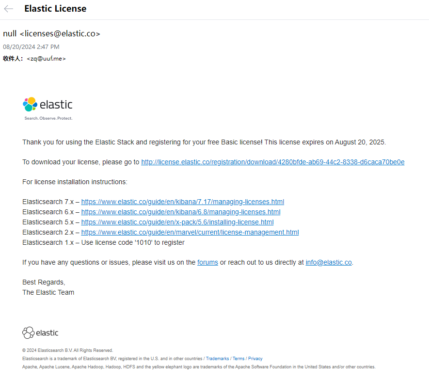
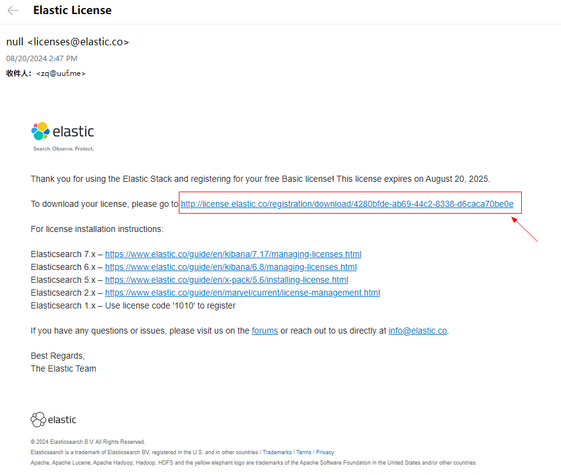
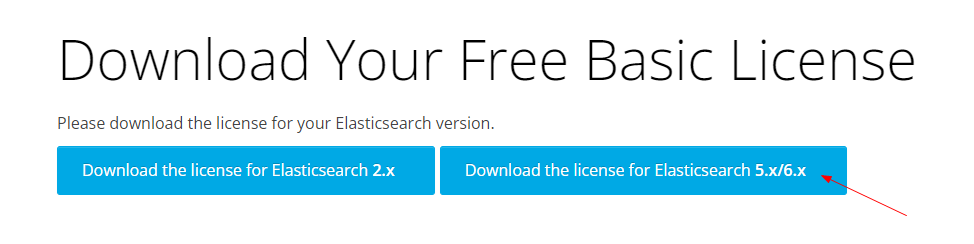
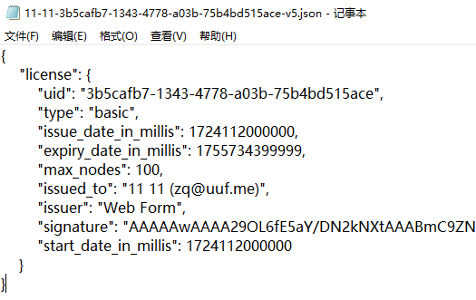
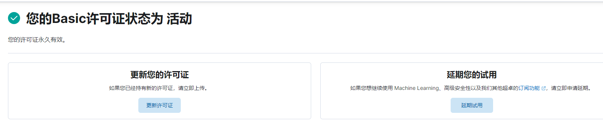

# 许可证

kibana控制台执行dsl时如下提示：

```
#! Your license will expire in [2] days. Contact your administrator or update your license for continued use of features
```

检查：

```
# 查看集群状态
GET /_cluster/health?pretty

# 查看许可证过期时间
GET /_license
```

kibana 查看证书有效期 http://127.0.0.1:5601/app/management/stack/license_management


### 解決

> https://www.elastic.co/guide/en/elasticsearch/reference/7.17/update-license.html

到 https://register.elastic.co/registration 注册一个新的license



下载license




执行dsl

```
POST /_license/start_basic?acknowledge=true
{
    "license": {
        "uid": "3b5cafb7-1343-4778-a03b-75b4bd515ace",
        "type": "basic",
        "issue_date_in_millis": 1724112000000,
        "expiry_date_in_millis": 1755734399999,
        "max_nodes": 100,
        "issued_to": "11 11 (zq@uuf.me)",
        "issuer": "Web Form",
        "signature": "AAAAAwAAAA29OL6fE5aY/DN2kNXtAAABmC9ZN0hjZDBGYnVyRXpCOW5Bb3FjZDAxOWpSbTVoMVZwUzRxVk1PSmkxaktJRVl5MUYvUWh3bHZVUTllbXNPbzBUemtnbWpBbmlWRmRZb25KNFlBR2x0TXc2K2p1Y1VtMG1UQU9TRGZVSGRwaEJGUjE3bXd3LzRqZ05iLzRteWFNekdxRGpIYlFwYkJiNUs0U1hTVlJKNVlXekMrSlVUdFIvV0FNeWdOYnlESDc3MWhlY3hSQmdKSjJ2ZTcvYlBFOHhPQlV3ZHdDQ0tHcG5uOElCaDJ4K1hob29xSG85N0kvTWV3THhlQk9NL01VMFRjNDZpZEVXeUtUMXIyMlIveFpJUkk2WUdveEZaME9XWitGUi9WNTZVQW1FMG1DenhZU0ZmeXlZakVEMjZFT2NvOWxpZGlqVmlHNC8rWVVUYzMwRGVySHpIdURzKzFiRDl4TmM1TUp2VTBOUlJZUlAyV0ZVL2kvVk10L0NsbXNFYVZwT3NSU082dFNNa2prQ0ZsclZ4NTltbU1CVE5lR09Bck93V2J1Y3c9PQAAAQCCLUDFogDTzeJvBCWksE0+ml6lDr7QDhBPsjGwJyBukJvHxYf6f6Axr486c2sTD5IFQ2V5UHB5lG+M8tR/2epRL6T4YujTvvDf5BmW99E4fH0bzLQLaYjvSv+LHQQV69BHF3e/yXYJ6VviBo6vJTrwoKRnLf68X2nwQMb8pFHESYacBbeFebtvRPGuw0yPScJPcYZeUF+HsQU3kCCeTYXXTyzFEAXlsmxeLBKIhu1lmbtLML+6Zg/9V7OJbdkJEQQcITHc+mN7N1Wqbu6kVon9WidamDRXQbv7hDDDK/zSC0sAVzmYYU6BhyM6nUz299L32q2aVLz1Jk1Qf8lzzorM",
        "start_date_in_millis": 1724112000000
    }
}

# 查看许可证过期时间
GET /_license
```

kibana 查看证书有效期 http://127.0.0.1:5601/app/management/stack/license_management
最终


---

其它：

> tips：下面是网上找到的方案，解决证书仅一年有效期问题，暂时不用管，通过上面的方式许可证即可永久有效。

```
# 签发证书
PUT /_xpack/license?acknowledge=true
@license.json

# 将证书期限修改为50年，修改 License.json 文件中的以下字段：
# 1、将 "type":"basic" 替换为 "type":"platinum" （基础版变更为铂金版）
# 2、将 "expiry_date_in_millis":1755734399999 替换为 "expiry_date_in_millis":4102416000000（1年 延续到 2100-01-01 00:00:00）
```
