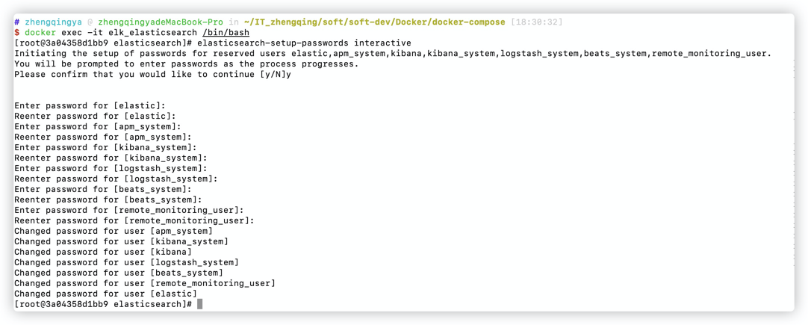

### ELK

`Elasticsearch` + `Logstash` + `Kibana` 搭建日志监控系统

1. `Logstash` 日志收集+解析+转换
2. `Elasticsearch` 日志搜索
3. `Kibana` 日志展示

```shell
# 运行
docker-compose -f docker-compose-elk.yml -p elk up -d
# 若运行之后启动日志报相关权限问题，给新产生的文件赋予权限
chmod -R 777 ./elk
```

1. ES访问地址：[`ip地址:9200`](http://www.zhengqingya.com:9200)
   默认账号密码：`elastic/123456`
2. kibana访问地址：[`ip地址:5601`](http://www.zhengqingya.com:5601)
   默认账号密码：`elastic/123456`

#### 设置ES密码

```shell
# 进入容器
docker exec -it elasticsearch /bin/bash
# 设置密码-随机生成密码
# elasticsearch-setup-passwords auto
# 设置密码-手动设置密码
elasticsearch-setup-passwords interactive
```


