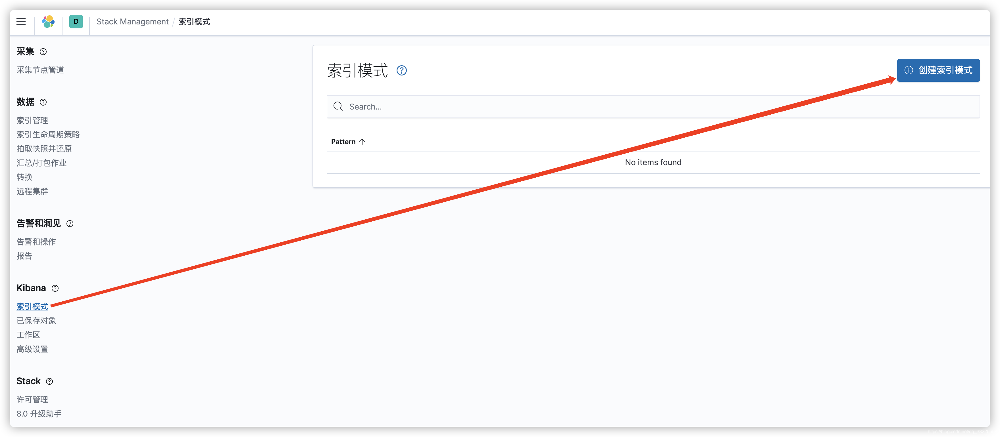
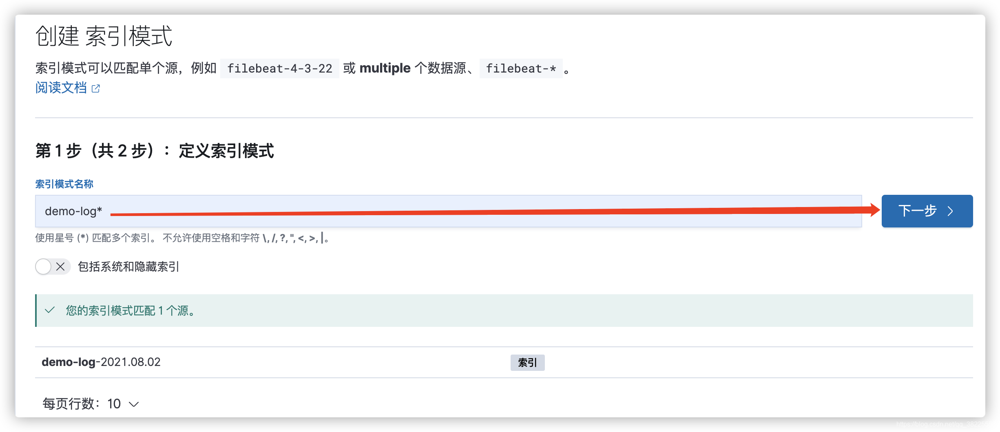
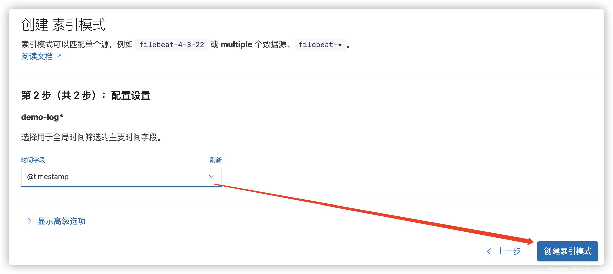
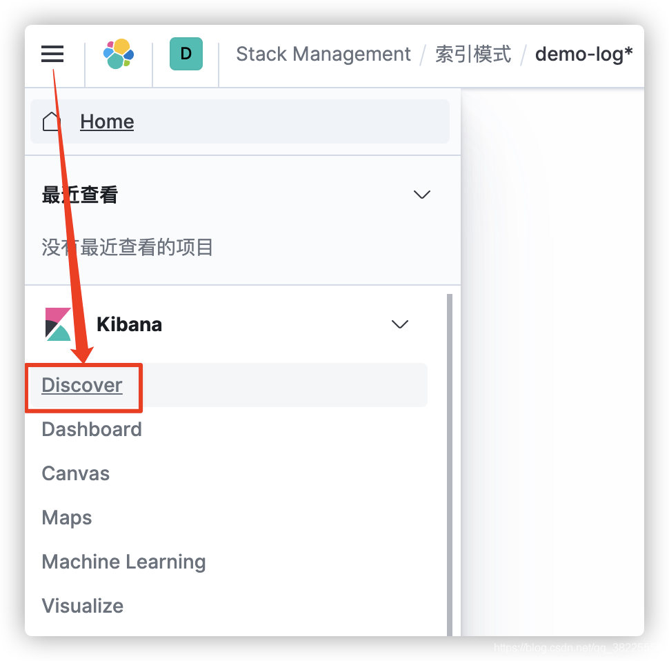
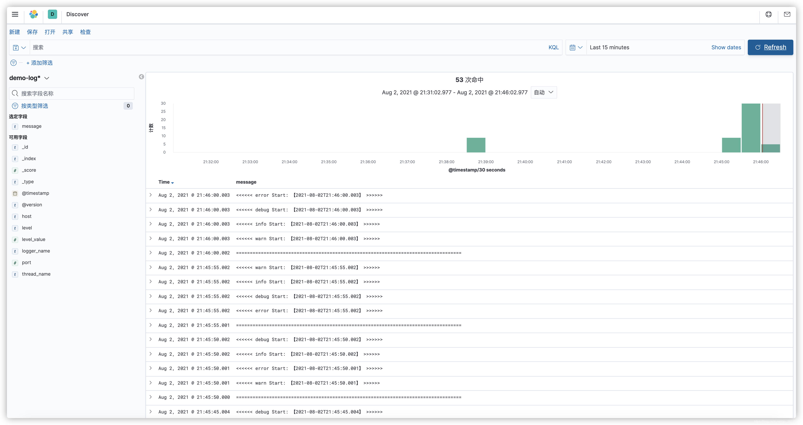
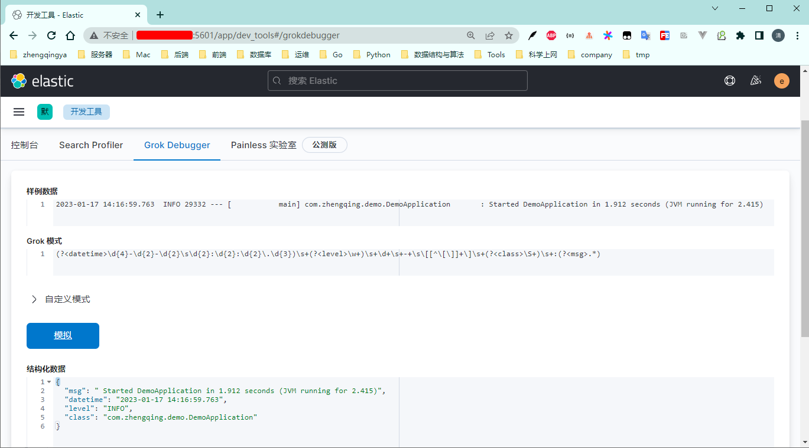

# ELKF

`Elasticsearch` + `Logstash` + `Kibana` + `Filebeat` 搭建日志监控系统

1. `Filebeat` 采集日志
2. `Logstash` 日志过滤
3. `Elasticsearch` 日志搜索
4. `Kibana` 日志展示

```shell
# 运行
docker-compose -f docker-compose.yml -p elkf up -d
# 当前目录下所有文件赋予权限(读、写、执行)  -- 解决es启动报错问题...
chmod -R 777 ./app/elasticsearch
# 解决logstash启动报错问题...
chmod -R 777 ./app/logstash
```

1. ES访问地址：[`ip地址:9200`](http://127.0.0.1:9200)
   默认账号密码：`elastic/123456`
2. kibana访问地址：[`ip地址:5601`](http://127.0.0.1:5601)
   默认账号密码：`elastic/123456`

---

### Kibana配置日志查看

> tips: 在`./app/filebeat/my-log/demo.log`中添加日志数据

#### 1、创建索引模式

http://127.0.0.1:5601/app/management/kibana/indexPatterns






#### 2、查看日志

> [http://127.0.0.1:5601/app/discover](http://127.0.0.1:5601/app/discover)




---

### 遇到的问题

filebeat收集日志到logstash时乱码问题；
如果直接在springboot中推日志到logstash中则正常。

解决： 将 logstash 的输入配置从

```
input {
    tcp {
        mode => "server"
        host => "0.0.0.0"   # 允许任意主机发送日志
        type => "demo"      # 设定type以区分每个输入源
        port => 5044
        codec => json_lines # 数据格式
    }
}
```

修改为

```
input {
    beats {
        port => 5044
    }
}
```

### logstash - Grok过滤器配置

ex: java日志如下

```
2023-01-17 14:16:59.763  INFO 29332 --- [           main] com.zhengqing.demo.DemoApplication       : Started DemoApplication in 1.912 seconds (JVM running for 2.415)
```

Grok 模式

```
(?<datetime>\d{4}-\d{2}-\d{2}\s\d{2}:\d{2}:\d{2}\.\d{3})\s+(?<level>\w+)\s+\d+\s+-+\s\[[^\[\]]+\]\s+(?<class>\S+)\s+:(?<msg>.*)
```

处理后，数据格式如下

```
{
  "msg": " Started DemoApplication in 1.912 seconds (JVM running for 2.415)",
  "datetime": "2023-01-17 14:16:59.763",
  "level": "INFO",
  "class": "com.zhengqing.demo.DemoApplication"
}
```

可以到 http://127.0.0.1:5601/app/dev_tools#/grokdebugger 中测试
