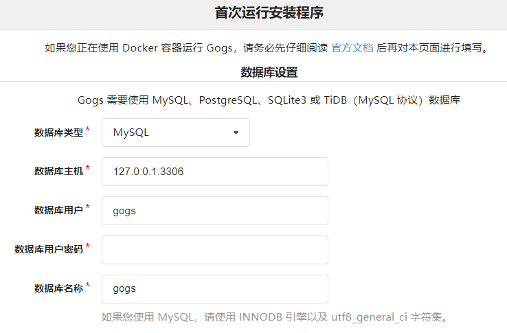

# Gogs

- https://github.com/gogs/gogs
- https://gogs.io

一款极易搭建的自助 Git 服务。
Gogs 的目标是打造一个最简单、最快速和最轻松的方式搭建自助 Git 服务。
使用 Go 语言开发使得 Gogs 能够通过独立的二进制分发，并且支持 Go 语言支持的 所有平台，包括 Linux、Mac OS X、Windows 以及 ARM 平台。

### 部署

```shell
docker-compose -f docker-compose.yml -p gogs up -d
```

访问地址：[`http://ip地址:10880`](http://127.0.0.1:10880)

自动配置



