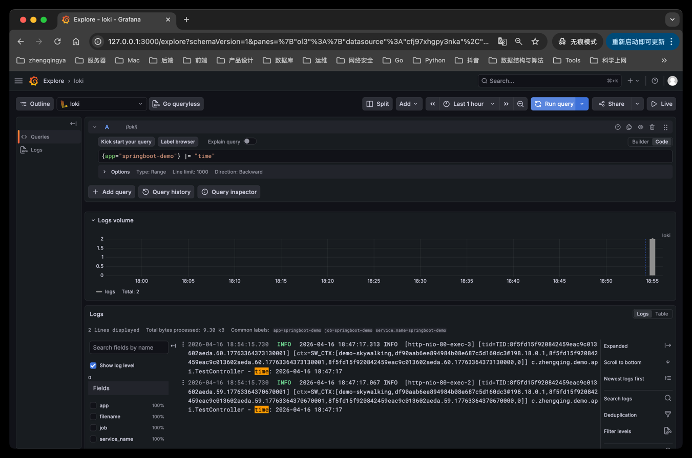

### Grafana Loki - 一个水平可扩展，高可用性，多租户的日志聚合系统

`Loki + Promtail + Grafana`

```shell
# 先授权，否则会报错：`cannot create directory '/var/lib/grafana/plugins': Permission denied`
chmod 777 $PWD/grafana_promtail_loki/grafana/data
chmod 777 $PWD/grafana_promtail_loki/grafana/log

# 启动
docker compose up -d

# 停止并删除容器、网络
docker compose down
```

访问地址：

- Grafana：[`http://127.0.0.1:3000`](http://127.0.0.1:3000)
- Loki API：[`http://127.0.0.1:3100/ready`](http://127.0.0.1:3100/ready)

Grafana 默认账号密码：`admin/admin`

---

### 在 Grafana 中查看 Loki 日志

#### 1、添加 Loki 数据源

登录 Grafana 后：

1. 进入 `Connections` -> `Data sources`
2. 点击 `Add data source`
3. 选择 `Loki`
4. `URL` 填写：`http://loki:3100`
5. 点击 `Save & test`

#### 2、查询日志

进入 `Explore`，选择 Loki 数据源，执行查询：

```logql
{app="springboot-demo"}
```

如果想进一步过滤关键字，可以使用：

```logql
{app="springboot-demo"} |= "time"
```



