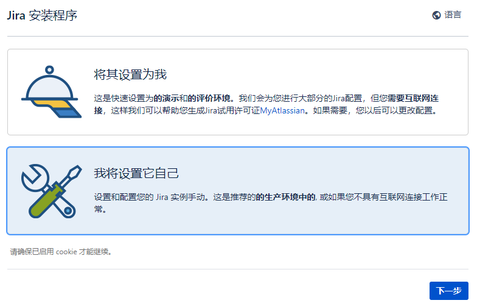
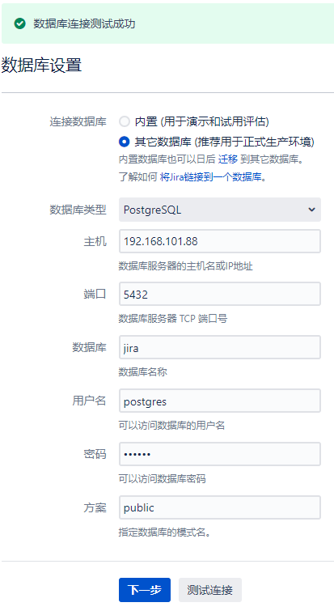
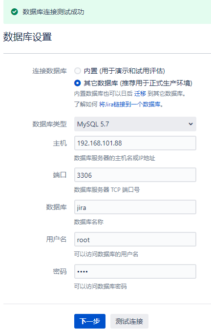
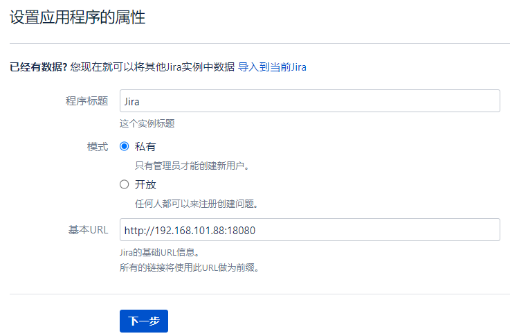
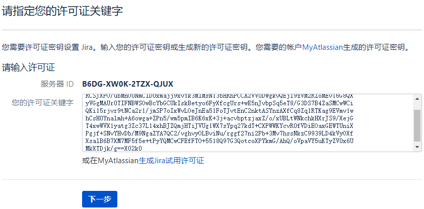
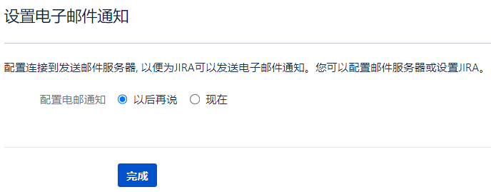
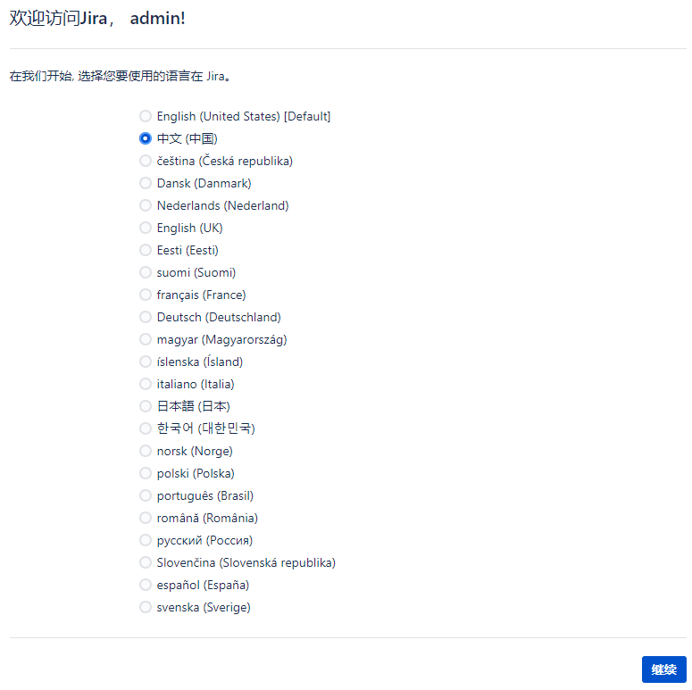
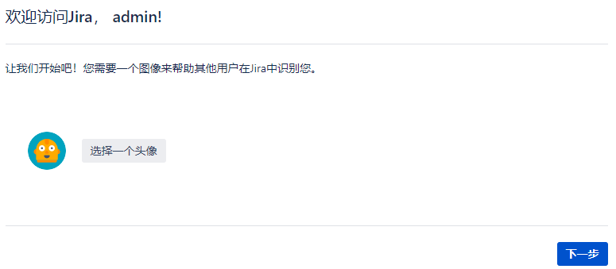
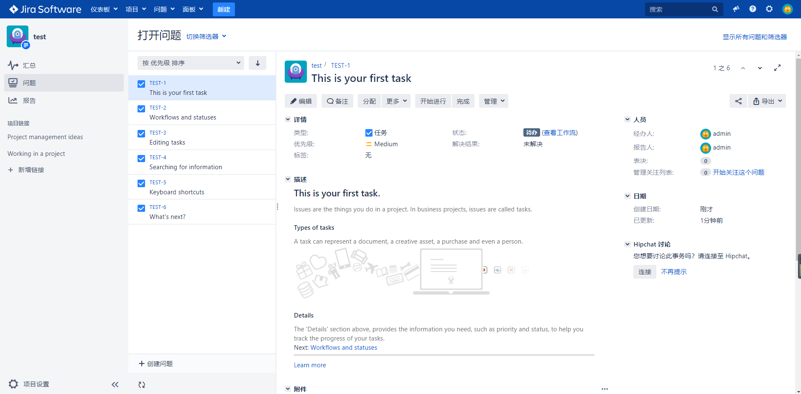
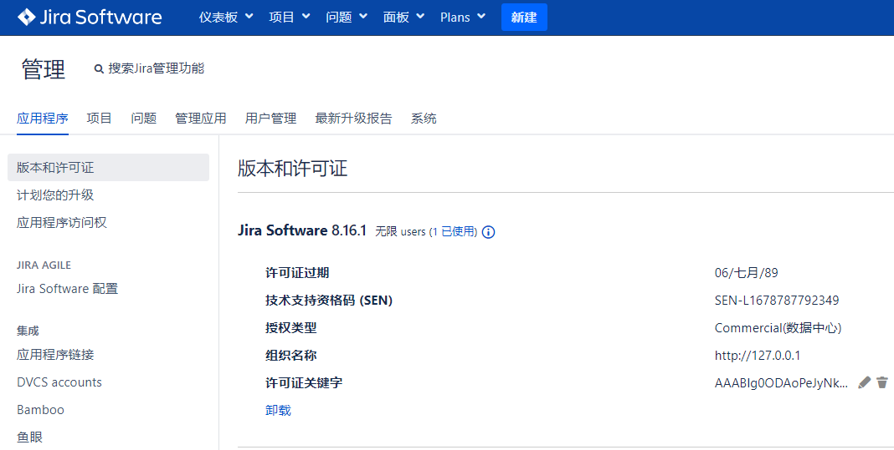

# Jira

JIRA是Atlassian公司出品的项目与事务跟踪工具，被广泛应用于缺陷跟踪、客户服务、需求收集、流程审批、任务跟踪、项目跟踪和敏捷管理等工作领域。

### 运行

```shell
# 运行
docker-compose -f docker-compose.yml -p jira up -d
# 若运行之后，启动日志报相关权限问题，给新产生的文件赋予权限
chmod -R 777 ./app/data
```

访问地址：[`http://ip地址:18080`](http://127.0.0.1:18080)

### 配置



#### 连接数据库

###### eg: PostgreSQL



###### eg: MySQL

> 可参考 https://confluence.atlassian.com/adminjiraserver0816/connecting-jira-applications-to-a-database-1063163980.html

```sql
-- 创建数据库
CREATE DATABASE jira CHARACTER SET utf8mb4 COLLATE utf8mb4_bin;
```



> tips: 要等10分钟左右... 
> 机器好点的话可能会快点...

#### 其它



许可证

```shell
# 生成激活码 （仅用于学习！） eg:
java -jar ./app/atlassian-agent.jar -d -m test@test.com -n BAT -p jira -o http://127.0.0.1 -s B6DG-XW0K-2TZX-QJUX
```

```
AAABnQ0ODAoPeJyNkl9Pq0AQxd/5FCQ+LwIt0jbZRAViUGi9F3ptfNvSqV1DFzK7VOundymY65+mM
RCSJXPO/ubMnOUNmClD0xmajj9xvYk3MIMsN13bHRhPCCA2VV0DWgkvQEjI9zVM2RZoMEvT6G8QX
yVGgMAUr0TIFNBWSOwBcYbGCUkIskBetyo6FyXfcgUrs+wE5nJvbpSq5eT8/G3DS7B4ZaSMCwWCi
QKi15rjvr9tNCa2r1/jmSP7oIxWvLOeJnEa51FoTJvtEnC2nktASYnzAXfCq8Zq1RTKag9EVmv1w
hCsH0Ynalmh+A6owga+ZPn5/wm5pmIB6K6xK+3j+acvbptzjaxZ/o/xUBLtWNkchkHXrJS9/XejG
T4xwWVX1yatg3Zc37L14xhBJZQmjHTiJVUg1WX7sYpq27kdT+CXPWWKYcvR0fVDiEOaxGEWTUniX
Pgjf+SNvYHvDb/M9NgaZYA7QC2/vghvyOLBviNu/rggf27ni2Pb+3Mv7hssNkzC9939LD4kVyOXf
XsalB6B7XM7MF5f5e+tPyYQMCwCFEfFTO+5518Q97G3QotcoXPYkmG/AhQ/oVpaVY5uKTyZV0x6U
MkXTDjk/g==X02k0
```









