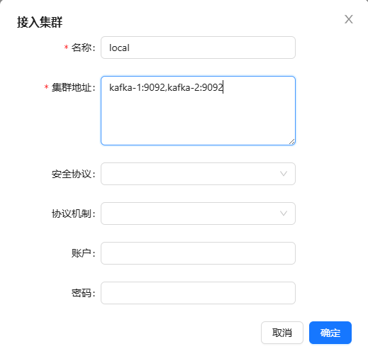
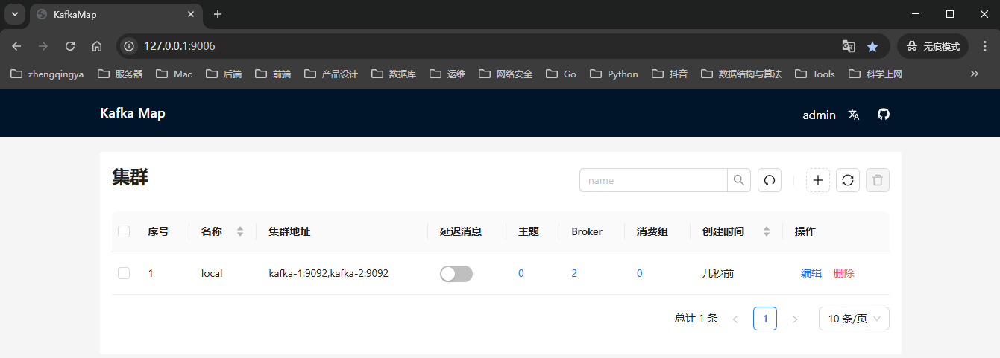

# Kafka -- ACL 认证版 -- 未完成版本...

Kafka 是一种基于分布式发布-订阅消息系统的开源软件。 其目标是提供高吞吐量、低延迟、可扩展性和容错能力。
Kafka 中将消息存储在可配置数量的分区中，以便实现横向扩展，并且支持多个生产者和消费者，具有良好的可靠性保证机制。
除此之外，Kafka 还支持数据复制、故障转移和离线数据处理等功能，并被广泛应用于网站活动跟踪、日志收集与分析、流式处理、消息队列等场景。

### 运行

```shell
# 停止
docker-compose -f docker-compose.yml -p kafka down
# 启动
docker-compose -f docker-compose.yml -p kafka up -d
```

### kafka-map 可视化工具

https://github.com/dushixiang/kafka-map

- 访问：http://127.0.0.1:9006
- 账号密码：admin/123456


添加集群 eg: kafka-1:9092,kafka-2:9092



### java 客户端连接

```yml
# ======================== ↓↓↓↓↓↓ kafka相关配置 ↓↓↓↓↓↓ ===============================
spring:
  kafka:
    bootstrap-servers: 127.0.0.1:9094,127.0.0.1:9093 # 127.0.0.1:9092,127.0.0.1:9093,127.0.0.1:9094 # Kafka服务器的地址。集群用多个逗号分隔
    producer:
      # 消息键值的序列化
      key-serializer: org.apache.kafka.common.serialization.StringSerializer
      value-serializer: org.springframework.kafka.support.serializer.JsonSerializer
      compression-type: gzip  # 发送消息时的压缩类型 (none, gzip, snappy, lz4)
      retries: 3 # 生产者在发送消息时的重试次数。当发送失败或遇到可重试异常时，生产者会自动尝试重新发送消息。
      batch-size: 16384 # 生产者在进行批量发送之前等待累积的消息大小。当待发送消息的大小达到这个阈值时，生产者会将消息一起发送。默认值: 16384字节 (16KB)
      buffer-memory: 33554432 # 生产者的缓冲区大小，即用于存储待发送消息的内存大小 默认值: 32MB
      # 生产者在发送消息后等待确认的方式
      #  - 0: 生产者在发送消息后不需要等待任何来自服务器的确认。这种方式下生产者不知道消息是否成功发送，也无法处理发送失败导致的错误。该方式具备最高的性能，但也带来了潜在的数据丢失风险。
      #  - 1: 生产者在发送消息后只需要等待来自主节点（leader）的确认即可继续发送下一条消息。主节点确认意味着消息已经成功写入到主节点的本地日志中，但仍有可能由于某些原因导致数据丢失。这是默认的设置，同时兼顾了性能和数据可靠性。
      #  - -1或all: 生产者在发送消息后需要等待来自所有副本（包括主节点和副本节点）的确认。这种方式提供了最高的数据可靠性保证，但也带来了较大的延迟和吞吐量下降。
      acks: all
      properties:
        # 自定义消息拦截器 -- 生产者
        interceptor.classes: com.zhengqing.demo.config.CustomProducerInterceptor
        linger.ms: 5 # 设置消息发送的最大等待时间 单位：毫秒  -- tips: 如果设置为0ms（立即发送消息），那么batch-size参数等于无效设置
        # 添加认证配置
        security.protocol: SASL_PLAINTEXT
        sasl.mechanism: SCRAM-SHA-256
        sasl.jaas.config: org.apache.kafka.common.security.scram.ScramLoginModule required username="admin" password="admin-secret";
    consumer:
      # 消息键值的反序列化
      key-deserializer: org.apache.kafka.common.serialization.StringDeserializer
      value-deserializer: org.springframework.kafka.support.serializer.JsonDeserializer
      # 如果消费者组的offset已经失效（例如，消费者加入时没有有效的offset），这个属性指定了从哪里开始消费：
      #   - earliest表示从最早的offset开始;
      #   - latest表示从最新的offset开始;
      #   - none表示如果没有找到有效的offset则抛出异常。
      auto-offset-reset: latest
      max-poll-records: 500 # 每次拉取消息的最大记录数。用于控制每次消费的批量大小。
      group-id: my-group # 消费者所属的消费者组ID。同一个消费者组内的消费者会共享消息的消费负载。
      enable-auto-commit: true # 是否启用自动提交消费位移（offset）。如果设置为true，消费者会定期自动提交消费位移。
      auto-commit-interval: 5000ms # 消费者自动提交偏移量的时间间隔
      properties:
        spring.json.trusted.packages: "*" # 配置信任的包，以便让反序列化器知道哪些类是安全的可以被反序列化的 eg: 指定包：com.zhengqing.demo；也可以 * 全部信任
        # 自定义消息拦截器 -- 消费者
        interceptor.classes: com.zhengqing.demo.config.CustomConsumerInterceptor
        isolation.level: read_committed
        # 添加认证配置
        security.protocol: SASL_PLAINTEXT
        sasl.mechanism: SCRAM-SHA-256
        sasl.jaas.config: org.apache.kafka.common.security.scram.ScramLoginModule required username="admin" password="admin-secret";
    listener:
      # 指定消息监听器容器的类型，决定了消息的处理方式和消费者实例的创建方式
      #   - single：单一模式（默认值）。每个Kafka主题创建一个唯一的消息监听器容器，并使用单个消费者实例来处理该主题的所有分区中的消息。
      #   - batch：批量模式。每个Kafka主题创建一个唯一的消息监听器容器，并使用单个消费者实例将一批消息传递给消息处理方法进行批量处理。此模式有助于提高处理效率。
      type: single
      concurrency: 5 # 消息监听器容器的并发消费者数
```

### 测试消费

```shell
# 1、创建主题(如果不存在)
docker exec -it kafka-1 /opt/bitnami/kafka/bin/kafka-topics.sh --bootstrap-server kafka-1:9092 --create --if-not-exists --topic topic1 --partitions 3 --replication-factor 2

# 2、为消费者组添加ACL权限（手动配置消费者组权限）
docker exec -it kafka-1 /opt/bitnami/kafka/bin/kafka-acls.sh --bootstrap-server kafka-1:9092 --add --allow-principal User:admin --operation Read --operation Describe --group group1

# 3、为主题添加生产和消费的ACL权限
docker exec -it kafka-1 /opt/bitnami/kafka/bin/kafka-acls.sh --bootstrap-server kafka-1:9092 --add --allow-principal User:admin --operation Write --operation Describe --operation Read --topic topic1

# 4、为集群内部通信添加权限（必须步骤，否则集群节点间通信会被拒绝）
docker exec -it kafka-1 /opt/bitnami/kafka/bin/kafka-acls.sh --bootstrap-server kafka-1:9092 --add --allow-principal User:ANONYMOUS --operation All --cluster

# 5、查看设置的ACL权限
docker exec -it kafka-1 /opt/bitnami/kafka/bin/kafka-acls.sh --bootstrap-server kafka-1:9092 --list

# 6、控制台生产者 -- 测试生产消息
docker exec -it kafka-1 /opt/bitnami/kafka/bin/kafka-console-producer.sh --bootstrap-server kafka-1:9092 --topic topic1

# 7、控制台消费者 -- 使用指定的消费者组消费消息
docker exec -it kafka-1 /opt/bitnami/kafka/bin/kafka-console-consumer.sh --bootstrap-server kafka-1:9092 --topic topic1 --group group1 --from-beginning

# 8、验证消费者组是否正确创建和工作 -- 会显示消费者组信息、分区分配和偏移量等详情。
docker exec -it kafka-1 /opt/bitnami/kafka/bin/kafka-consumer-groups.sh --bootstrap-server kafka-1:9092 --describe --group group1

# 9、重置消费者组（如需测试，先停止消费者组）
docker exec -it kafka-1 /opt/bitnami/kafka/bin/kafka-consumer-groups.sh --bootstrap-server kafka-1:9092 --group group1 --reset-offsets --to-earliest --execute --topic topic1

# 10、测试未授权的消费者组（应该被拒绝）
docker exec -it kafka-1 /opt/bitnami/kafka/bin/kafka-console-consumer.sh --bootstrap-server kafka-1:9092 --topic topic1 --group group2 --from-beginning
```
