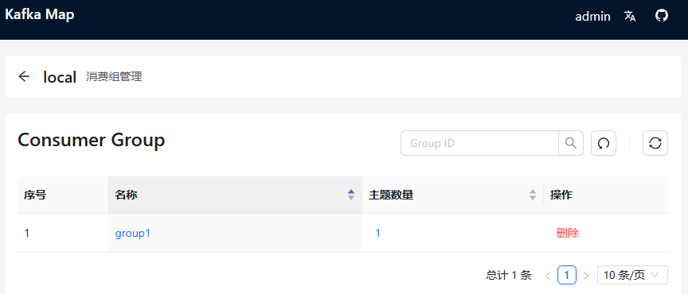

# Kafka -- 未完成版

Kafka是一种基于分布式发布-订阅消息系统的开源软件。 其目标是提供高吞吐量、低延迟、可扩展性和容错能力。
Kafka中将消息存储在可配置数量的分区中，以便实现横向扩展，并且支持多个生产者和消费者，具有良好的可靠性保证机制。
除此之外，Kafka还支持数据复制、故障转移和离线数据处理等功能，并被广泛应用于网站活动跟踪、日志收集与分析、流式处理、消息队列等场景。

### 运行

```shell
# 停止
docker-compose -f docker-compose.yml -p kafka down
# 启动
docker-compose -f docker-compose.yml -p kafka up -d


# 给脚本添加执行权限 -- linux环境
chmod +x create-consumer-group.sh
# 使用脚本创建和授权消费者组 -- 在Windows中可能需要使用Git Bash或WSL运行，脚本执行后，只有被授权的消费者组才能消费指定的主题，未授权的消费者组将被拒绝访问。
# my-consumer-group是您要创建的消费者组名称
# simple-local是主题名称
sh ./create-consumer-group.sh my-consumer-group simple-local
```

### kafka-map可视化工具

https://github.com/dushixiang/kafka-map

- 访问：http://127.0.0.1:9006
- 账号密码：admin/123456


添加集群 eg: kafka-1:9092,kafka-2:9092


### java客户端连接

```yml
spring:
  kafka:
    bootstrap-servers: 127.0.0.1:9093,127.0.0.1:9094 # 指定kafka server地址，集群（多个逗号分隔）
```

### 测试消费

```shell
# 1、创建主题(如果不存在)
docker exec -it kafka-1 /opt/bitnami/kafka/bin/kafka-topics.sh --bootstrap-server kafka-1:9092 --create --if-not-exists --topic topic1 --partitions 3 --replication-factor 2

# 2、为消费者组添加ACL权限（手动配置消费者组权限）
docker exec -it kafka-1 /opt/bitnami/kafka/bin/kafka-acls.sh --bootstrap-server kafka-1:9092 --add --allow-principal User:ANONYMOUS --operation Read --operation Describe --group group1

# 3、为主题添加生产和消费的ACL权限
docker exec -it kafka-1 /opt/bitnami/kafka/bin/kafka-acls.sh --bootstrap-server kafka-1:9092 --add --allow-principal User:ANONYMOUS --operation Write --operation Describe --operation Read --topic topic1

# 4、查看设置的ACL权限
docker exec -it kafka-1 /opt/bitnami/kafka/bin/kafka-acls.sh --bootstrap-server kafka-1:9092 --list

# 5、控制台生产者 -- 测试生产消息
docker exec -it kafka-1 /opt/bitnami/kafka/bin/kafka-console-producer.sh --bootstrap-server kafka-1:9092 --topic topic1
# 6、控制台消费者 -- 使用指定的消费者组消费消息
docker exec -it kafka-1 /opt/bitnami/kafka/bin/kafka-console-consumer.sh --bootstrap-server kafka-1:9092 --topic topic1 --group group1 --from-beginning

# 7、验证消费者组是否正确创建和工作 -- 会显示消费者组信息、分区分配和偏移量等详情。
docker exec -it kafka-1 /opt/bitnami/kafka/bin/kafka-consumer-groups.sh --bootstrap-server kafka-1:9092 --describe --group group1

# 8、重置消费者组（如需测试，先停止消费者组）
docker exec -it kafka-1 /opt/bitnami/kafka/bin/kafka-consumer-groups.sh --bootstrap-server kafka-1:9092 --group group1 --reset-offsets --to-earliest --execute --topic topic1
```



