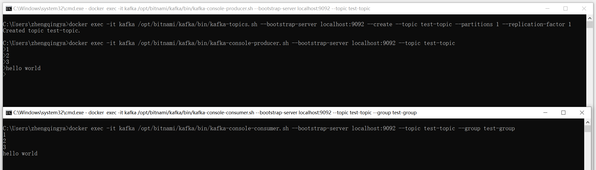
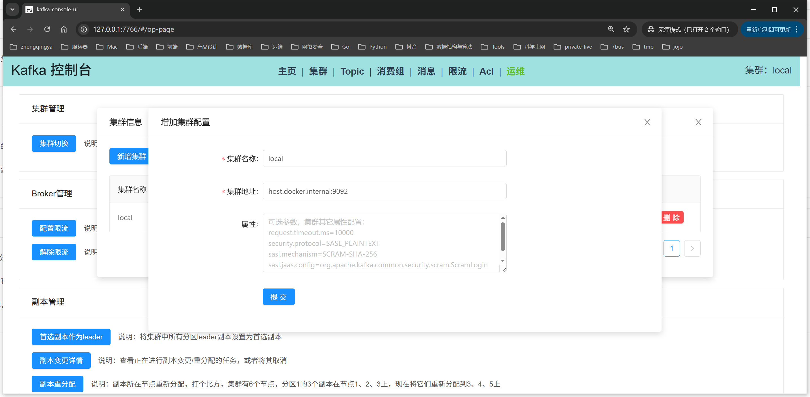
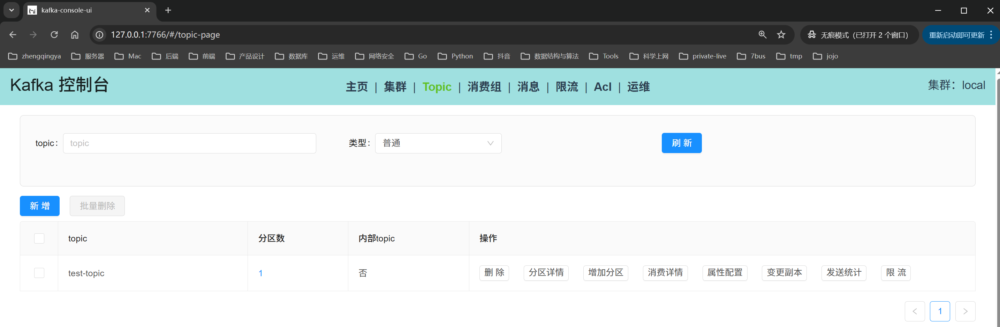

# Kafka 单机版（无认证）

## 一、运行

```shell
docker-compose -f docker-compose.yml up -d
```

## 二、测试消息收发

```shell
# 创建主题
docker exec -it kafka /opt/bitnami/kafka/bin/kafka-topics.sh --bootstrap-server localhost:9092 --create --topic test-topic --partitions 1 --replication-factor 1

# 发送消息
docker exec -it kafka /opt/bitnami/kafka/bin/kafka-console-producer.sh --bootstrap-server localhost:9092 --topic test-topic

# 接收消息
docker exec -it kafka /opt/bitnami/kafka/bin/kafka-console-consumer.sh --bootstrap-server localhost:9092 --topic test-topic --group test-group
```



## 三、图形化工具访问

访问地址：http://localhost:7766

集群地址：host.docker.internal:9092



