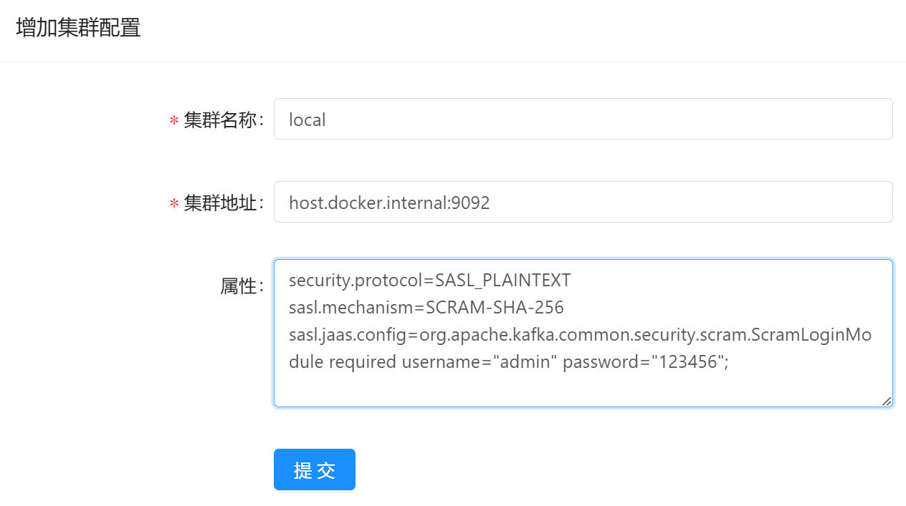
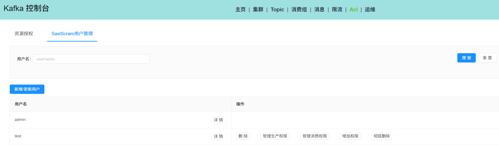
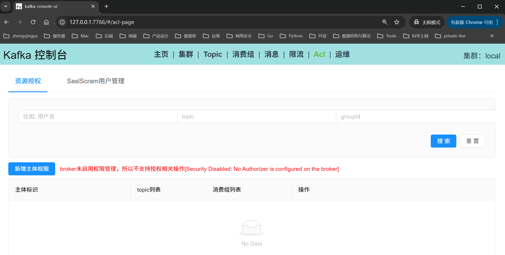

# Kafka 单机 & 安全认证机制-SASL/SCRAM

### 一、运行

```shell
docker-compose -f docker-compose.yml up -d
```

### 二、图形化工具访问

访问地址：http://localhost:7766

集群地址：host.docker.internal:9092

集群管理属性配置

```
security.protocol=SASL_PLAINTEXT
sasl.mechanism=SCRAM-SHA-256
sasl.jaas.config=org.apache.kafka.common.security.scram.ScramLoginModule required username="admin" password="123456";
```




### 三、SpringBoot连接配置

```yaml
spring:
  kafka:
    bootstrap-servers: 127.0.0.1:9092
    properties:
      security.protocol: SASL_PLAINTEXT
      sasl.mechanism: SCRAM-SHA-256
      sasl.jaas.config: 'org.apache.kafka.common.security.scram.ScramLoginModule required username="test" password="123456";'
```

### 四、ACL授权 -- 待办



```shell
# 消费者权限管理
org.apache.kafka.common.errors.GroupAuthorizationException: Not authorized to access group: xxx
```