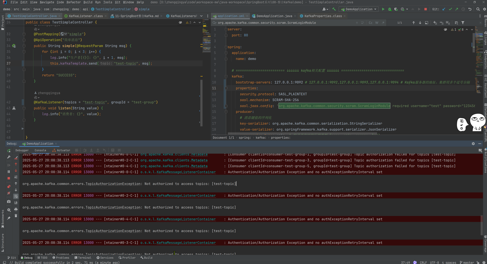
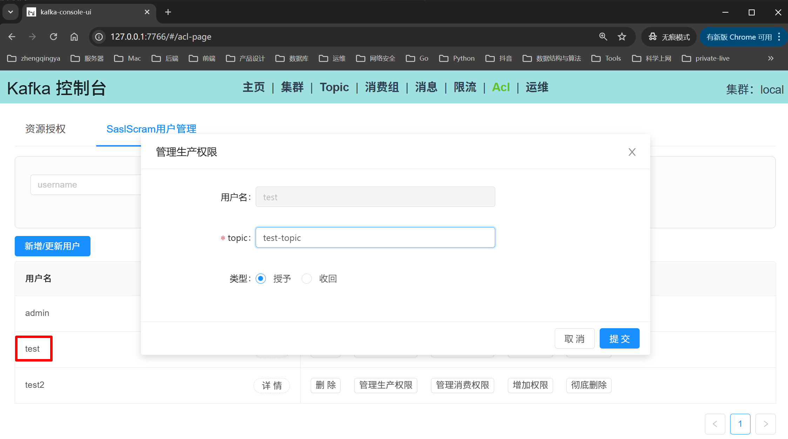
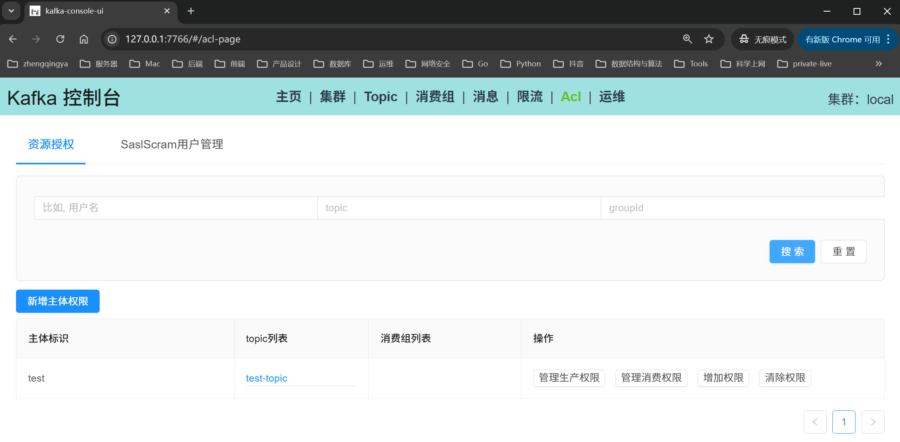
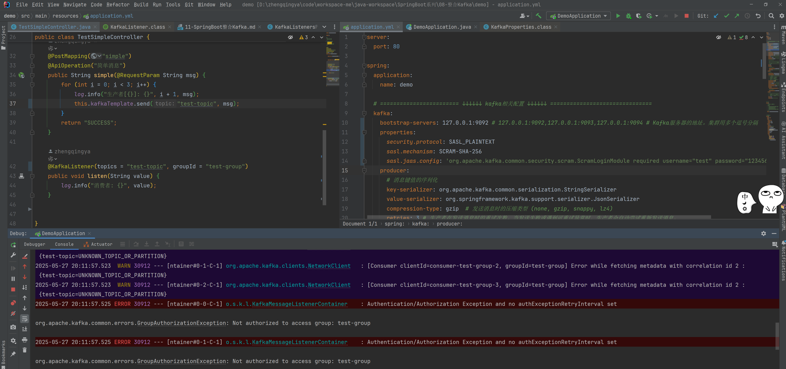
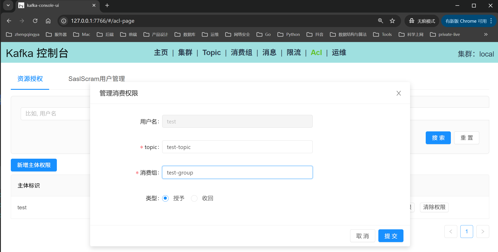
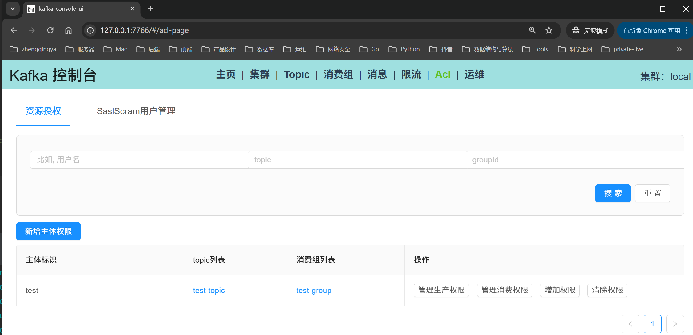
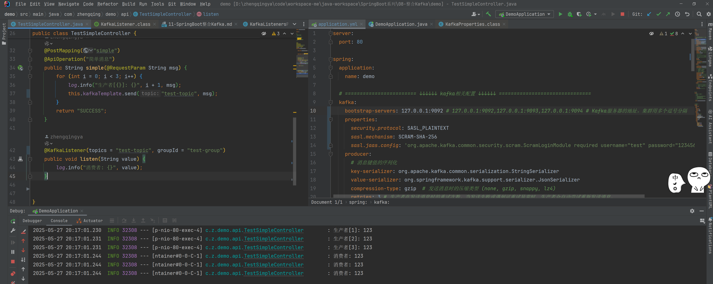

# Kafka 单机 & 安全认证机制-SASL/SCRAM

### 一、运行

```shell
docker-compose -f docker-compose.yml up -d
```

### 二、图形化工具访问

访问地址：http://localhost:7766

集群地址：host.docker.internal:9092

集群管理属性配置

```
security.protocol=SASL_PLAINTEXT
sasl.mechanism=SCRAM-SHA-256
sasl.jaas.config=org.apache.kafka.common.security.scram.ScramLoginModule required username="admin" password="123456";
```


### 三、SpringBoot连接配置

```yaml
spring:
  kafka:
    bootstrap-servers: 127.0.0.1:9092
    properties:
      security.protocol: SASL_PLAINTEXT
      sasl.mechanism: SCRAM-SHA-256
      sasl.jaas.config: 'org.apache.kafka.common.security.scram.ScramLoginModule required username="test" password="123456";'
```

### 四、ACL授权

#### 1、topic未授权

test账号无授权配置时提示如下：

```shell
2025-05-27 20:08:38.113 ERROR 13000 --- [ntainer#0-4-C-1] org.apache.kafka.clients.Metadata        : [Consumer clientId=consumer-test-group-5, groupId=test-group] Topic authorization failed for topics [test-topic]
2025-05-27 20:08:38.114 ERROR 13000 --- [ntainer#0-0-C-1] o.s.k.l.KafkaMessageListenerContainer    : Authentication/Authorization Exception and no authExceptionRetryInterval set

org.apache.kafka.common.errors.TopicAuthorizationException: Not authorized to access topics: [test-topic]
```



#### 2、消费者组未授权

给test账号配置生产权限



```shell
2025-05-27 20:11:57.525 ERROR 30912 --- [ntainer#0-0-C-1] o.s.k.l.KafkaMessageListenerContainer    : Authentication/Authorization Exception and no authExceptionRetryInterval set

org.apache.kafka.common.errors.GroupAuthorizationException: Not authorized to access group: test-group
```



#### 3、正常授权

配置消费权限



正常消费消息

