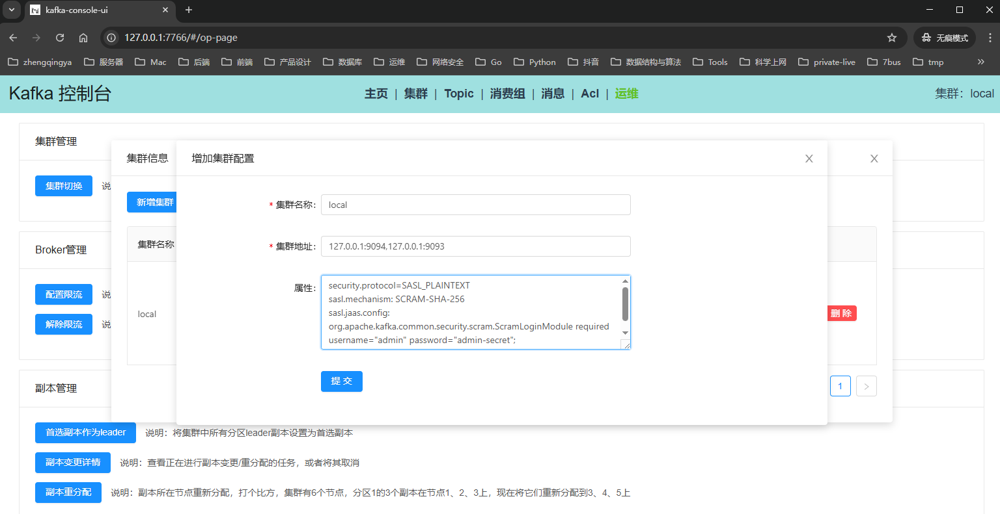
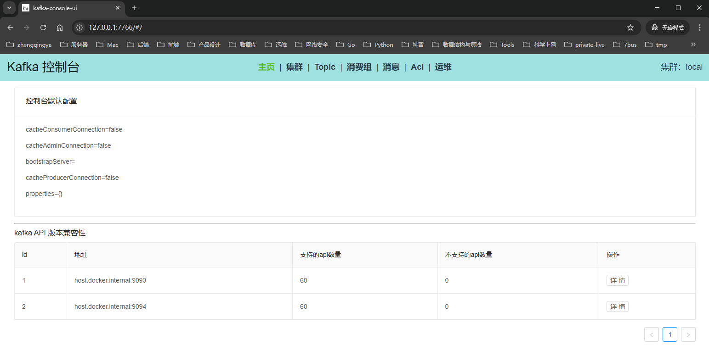
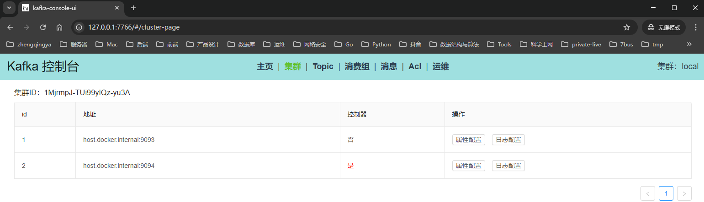
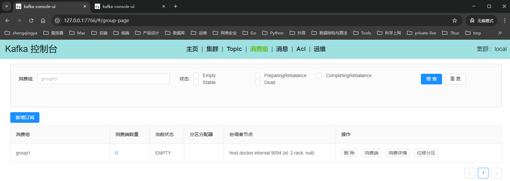
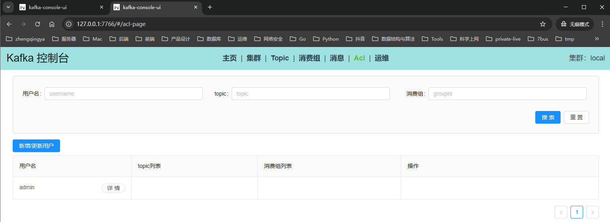
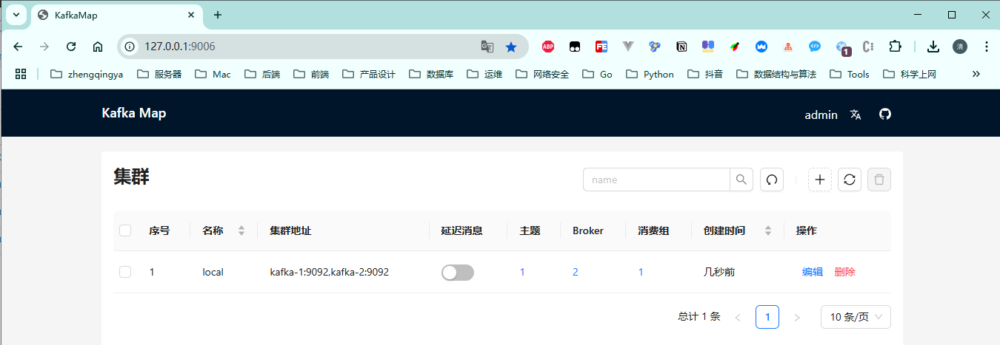

# 可视化UI管理工具

### kafka-console-ui

https://github.com/xxd763795151/kafka-console-ui

集群管理属性配置

```
security.protocol=SASL_PLAINTEXT
sasl.mechanism: SCRAM-SHA-256
sasl.jaas.config: org.apache.kafka.common.security.scram.ScramLoginModule required username="admin" password="admin-secret";
```

添加集群：

查看配置：








### kafka-map

https://github.com/dushixiang/kafka-map


