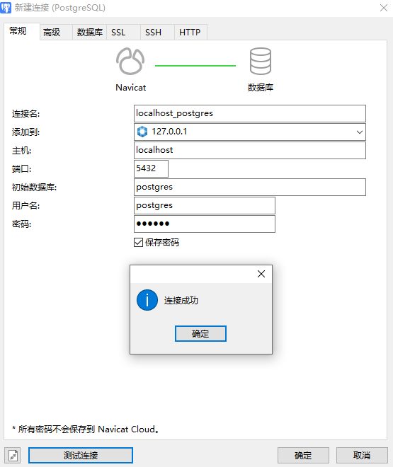

# PostgreSQL

关系型数据库

### 运行

```shell
docker-compose -f docker-compose.yml -p postgresql up -d

# 若运行之后，postgresql启动日志报相关权限问题，给新产生的文件赋予权限
chmod -R 777 ./postgresql/data
```

连接



```shell
# 进入容器
docker exec -it postgresql /bin/bash
# 登录
psql -U postgres -W
# 查看版本
select version();
```
