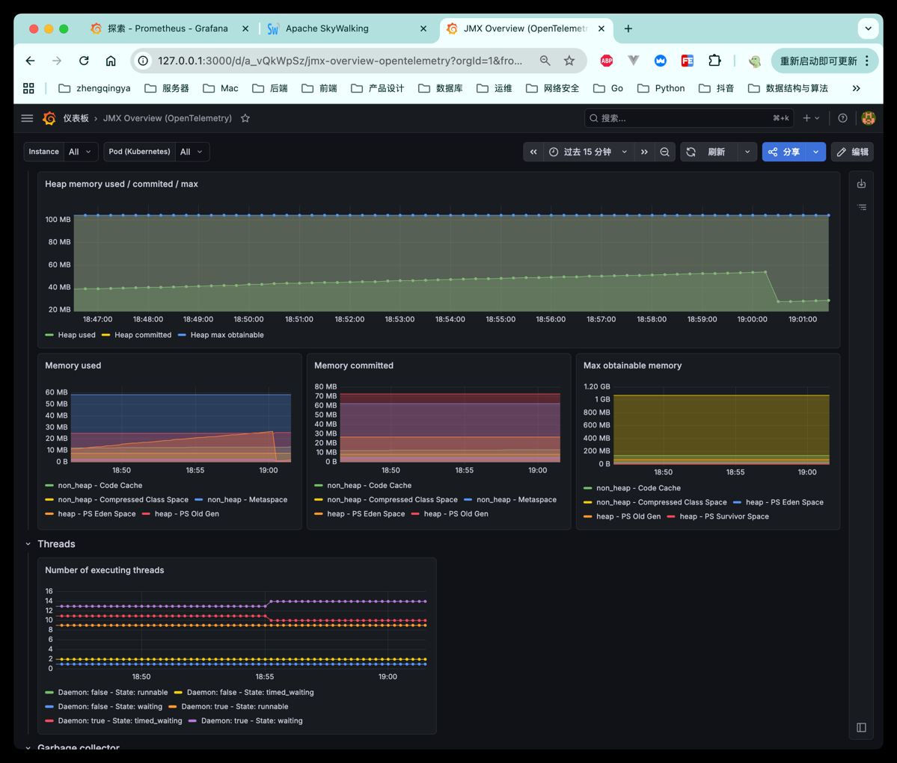
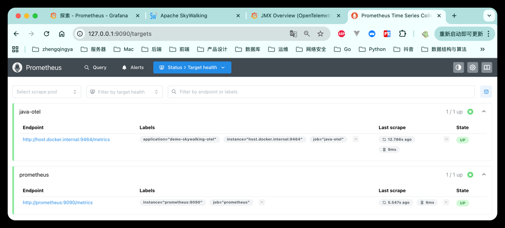

### Prometheus + Grafana 监控 OTel Java 服务

| 组件 | 作用 | 是否必须 |
| --- | --- | --- |
| Prometheus | 指标采集与时序数据存储，定时拉取 Java 服务等 `/metrics` 指标。 | 必须 |
| Grafana | 指标可视化、Dashboard 展示和告警配置，数据源使用 Prometheus。 | 推荐必须 |
| OTel Java Agent Prometheus Exporter | Java 应用通过 `opentelemetry-javaagent.jar` 暴露 `/metrics` 给 Prometheus 采集。 | 监控 OTel Java 服务时需要 |

整体链路：

```text
Java服务 /metrics (OTel Java Agent) ─┐
Prometheus自身 :9090/metrics         ├─> Prometheus ──> Grafana
                                     ┘
```

#### 1. 启停监控组件

```shell
# 启动监控组件
docker compose up -d

# 停止并删除容器、网络
docker compose down
```

#### 2. 访问地址

- Grafana: http://localhost:3000
  - 默认账号: `admin`
  - 默认密码: `admin`
- Prometheus: http://localhost:9090

#### 3. Java 服务接入方式

示例 JVM 参数：

```shell
-javaagent:/absolute/path/opentelemetry-javaagent.jar
-Dotel.service.name=demo-skywalking-otel
-Dotel.metrics.exporter=prometheus
-Dotel.exporter.prometheus.host=0.0.0.0
-Dotel.exporter.prometheus.port=9464
```

如果你的 Java 服务跑在宿主机，本套 Prometheus 默认会抓取：

```text
host.docker.internal:9464/metrics
```

如果实际暴露端口不是 `9464`，同步修改 `prometheus/prometheus.yml` 里的 target。

#### 4. Grafana Dashboard

Grafana 已自动配置 Prometheus 数据源。

可在 Grafana 导入这些 Dashboard ID：

- JMX Overview (OpenTelemetry): [`17582`](https://grafana.com/grafana/dashboards/17582-jmx-overview-opentelemetry/)
- JVM Runtime: `4701` -- 亲测 java otel 无数据显示
- JVM Micrometer: `21064` -- 亲测 java otel 无数据显示

推荐说明：

- 当前这套 `opentelemetry-javaagent.jar + Prometheus` 验证链路，优先推荐使用 `17582`。
- `17582` 对 `jvm_memory_used_bytes`、`jvm_cpu_recent_utilization_ratio`、`jvm_gc_duration_seconds_*` 这类 OTel Java runtime metrics 兼容更好。
- `4701` 这类旧面板更偏传统 Micrometer/JMX 指标命名，在当前 OTel 指标命名下可能会出现大面积 `N/A`，属于正常现象。
- 即使 `17582` 中个别面板无数据，也不代表采集失败，通常只是当前 JVM 或运行环境没有对应指标。




#### 5. 查看采集状态

打开 Prometheus Targets 页面：

```text
http://localhost:9090/targets
```

确认 `prometheus`、`java-otel` 都是 `UP`。

