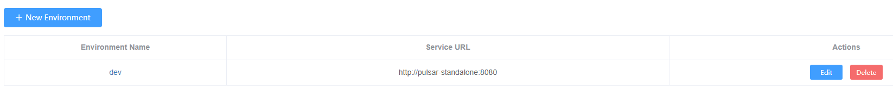
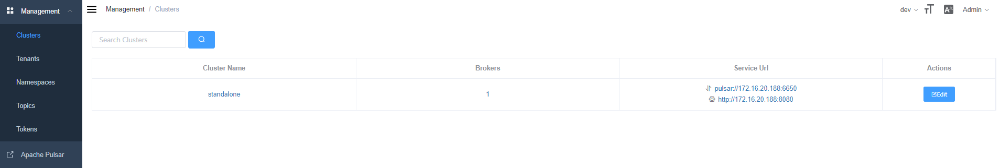
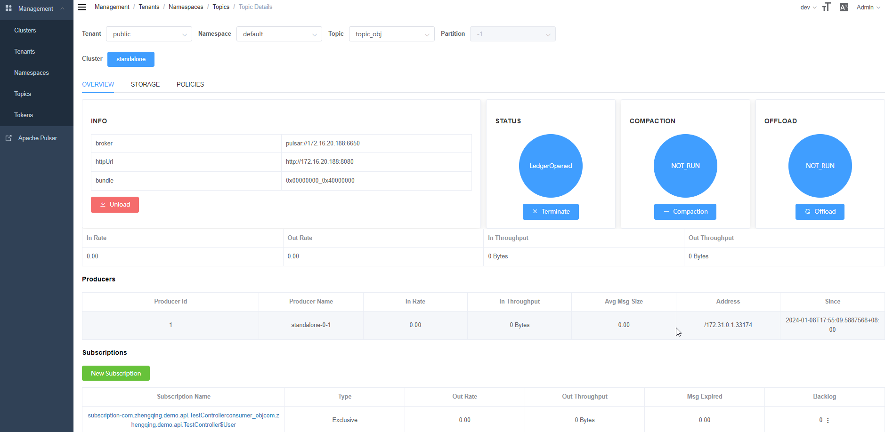

# Apache Pulsar

一个专为云构建的开源分布式消息传递和流媒体平台。

https://pulsar.apache.org/

### 部署

```shell
# 运行
docker-compose -f docker-compose.yml -p pulsar up -d

# 创建账号
CSRF_TOKEN=$(curl http://localhost:7750/pulsar-manager/csrf-token) 
curl -H "X-XSRF-TOKEN: $CSRF_TOKEN" -H "Cookie: XSRF-TOKEN=$CSRF_TOKEN;" -H 'Content-Type: application/json' -X PUT http://localhost:7750/pulsar-manager/users/superuser -d '{"name": "admin", "password": "apachepulsar", "description": "zhengqingya", "email": "zhengqingya@xxx.com"}'
# 创建成功，返回
# {"message":"Add super user success, please login"}
```

- 访问地址：[`ip地址:9527`](http://127.0.0.1:9527)
- 账号：admin
- 密码：apachepulsar

登录成功后，添加环境

进入指定环境后可查看管理配置



