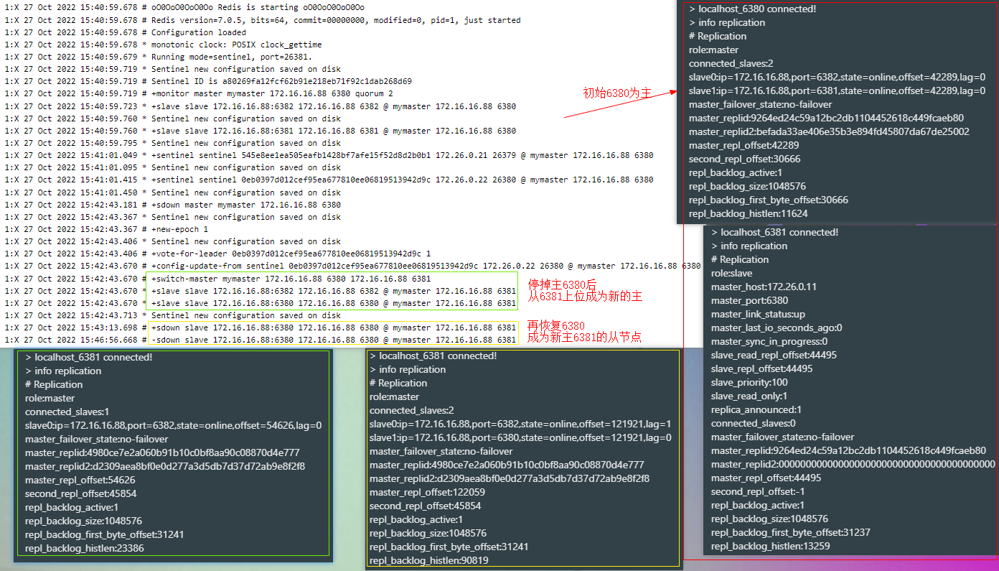

### Redis

```shell
# 当前目录下所有文件赋予权限(读、写、执行)
chmod -R 777 ./redis-master-slave-sentinel
# 运行 -- 哨兵模式-一主二从三哨兵（sentinel监视redis主从服务，当某个master服务下线时，自动将该master下的某个从服务升级为master服务替代已下线的master服务继续处理请求 -- 即主节点切换）
docker-compose -f docker-compose-redis-master-slave-sentinel.yml -p redis up -d
```

###### 连接redis

```shell
# 密码为123456
docker exec -it redis-master redis-cli -p 6380 -a 123456
```

###### 哨兵模式查看

```shell
# 连接
docker exec -it redis-sentinel-1 redis-cli -p 26379 -a 123456
# 查看redis主信息
sentinel master mymaster
# 查看redis从信息
sentinel slaves mymaster
```

sentinel启动日志&测试主从切换


