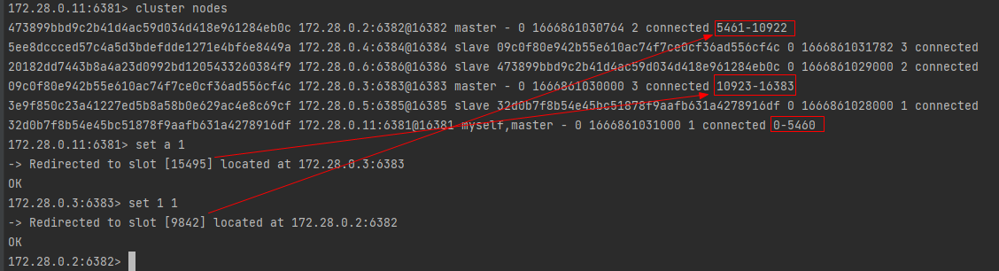

### Redis

```shell
# 当前目录下所有文件赋予权限(读、写、执行)
chmod -R 777 ./redis-cluster
# 运行 -- Redis Cluster 集群
docker-compose -f docker-compose-redis-cluster.yml -p redis up -d
```

###### 连接redis

```shell
# 密码为123456
docker exec -it redis-6381 redis-cli -p 6381 -a 123456
```

###### Redis Cluster 集群

redis.conf中主要新增了如下配置

```
cluster-enabled yes
cluster-config-file nodes-6379.conf
cluster-node-timeout 15000
```

创建集群

```shell
# `--cluster-replicas 1`: 指定集群中每个master的副本个数为1，此时`节点总数/(replicas+1)`得到的就是master的数量。前n个为master，其它节点为slave，随机分配到不同master
docker exec -it redis-6381 redis-cli -h 172.28.0.11 -p 6381 -a 123456 --cluster create --cluster-replicas 1 172.28.0.11:6381 redis-6382:6382 redis-6383:6383 redis-6384:6384 redis-6385:6385 redis-6386:6386

# tips: 上面方式，Java会使用容器内部ip而导致连接不上，报错“Unable to connect to [172.28.0.11:6381]: connection timed out: /172.28.0.11:6381”
# 网上说集群节点IP使用宿主机IP即可，我这里测试未通过，后期再看看...
# docker exec -it redis-6381 redis-cli -h 172.28.0.11 -p 6381 -a 123456 --cluster create --cluster-replicas 1 172.16.16.88:6381 172.16.16.88:6382 172.16.16.88:6383 172.16.16.88:6384 172.16.16.88:6385 172.16.16.88:6386
```

查看集群

```shell
# 连接集群某个节点
docker exec -it redis-6381 redis-cli -c -h redis-6381 -p 6381 -a 123456
# 查看集群信息
cluster info
# 查看集群节点信息
cluster nodes
# 查看slots分片
cluster slots
```


