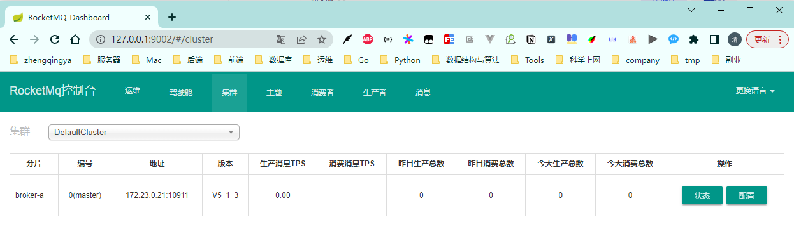

### RocketMQ

- https://github.com/apache/rocketmq
- https://rocketmq.apache.org/

Apache RocketMQ是一个分布式消息和流媒体平台，具有低延迟、高性能和可靠性、万亿级容量和灵活的可扩展性。

```shell
docker-compose -p rocketmq up -d
```

访问地址：http://127.0.0.1:9002


