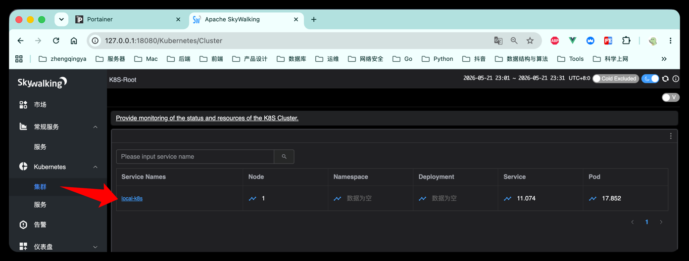
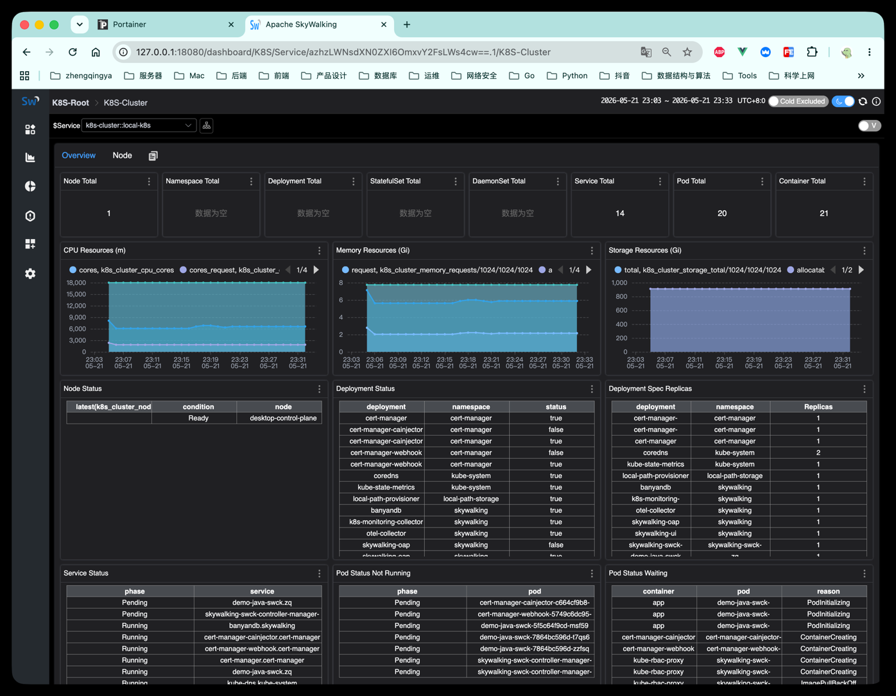
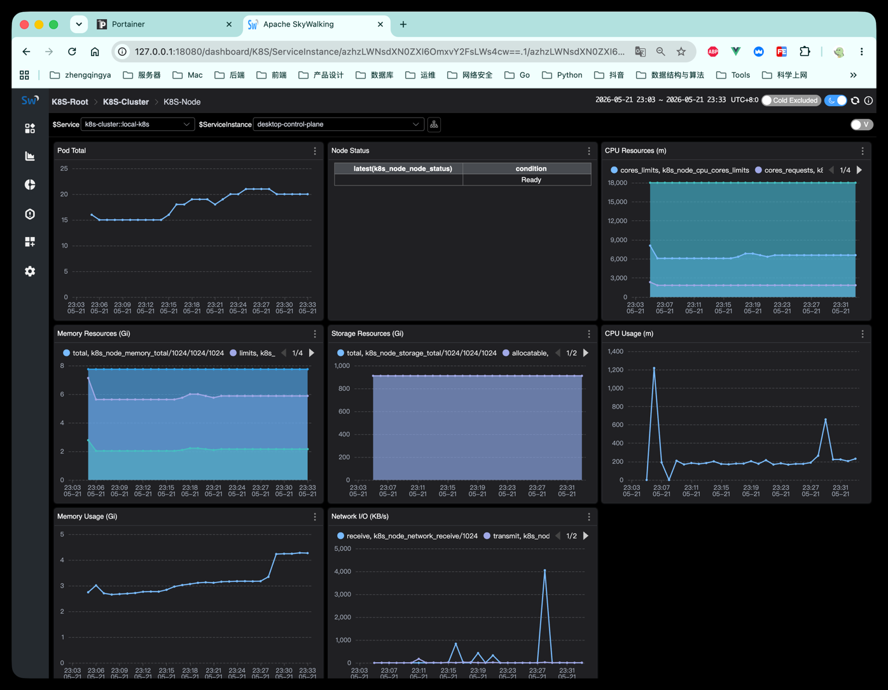
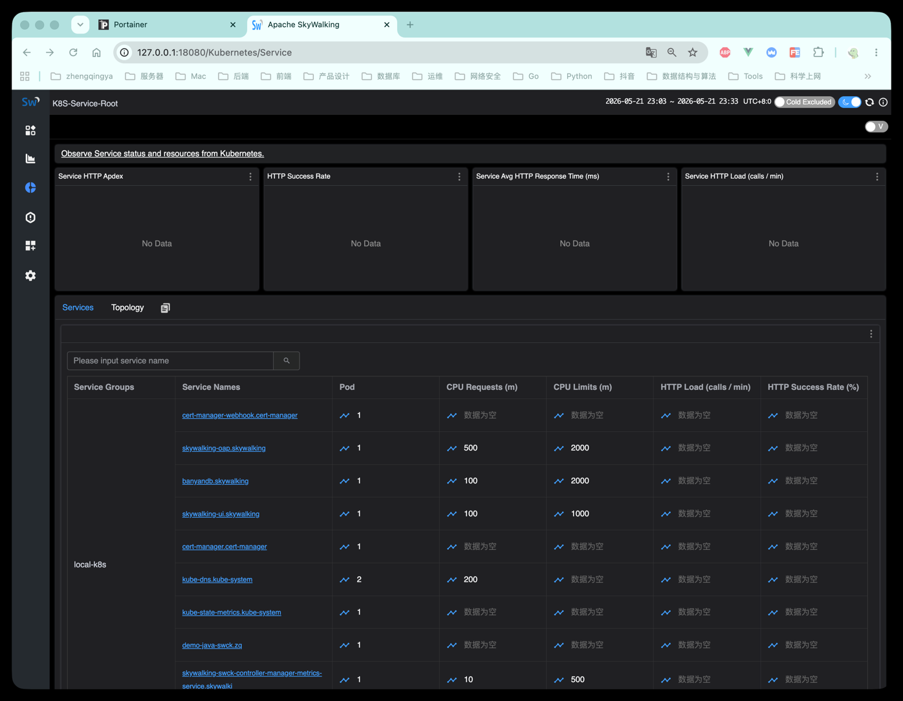
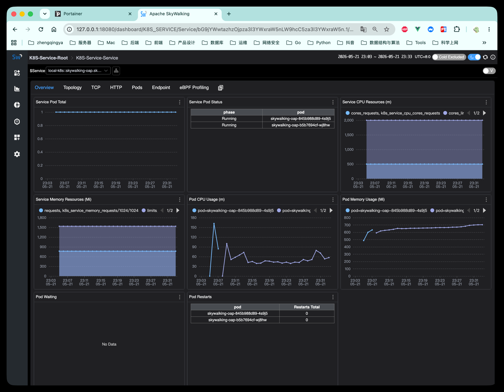

# Apache SkyWalking 10.4.0 K8s

这是一个面向 Docker Desktop Kubernetes 的 `SkyWalking 10.4.0 + BanyanDB + OTel Collector + K8s Monitoring` 轻量部署方案。

目标：

- 用 K8s 部署替代 [Docker Compose 版](../10.4.0-banyandb-lite-otel)。
- 暴露端口尽量和 Docker Compose 版一致，方便已有 Java 服务接入。
- 将 OAP 放在 K8s 内，并通过 RBAC 访问 Kubernetes API Server，用于验证 [03-k8s-monitoring](../docs/03-k8s-monitoring)。

## 一、架构

```text
Java / Python / Go / PHP App
  -> OTel Collector(4317/4318)
  -> SkyWalking OAP(11800)
  -> BanyanDB(17912)
  -> SkyWalking UI(18080)

Java / Python / Go / PHP stdout/stderr logs
  -> OTel Log Agent(filelog DaemonSet)
  -> OTel Collector(4317)
  -> SkyWalking OAP(11800)
  -> SkyWalking UI Logs

kube-state-metrics + kubelet cAdvisor
  -> K8s Monitoring Collector
  -> SkyWalking OAP(11800)
  -> BanyanDB
  -> SkyWalking UI Kubernetes 页面
```

## 二、前置条件

Docker Desktop 需要已经启用 Kubernetes。

建议 Docker Desktop 至少分配 `6GB` 内存。OAP 首次启用 `k8s/*` OTel metrics rules 时会创建较多 BanyanDB schema，BanyanDB 在初始化阶段的内存峰值会高于普通空实例。

`kube-state-metrics` 用于采集 Namespace、Deployment、Service、Pod 等对象状态指标。如果集群中还没有，先安装：

```shell
kubectl apply -k https://github.com/kubernetes/kube-state-metrics/examples/standard
```

验证：

```shell
kubectl get pods -A | grep kube-state-metrics
kubectl get svc -A | grep kube-state-metrics
```

## 三、部署

```shell
kubectl apply -f namespace.yaml
kubectl apply -f banyandb.yaml
kubectl apply -f oap.yaml
kubectl apply -f ui.yaml
kubectl apply -f otel-collector.yaml
kubectl apply -f k8s-monitoring-collector.yaml
# 日志采集 OTel filelog DaemonSet -- 注：此方案只能保证日志进入 SkyWalking，但对 SkyWalking 原生 Agent trace id 来说，不能保证“真正按链路 ID 关联”。即：能上报日志，但UI中无法筛选链路日志。
# kubectl apply -f otel-log-agent.yaml
```

查看状态：

```shell
kubectl get pods -n skywalking
kubectl get svc -n skywalking
```

Docker Desktop 的 `LoadBalancer` 通常会把 `EXTERNAL-IP` 显示为 `localhost`。
如果你的环境显示为 `172.x.x.x`，访问时使用 `kubectl get svc -n skywalking` 里对应 Service 的 `EXTERNAL-IP`，端口仍保持下方列表一致。

## 四、访问地址

本方案的对外端口尽量对齐 Docker Compose 版：

```text
SkyWalking UI:               http://127.0.0.1:18080
Zipkin UI:                   http://127.0.0.1:18080/zipkin
OAP HealthCheck:             http://127.0.0.1:12800/healthcheck
SkyWalking Agent / OAP gRPC: 127.0.0.1:11800
Zipkin Receiver:             127.0.0.1:9411
OTel Collector gRPC:         127.0.0.1:4317
OTel Collector HTTP:         127.0.0.1:4318
Collector HealthCheck:       http://127.0.0.1:13133
```

如果 Docker Desktop 没有分配 `localhost`，可以临时使用端口转发：

```shell
kubectl port-forward -n skywalking svc/skywalking-ui 18080:18080
kubectl port-forward -n skywalking svc/skywalking-oap 11800:11800 12800:12800 9411:9411
kubectl port-forward -n skywalking svc/otel-collector 4317:4317 4318:4318 13133:13133
```

## 六、应用日志接入

`otel-log-agent.yaml` 使用 DaemonSet 在每个节点采集容器 stdout/stderr 日志，读取路径为 `/var/log/pods/*/*/*.log`，通过 OTLP gRPC 发送到集群内的 `otel-collector:4317`，再由现有 Collector 转发到 `skywalking-oap:11800`。

日志归属服务名优先使用日志资源属性 `service.name`。如果应用日志没有显式携带 `service.name`，Log Agent 会尝试使用 Pod 的 `app` label 作为 `service.name`；仍然不存在时，回退到 Pod 名称。

PHP / Go 服务推荐输出 JSON 日志，至少包含：

```json
{"service.name":"demo-k8s-agent-go","level":"INFO","message":"hello request","trace_id":"trace-id"}
```

如果暂时不改应用代码，保留 stdout/stderr 文本日志也可以先接入 SkyWalking，但 trace-log 关联效果取决于日志内容中是否包含 trace id。

## 七、Java 服务接入

### SkyWalking 原生 Java Agent

宿主机本地 Java 服务：

```shell
SW_AGENT_COLLECTOR_BACKEND_SERVICES=127.0.0.1:11800
```

K8s 集群内 Java Pod：

```shell
SW_AGENT_COLLECTOR_BACKEND_SERVICES=skywalking-oap.skywalking.svc.cluster.local:11800
```

### OpenTelemetry Java Agent

宿主机本地 Java 服务：

```shell
-Dotel.exporter.otlp.protocol=grpc
-Dotel.exporter.otlp.endpoint=http://127.0.0.1:4317
```

K8s 集群内 Java Pod：

```shell
-Dotel.exporter.otlp.protocol=grpc
-Dotel.exporter.otlp.endpoint=http://otel-collector.skywalking.svc.cluster.local:4317
```

## 八、K8s Monitoring 验证

查看 K8s Monitoring Collector 日志：

```shell
kubectl logs -n skywalking deploy/k8s-monitoring-collector
```

正常日志中应该能看到类似内容：

```text
Scrape job added ... jobName="kubernetes-cadvisor"
Scrape job added ... jobName="kube-state-metrics"
Everything is ready. Begin running and processing data.
```

进入 SkyWalking UI：

```text
http://127.0.0.1:18080
```

查看 `Kubernetes` 页面，确认 Cluster、Node、Namespace、Deployment、Service、Pod 等资源是否出现数据。

集群



服务




## 七、排查

OAP 健康检查：

```shell
curl http://127.0.0.1:12800/healthcheck
```

Collector 健康检查：

```shell
curl http://127.0.0.1:13133
```

查看 OAP 日志：

```shell
kubectl logs -n skywalking deploy/skywalking-oap
```

查看 Collector 日志：

```shell
# kubectl logs -n skywalking ds/otel-log-agent --tail=100
kubectl logs -n skywalking deploy/otel-collector
kubectl logs -n skywalking deploy/k8s-monitoring-collector
```

如果 Kubernetes 页面只有部分数据，优先排查：

- `kube-state-metrics` 是否已安装。
- `k8s-monitoring-collector` 是否能抓到 `kube-state-metrics` 和 kubelet cAdvisor。
- `skywalking-oap` 的 ServiceAccount 是否拥有访问 Kubernetes API Server 的 RBAC。
- OAP 是否已启用 `k8s/*` OTel metrics rules。
- 应用日志是否写到 stdout/stderr。
- `otel-log-agent` 是否能读取 `/var/log/pods/*/*/*.log`。
- 日志资源属性或 Pod label 是否能提供 `service.name`。

## 九、清理

```shell
# kubectl delete -f otel-log-agent.yaml
kubectl delete -f k8s-monitoring-collector.yaml
kubectl delete -f otel-collector.yaml
kubectl delete -f ui.yaml
kubectl delete -f oap.yaml
kubectl delete -f banyandb.yaml
kubectl delete -f namespace.yaml
```

如果 kube-state-metrics 是本次单独安装的，也可以清理：

```shell
kubectl delete -k https://github.com/kubernetes/kube-state-metrics/examples/standard
```
