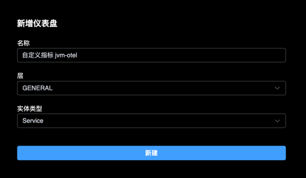
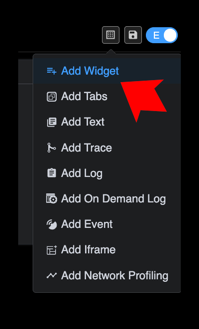
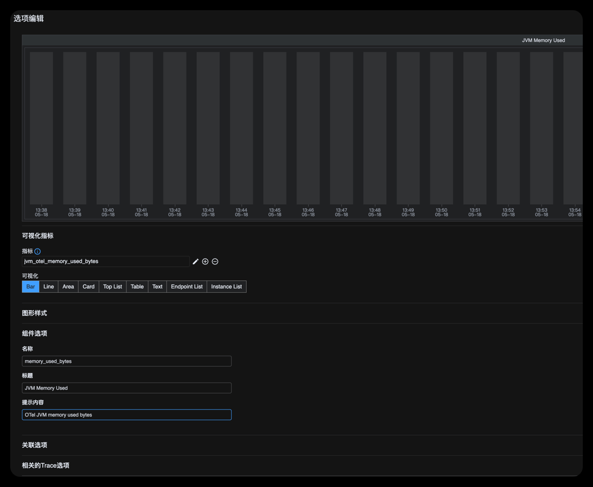
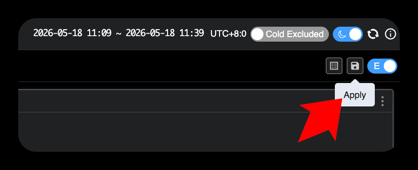
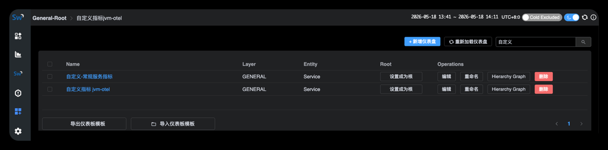
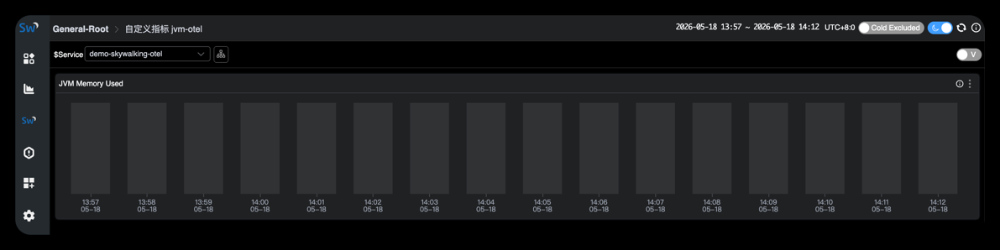
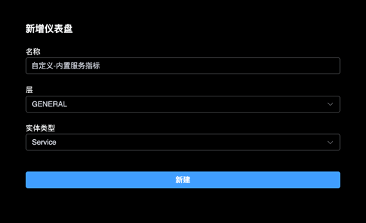
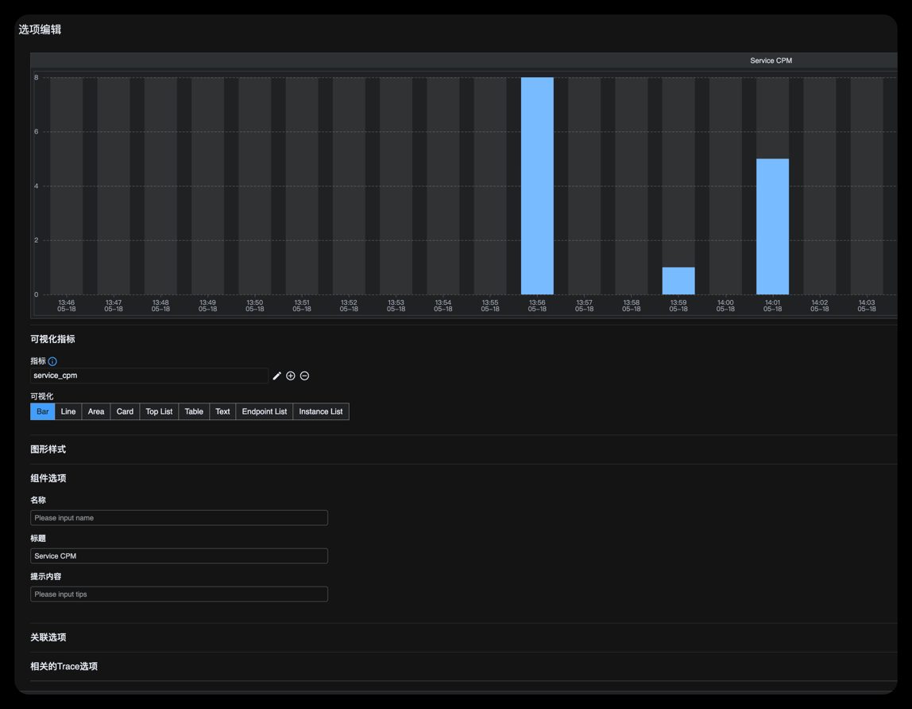
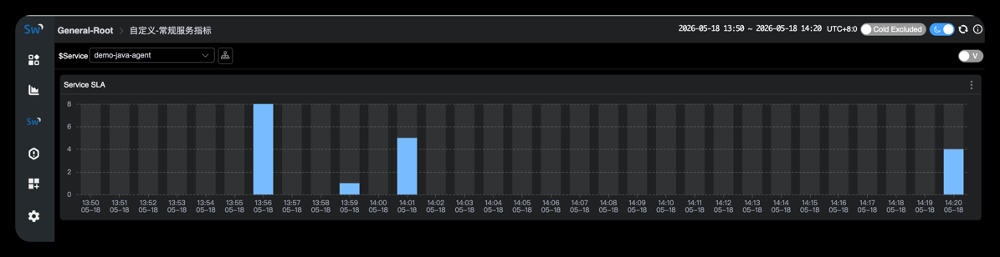
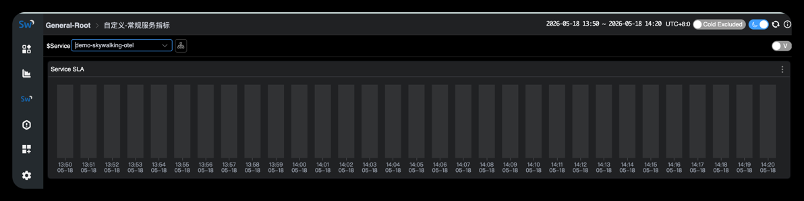

# Apache SkyWalking 10.4.0

分布式系统的应用程序性能监控工具，特别为微服务、云原生和基于容器(Kubernetes)架构设计。

- 官网：https://skywalking.apache.org/
- github：https://github.com/apache/skywalking
- 文档：https://skywalking.apache.org/docs/
- OpenTelemetry：https://opentelemetry.io/zh/

##### 当前方案

这是一个偏 **低内存** 的 `10.4.0` 单机部署方案，并额外集成了 `OTel Collector` 作为统一接入入口：

- 存储使用 `BanyanDB`，不再引入 `Elasticsearch`
- 当前 `BanyanDB` 镜像版本使用 `0.10.1`
- OAP 堆内存先压到 `512m`
- OTel 数据统一先进入 `OTel Collector`，再转发到 `SkyWalking OAP`
- 第一版同时打通 `OTel traces / metrics / logs`
- BanyanDB 写入并发和 shard 数量做了保守配置
- 适合本地测试、PoC、小流量环境

如果你的机器内存比较紧张，这套通常会比 `Elasticsearch` 方案更省内存；如果你的目标是验证异构语言统一通过 `OTLP` 接入 SkyWalking，这套也比纯原生 agent 方案更贴近后续标准化演进方向。

### 一、运行说明

#### 启动

```bash
# 启动
docker compose up -d

# 停止并删除容器、网络
docker compose down
```

#### 访问

- SkyWalking UI: http://127.0.0.1:18080
- Zipkin Trace UI: http://127.0.0.1:18080/zipkin
- OAP HealthCheck: http://127.0.0.1:12800/healthcheck
- OTel Collector gRPC: 127.0.0.1:4317
- OTel Collector HTTP: 127.0.0.1:4318
- OTel Collector HealthCheck: http://127.0.0.1:13133
- OAP gRPC: 127.0.0.1:11800

### 二、推荐接入链路

```text
App -> OTel Collector(4317/4318) -> SkyWalking OAP(11800/12800) -> BanyanDB -> SkyWalking UI
```

#### Java 标准接入

下载`opentelemetry-javaagent.jar` https://github.com/open-telemetry/opentelemetry-java-instrumentation/releases
eg: https://github.com/open-telemetry/opentelemetry-java-instrumentation/releases/download/v2.27.0/opentelemetry-javaagent.jar

###### 方式1：otel

JVM 参数：

```shell
-javaagent:/data/opentelemetry-javaagent.jar
-Dotel.service.name=demo-skywalking-otel
-Dotel.resource.attributes=deployment.environment=dev,service.namespace=default
-Dotel.traces.exporter=otlp
-Dotel.metrics.exporter=otlp
-Dotel.logs.exporter=otlp
-Dotel.exporter.otlp.protocol=grpc
-Dotel.exporter.otlp.endpoint=http://127.0.0.1:4317
-Dotel.metric.export.interval=10000
```

补充说明：

- `JVM runtime metrics` 例如 CPU、内存、GC、线程，`opentelemetry-javaagent.jar` 默认就会采集，不需要额外增加 `otel.jmx.target.system`。
- `otel.jmx.target.system` / `otel.jmx.config` 只用于采集 Tomcat、Jetty 或自定义 MBean 这类 JMX 指标。

###### 方式2：otel+prometheus 收集指标

JVM 参数：

```shell
-javaagent:/data/opentelemetry-javaagent.jar
-Dotel.service.name=demo-skywalking-otel
-Dotel.resource.attributes=deployment.environment=dev,service.namespace=default
-Dotel.traces.exporter=otlp
-Dotel.logs.exporter=otlp
-Dotel.metrics.exporter=prometheus
-Dotel.exporter.otlp.protocol=grpc
-Dotel.exporter.otlp.endpoint=http://127.0.0.1:4317
-Dotel.exporter.prometheus.host=0.0.0.0
-Dotel.exporter.prometheus.port=9464
-Dotel.metric.export.interval=10000
```

验证

1. 启动服务后，先确认 `http://127.0.0.1:12800/healthcheck` 返回 `200 OK`
2. 再确认 `http://127.0.0.1:13133` 返回 `Server available`
3. 启动应用并访问几次业务接口，例如 `http://127.0.0.1/time`
4. 打开 `http://127.0.0.1:18080/zipkin`，优先确认能按服务名查看 OTel traces
5. 打开 SkyWalking UI，确认服务、OTel metrics 与应用日志都能按服务维度查看
6. 不要优先用 `General-Service -> Trace` 作为 OTel traces 的验证入口；该页面更偏 SkyWalking 原生 trace 模型，OTel traces 当前优先以 `/zipkin` 作为验证入口

说明

- 当前 OAP 显式保留 SkyWalking 官方默认的 `enabledOtelMetricsRules`，并额外追加了自定义规则 `jvm-otel`。
- `vm` 是 Linux / node-exporter 的主机监控规则，不是 Java `JVM runtime metrics` 规则，不能把它当作 OTel Java JVM 面板开关使用。
- 继续走 OTel 时，可以在 SkyWalking 中看服务、实例、Endpoint、日志以及 OTel metrics，但不要期待它和 SkyWalking 原生 Java Agent 的 `JVM` 页完全等价。
- 如果后续要展示业务自定义 metrics，通常还需要继续补充 OAP 侧 otel-rules，而不是只改 Collector。
- 这套目录当前采用的是 `OTel Agent/SDK -> OTel Collector -> SkyWalking OAP` 标准 OTLP 方案。
- OAP 的 `9090` PromQL 端口当前先不对宿主机暴露，避免与独立 Prometheus 的 `9090` 冲突；如需验证 SkyWalking PromQL，再手动取消 compose 里的端口注释。
- `13133` 端口用于 OTel Collector 的 health_check 扩展，便于排查 Collector 是否真正 ready。
- OAP 当前已开启 `SW_ENABLE_UPDATE_UI_TEMPLATE=true`，允许在 SkyWalking 页面里创建并保存自定义仪表盘；该能力由后端控制，不是 `ui` 容器单独控制。
- 在 SkyWalking 中，OTel traces 会转换为 Zipkin trace 模型，因此正确查看入口是 UI 的 `/zipkin` 或 Zipkin Trace 相关菜单，而不是 `General-Service -> Trace` 原生页。
- SkyWalking 原生 UI 中的 `General-Service -> Trace` 更适合 SkyWalking 原生 agent / trace 模型；如果你的目标是直接在原生 Trace 页查看链路，应改用 SkyWalking 原生 agent 探针方式接入。
- 日志与指标仍然通过 SkyWalking 自身的 Log / Metrics 页面查看，不受 Zipkin Trace UI 入口影响。

---

##### 结论：

- SkyWalking 原生 agent 更适合在 SkyWalking 原生页面看链路
- OTel 也能看链路，但在 SkyWalking 里通常走的是 Zipkin/Lens 这套查询入口。https://skywalking.apache.org/docs/main/v10.4.0/en/setup/backend/otlp-trace/

即分为2步查看数据
- 看链路：http://127.0.0.1:18080/zipkin
- 看日志：SkyWalking 原来的 Log 页面


### 三、otel 服务指标说明

skywalking中无法展示相关服务指标


可以通过 [Grafana+Prometheus](../../prometheus/v3.11.2-prometheus-grafana-otel) 去查看指标
eg: `jvm_memory_used_by`


可在 Grafana 以下 Dashboard ID 查看数据
JMX Overview (OpenTelemetry): [`17582`](https://grafana.com/grafana/dashboards/17582-jmx-overview-opentelemetry/)


### 四、自定义 JVM OTel 规则

当前目录新增了一份最小可落地的 OTel MAL 规则：[otel-rules/jvm-otel.yaml](otel-rules/jvm-otel.yaml)

它会把以下 OTel Java runtime metrics 接入 SkyWalking OAP 的 meter system：

- `jvm_memory_used_bytes`
- `jvm_thread_count`
- `jvm_class_count`
- `jvm_cpu_recent_utilization_ratio`

说明：

- 这版规则的目标是“让 OAP 能识别并保存核心 JVM OTel 指标”，不是强行补齐 SkyWalking 原生 `JVM` 页。
- `jvm-otel.yaml` 当前使用的是 `metricPrefix + metricsRules` 这套 MAL 顶层结构，和 OAP 10.4.0 实际加载 `otel-rules` 的格式保持一致。
- `docker-compose.yml` 只挂载单个 `jvm-otel.yaml` 文件到 `/skywalking/config/otel-rules/`，不能把整个本地 `otel-rules` 目录直接覆盖到容器里，否则会把 OAP 内置官方规则一并覆盖掉，导致启动失败。
- 第一版规则当前先按 `service.name -> service` 维度映射，优先验证 OTel JVM 指标是否被 OAP 正常命中；不要先按 `Service Instance` 建仪表盘。
- 修改规则后，需要重启 OAP 才会重新加载。

#### 新建仪表盘 -- 验证指标是否可以正常查看

##### 验证1 -- jvm内存占用指标

新建一个 GENERAL + Service 类型的仪表盘


右上角开启编辑模式，添加图表


右上角编辑图表
- 指标：`jvm_otel_memory_used_bytes`
- 可视化：`Bar`

组件选项：
- 名称：memory_used_bytes
- 标题：JVM Memory Used
- 提示内容：OTel JVM memory used bytes




应用 & 保存仪表盘

重新加载仪表盘 & 查看


无数据


##### 验证2 -- SkyWalking内置服务指标 `service_cpm`

新建一个 GENERAL + Service 的仪表盘


指标：service_cpm
标题：Service CPM

> 从这里也可以看出如果有数据的话，在编辑时就能预览数据。



保存后，查看数据



验证结论：
1. otel方式无法在 skywalking ui 中查看指标数据
2. agent方式正常查看
