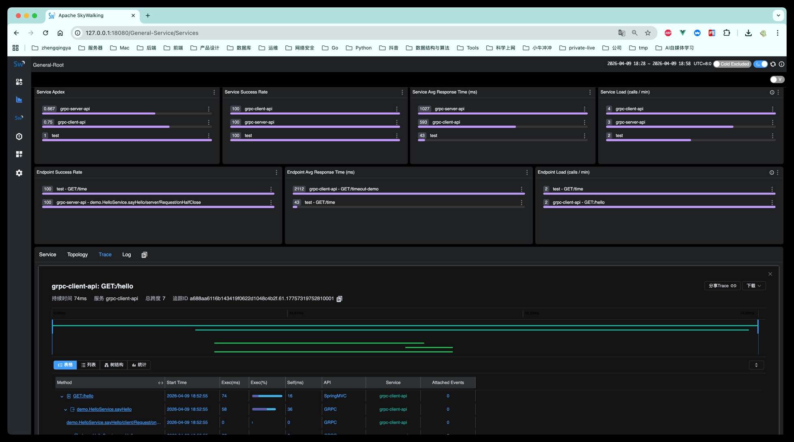

# Apache SkyWalking 10.4.0

分布式系统的应用程序性能监控工具，特别为微服务、云原生和基于容器(Kubernetes)架构设计。

- https://github.com/apache/skywalking
- https://skywalking.apache.org

### 当前方案

这是一个偏 **低内存** 的 `10.4.0` 单机部署方案：

- 存储使用 `BanyanDB`，不再引入 `Elasticsearch`
- 当前 `BanyanDB` 镜像版本使用 `0.10.1`
- OAP 堆内存先压到 `512m`
- BanyanDB 写入并发和 shard 数量做了保守配置
- 适合本地测试、PoC、小流量环境

如果你的机器内存比较紧张，这套通常会比 `Elasticsearch` 方案更省内存。

### 部署

```shell
# 运行
docker compose -f docker-compose.yml -p skywalking up -d

# 停止
docker compose -f docker-compose.yml -p skywalking stop
# 停止 & 删除容器 & 删除网络
docker compose -f docker-compose.yml -p skywalking down
```

访问 [http://127.0.0.1:18080](http://127.0.0.1:18080)

### Java 项目配置

下载 `Java Agent` https://skywalking.apache.org/downloads/

> eg: https://dlcdn.apache.org/skywalking/java-agent/9.6.0/apache-skywalking-java-agent-9.6.0.tgz

说明：

- 当前 SkyWalking 后端使用的是 `10.4.0`
- `Java Agent` 采用独立版本线，官网当前最新稳定版是 `9.6.0`
- 也就是说，这里不是下载 `10.4.0` 的 agent 包，而是下载与当前官方发行对应的 `9.6.0` Java Agent

示例 JVM 参数：

```shell
-javaagent:/data/skywalking-agent/skywalking-agent.jar
-Dskywalking.agent.service_name=test
-Dskywalking.collector.backend_service=127.0.0.1:11800
```

项目跑起来之后调用下接口，就可以去SkyWalking中查看拓扑图，追踪等信息了...



