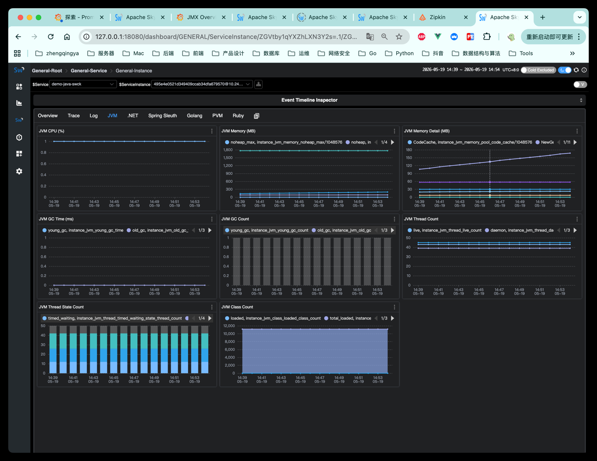

### 验证 k8s 中的 Java Pod 通过 SWCK 自动注入 SkyWalking Java Agent，并主动上报到 OAP。

https://skywalking.apache.org/docs/skywalking-swck/latest/operator/

k8s 安装 SWCK 的标准顺序：

1. 安装 cert-manager
2. 安装 SWCK Operator
3. 检查 CRD + webhook + controller
4. 给 namespace 打 swck-injection=enabled
5. 给 Deployment 打 swck-java-agent-injected: "true"

```shell
# 1、先确认目前环境是否有 cert-manager
kubectl get pods -A | grep cert-manager
# 删除旧版本
# kubectl delete namespace cert-manager


# 2、安装 cert-manager   https://cert-manager.io/docs/installation/
# 最新版本
# kubectl apply -f https://github.com/cert-manager/cert-manager/releases/latest/download/cert-manager.yaml
# 指定版本
kubectl apply -f https://github.com/cert-manager/cert-manager/releases/download/v1.20.2/cert-manager.yaml

# 验证：等待 pod 都 Running
kubectl get pods -n cert-manager
# NAME                                      READY   STATUS    RESTARTS   AGE
# cert-manager-68756bcf6f-4r2h9             1/1     Running   0          31s
# cert-manager-cainjector-c664cf9b8-xsflq   1/1     Running   0          31s
# cert-manager-webhook-5749c6dc95-lkwvx     1/1     Running   0          31s


# 3、安装 SWCK Operator   https://github.com/apache/skywalking-swck
# 删除旧版本
# kubectl delete namespace skywalking-swck-system
# 最新版本
# kubectl apply -k "github.com/apache/skywalking-swck/operator/config/default"
# 指定版本
kubectl apply -k "github.com/apache/skywalking-swck/operator/config/default?ref=v0.9.0"

# 验证：
kubectl get pods -A | grep -i skywalking
kubectl get mutatingwebhookconfigurations | grep -i skywalking
kubectl get crd | grep -i skywalking

# 【问题】如果出现如下：
# skywalking-swck-system   skywalking-swck-controller-manager-7d4cd47988-ng55v   0/2     ContainerCreating   0          84s
# 排查看下是那个镜像拉不下来
kubectl describe pod -n skywalking-swck-system skywalking-swck-controller-manager-7d4cd47988-ng55v
# Events:
#   Type     Reason     Age                    From               Message
#   ----     ------     ----                   ----               -------
#   Normal   Scheduled  6m55s                  default-scheduler  Successfully assigned skywalking-swck-system/skywalking-swck-controller-manager-7d4cd47988-ng55v to desktop-control-plane
#   Normal   Pulling    6m54s                  kubelet            Pulling image "apache/skywalking-swck:v0.8.0"
#   Normal   Pulled     5m20s                  kubelet            Successfully pulled image "apache/skywalking-swck:v0.8.0" in 1m34.841s (1m34.841s including waiting). Image size: 26221772 bytes.
#   Normal   Created    5m20s                  kubelet            Container created
#   Normal   Started    5m19s                  kubelet            Container started
#   Normal   Pulling    2m13s (x5 over 5m19s)  kubelet            Pulling image "gcr.io/kubebuilder/kube-rbac-proxy:v0.8.0"
#   Warning  Failed     2m12s (x5 over 5m17s)  kubelet            Failed to pull image "gcr.io/kubebuilder/kube-rbac-proxy:v0.8.0": rpc error: code = NotFound desc = failed to pull and unpack image "gcr.io/kubebuilder/kube-rbac-proxy:v0.8.0": failed to resolve reference "gcr.io/kubebuilder/kube-rbac-proxy:v0.8.0": gcr.io/kubebuilder/kube-rbac-proxy:v0.8.0: not found
#   Warning  Failed     2m12s (x5 over 5m17s)  kubelet            Error: ErrImagePull
#   Normal   BackOff    66s (x17 over 5m16s)   kubelet            Back-off pulling image "gcr.io/kubebuilder/kube-rbac-proxy:v0.8.0"
#   Warning  Failed     14s (x21 over 5m16s)   kubelet            Error: ImagePullBackOff

# 【解决】将 gcr.io/kubebuilder/kube-rbac-proxy:v0.8.0 镜像替换为 kubebuilder/kube-rbac-proxy:v0.8.0
# 先导出清单，再改镜像，再 apply
kubectl kustomize "github.com/apache/skywalking-swck/operator/config/default?ref=v0.9.0" > swck-operator-v0.9.0.yaml
sed -i '' 's#gcr.io/kubebuilder/kube-rbac-proxy:v0.8.0#kubebuilder/kube-rbac-proxy:v0.8.0#g' swck-operator-v0.9.0.yaml
kubectl apply -f swck-operator-v0.9.0.yaml
# 查看状态
kubectl get pods -n skywalking-swck-system -w
# NAME                                                  READY   STATUS              RESTARTS   AGE
# skywalking-swck-controller-manager-6fd75884ff-kmz4v   0/2     ContainerCreating   0          13s
# skywalking-swck-controller-manager-6fd75884ff-kmz4v   1/2     Running             0          17s
# skywalking-swck-controller-manager-6fd75884ff-kmz4v   2/2     Running             0          17s


# 4、开启命名空间注入
# 等 SWCK 装好后，给你的目标命名空间打标签（eg：zq）  -- 如果已经打过，会提示 not labeled 或 configured，都没问题
kubectl label namespace zq swck-injection=enabled
# 确认标签生效
kubectl get namespace zq --show-labels
# NAME   STATUS   AGE   LABELS
# zq     Active   18h   kubernetes.io/metadata.name=zq,swck-injection=enabled


# 5、然后再给具体 Java Deployment 的 Pod 模板加标签
spec:
  template:
    metadata:
      labels:
        swck-java-agent-injected: "true" # 开启当前 Pod 的自动注入
      annotations:
        agent.skywalking.apache.org/collector.backend_service: "host.docker.internal:11800"  # 指定 OAP 上报地址 todo 改成自己的宿主机ip
        agent.skywalking.apache.org/agent.service_name: "demo-java-swck" # 指定 SkyWalking 中显示的服务名


# 6、验证pod自动注入 & 上报oap
# 删除
# kubectl delete -f demo-java-swck.yaml
# 部署
kubectl apply -f demo-java-swck.yaml

# 查看
kubectl get pods -n zq
# NAME                              READY   STATUS    RESTARTS   AGE
# demo-java-swck-79d969f4d5-pn87w   1/1     Running   0          36s
kubectl get svc -n zq
# NAME             TYPE           CLUSTER-IP      EXTERNAL-IP   PORT(S)           AGE
# demo-java-swck   LoadBalancer   10.96.144.115   172.19.0.5    30080:32640/TCP   9m13s

# 访问服务接口
curl http://127.0.0.1:30080/hello
# {"message":"hello, skywalking","service":"demo-java-agent"}


# NodePort 方式在 mac上可能会出现如下情况。tips: 现在已经修改为LoadBalancer方式，本地能正常访问，下面部分不用管...
# curl: (7) Failed to connect to 127.0.0.1 port 30080 after 0 ms: Couldn't connect to server
# 如果访问不了，可通过如下端口转发方式
# kubectl port-forward -n zq svc/demo-java-swck 30081:8080
# Forwarding from 127.0.0.1:30081 -> 666
# Forwarding from [::1]:30081 -> 666
# Handling connection for 30081
# curl http://127.0.0.1:30081/hello
# {"message":"hello, skywalking","service":"demo-java-agent"}
```



