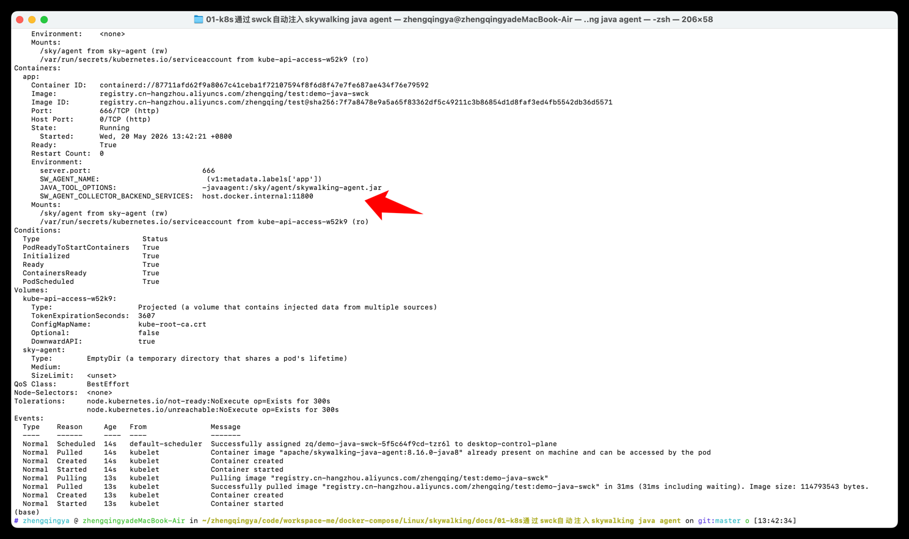

### 验证 k8s 中的 Java Pod 通过 SWCK 自动注入 SkyWalking Java Agent，并主动上报到 OAP。

https://skywalking.apache.org/docs/skywalking-swck/latest/operator/

k8s 安装 SWCK 的标准顺序：

1. 安装 cert-manager
2. 安装 SWCK Operator
3. 检查 CRD + webhook + controller
4. 给 namespace 打 swck-injection=enabled
5. 给 Deployment 打 swck-java-agent-injected: "true"

本示例提供两种方式：

- `Deployment annotations`：在业务 Deployment 中直接写 OAP 地址和服务名，适合单个服务快速验证。
- `SwAgent`：用 `swagent.yaml` 统一维护 Agent 镜像和 OAP 地址，业务 Deployment 只保留注入标签和服务名，推荐多服务或长期维护时使用。

### 一、前置组件安装

#### 1、安装 cert-manager

```shell
# 先确认目前环境是否有 cert-manager
kubectl get pods -A | grep cert-manager
# 删除旧版本
# kubectl delete namespace cert-manager


# 安装 cert-manager   https://cert-manager.io/docs/installation/
# 最新版本
# kubectl apply -f https://github.com/cert-manager/cert-manager/releases/latest/download/cert-manager.yaml
# 指定版本
kubectl apply -f https://github.com/cert-manager/cert-manager/releases/download/v1.20.2/cert-manager.yaml

# 验证：等待 pod 都 Running
kubectl get pods -n cert-manager
# NAME                                      READY   STATUS    RESTARTS   AGE
# cert-manager-68756bcf6f-4r2h9             1/1     Running   0          31s
# cert-manager-cainjector-c664cf9b8-xsflq   1/1     Running   0          31s
# cert-manager-webhook-5749c6dc95-lkwvx     1/1     Running   0          31s
```

#### 2、安装 SWCK Operator

```shell
# 安装 SWCK Operator   https://github.com/apache/skywalking-swck
# 删除旧版本
# kubectl delete namespace skywalking-swck-system
# 最新版本
# kubectl apply -k "github.com/apache/skywalking-swck/operator/config/default"
# 指定版本
kubectl apply -k "github.com/apache/skywalking-swck/operator/config/default?ref=v0.9.0"

# 验证：
kubectl get pods -A | grep -i skywalking
kubectl get mutatingwebhookconfigurations | grep -i skywalking
kubectl get crd | grep -i skywalking

# 【问题】如果出现如下：
# skywalking-swck-system   skywalking-swck-controller-manager-7d4cd47988-ng55v   0/2     ContainerCreating   0          84s
# 排查看下是那个镜像拉不下来
kubectl describe pod -n skywalking-swck-system skywalking-swck-controller-manager-7d4cd47988-ng55v
# Events:
#   Type     Reason     Age                    From               Message
#   ----     ------     ----                   ----               -------
#   Normal   Scheduled  6m55s                  default-scheduler  Successfully assigned skywalking-swck-system/skywalking-swck-controller-manager-7d4cd47988-ng55v to desktop-control-plane
#   Normal   Pulling    6m54s                  kubelet            Pulling image "apache/skywalking-swck:v0.8.0"
#   Normal   Pulled     5m20s                  kubelet            Successfully pulled image "apache/skywalking-swck:v0.8.0" in 1m34.841s (1m34.841s including waiting). Image size: 26221772 bytes.
#   Normal   Created    5m20s                  kubelet            Container created
#   Normal   Started    5m19s                  kubelet            Container started
#   Normal   Pulling    2m13s (x5 over 5m19s)  kubelet            Pulling image "gcr.io/kubebuilder/kube-rbac-proxy:v0.8.0"
#   Warning  Failed     2m12s (x5 over 5m17s)  kubelet            Failed to pull image "gcr.io/kubebuilder/kube-rbac-proxy:v0.8.0": rpc error: code = NotFound desc = failed to pull and unpack image "gcr.io/kubebuilder/kube-rbac-proxy:v0.8.0": failed to resolve reference "gcr.io/kubebuilder/kube-rbac-proxy:v0.8.0": gcr.io/kubebuilder/kube-rbac-proxy:v0.8.0: not found
#   Warning  Failed     2m12s (x5 over 5m17s)  kubelet            Error: ErrImagePull
#   Normal   BackOff    66s (x17 over 5m16s)   kubelet            Back-off pulling image "gcr.io/kubebuilder/kube-rbac-proxy:v0.8.0"
#   Warning  Failed     14s (x21 over 5m16s)   kubelet            Error: ImagePullBackOff

# 【解决】将 gcr.io/kubebuilder/kube-rbac-proxy:v0.8.0 镜像替换为 kubebuilder/kube-rbac-proxy:v0.8.0
# 先导出清单，再改镜像，再 apply
kubectl kustomize "github.com/apache/skywalking-swck/operator/config/default?ref=v0.9.0" > swck-operator-v0.9.0.yaml
sed -i '' 's#gcr.io/kubebuilder/kube-rbac-proxy:v0.8.0#kubebuilder/kube-rbac-proxy:v0.8.0#g' swck-operator-v0.9.0.yaml
kubectl apply -f swck-operator-v0.9.0.yaml
# 查看状态
kubectl get pods -n skywalking-swck-system -w
# NAME                                                  READY   STATUS              RESTARTS   AGE
# skywalking-swck-controller-manager-6fd75884ff-kmz4v   0/2     ContainerCreating   0          13s
# skywalking-swck-controller-manager-6fd75884ff-kmz4v   1/2     Running             0          17s
# skywalking-swck-controller-manager-6fd75884ff-kmz4v   2/2     Running             0          17s
```

#### 3、开启命名空间注入

```shell
# 开启命名空间注入
# 等 SWCK 装好后，给你的目标命名空间打标签（eg：zq）  -- 如果已经打过，会提示 not labeled 或 configured，都没问题
kubectl label namespace zq swck-injection=enabled
# 确认标签生效
kubectl get namespace zq --show-labels
# NAME   STATUS   AGE   LABELS
# zq     Active   18h   kubernetes.io/metadata.name=zq,swck-injection=enabled
```

### 二、Deployment annotations 方式

```shell
# 然后再给具体 Java Deployment 的 Pod 模板加标签
spec:
  template:
    metadata:
      labels:
        swck-java-agent-injected: "true" # 开启当前 Pod 的自动注入
      annotations:
        agent.skywalking.apache.org/collector.backend_service: "host.docker.internal:11800"  # 指定 OAP 上报地址 todo 改成自己的宿主机ip
        agent.skywalking.apache.org/agent.service_name: "demo-java-swck" # 指定 SkyWalking 中显示的服务名


# 验证 pod 自动注入 & 上报 OAP
# 删除
# kubectl delete -f demo-java-swck.yaml
# 部署
kubectl apply -f demo-java-swck.yaml

# 查看
kubectl get pods -n zq
# NAME                              READY   STATUS    RESTARTS   AGE
# demo-java-swck-79d969f4d5-pn87w   1/1     Running   0          36s
kubectl get svc -n zq
# NAME             TYPE           CLUSTER-IP      EXTERNAL-IP   PORT(S)           AGE
# demo-java-swck   LoadBalancer   10.96.144.115   172.19.0.5    30080:32640/TCP   9m13s

# 访问服务接口
curl http://127.0.0.1:30080/hello
# {"message":"hello, skywalking","service":"demo-java-agent"}


# NodePort 方式在 mac上可能会出现如下情况。tips: 现在已经修改为LoadBalancer方式，本地能正常访问，下面部分不用管...
# curl: (7) Failed to connect to 127.0.0.1 port 30080 after 0 ms: Couldn't connect to server
# 如果访问不了，可通过如下端口转发方式
# kubectl port-forward -n zq svc/demo-java-swck 30081:8080
# Forwarding from 127.0.0.1:30081 -> 666
# Forwarding from [::1]:30081 -> 666
# Handling connection for 30081
# curl http://127.0.0.1:30081/hello
# {"message":"hello, skywalking","service":"demo-java-agent"}
```


### 三、SwAgent 方式

[`demo-java-swck.yaml`](./demo-java-swck.yaml) 是直接在业务 Deployment 中通过 annotations 配置 OAP 地址和服务名。

如果不想在每份业务 Deployment 中重复维护 OAP 地址，可以使用 `SwAgent` 集中管理通用 agent 配置：

- `swagent.yaml`：统一配置 SkyWalking Java Agent 镜像和 OAP 上报地址。
- [`demo-java-swck-swagent.yaml`](./demo-java-swck-swagent.yaml)：业务 Deployment 只保留 `swck-java-agent-injected: "true"`，并通过 Downward API 从 `app` 标签动态生成 `SW_AGENT_NAME`。

```shell
# 部署 SwAgent 统一配置
kubectl apply -f swagent.yaml

# 部署使用 SwAgent 的业务服务
kubectl apply -f demo-java-swck-swagent.yaml
# kubectl delete -f demo-java-swck-swagent.yaml


# 验证 Pod 环境变量中是否存在 SkyWalking agent 配置
kubectl get po -n zq                                     
# NAME                             READY   STATUS    RESTARTS   AGE
# demo-java-swck-5f5c64f9cd-tzr6l   1/1     Running   0          96m
kubectl describe pod -n zq -l app=demo-java-swck
# Name:             demo-java-swck-5f5c64f9cd-tzr6l
# Namespace:        zq
# Priority:         0
# Service Account:  default
# Node:             desktop-control-plane/172.19.0.4
# Start Time:       Wed, 20 May 2026 13:42:20 +0800
# Labels:           app=demo-java-swck
#                   pod-template-hash=5f5c64f9cd
#                   swck-java-agent-injected=true
# Annotations:      sidecar.skywalking.apache.org/succeed: true
#                   swck-java-agent-injected: true
# Status:           Running
# IP:               10.244.0.13
# IPs:
#   IP:           10.244.0.13
# Controlled By:  ReplicaSet/demo-java-swck-5f5c64f9cd
# Init Containers:
#   inject-skywalking-agent:
#     Container ID:  containerd://a881efe55120cb014e9137f35c4a013fe1936a30cb55d662b893f685a38e5df3
#     Image:         apache/skywalking-java-agent:8.16.0-java8
#     Image ID:      docker.io/apache/skywalking-java-agent@sha256:0ebed9ce9b989aaed10d12271b411cc550b58f596a391b1980dc07e77d2cd535
#     Port:          <none>
#     Host Port:     <none>
#     Command:
#       sh
#     Args:
#       -c
#       mkdir -p /sky/agent && cp -r /skywalking/agent/* /sky/agent
#     State:          Terminated
#       Reason:       Completed
#       Exit Code:    0
#       Started:      Wed, 20 May 2026 13:42:20 +0800
#       Finished:     Wed, 20 May 2026 13:42:20 +0800
#     Ready:          True
#     Restart Count:  0
#     Environment:    <none>
#     Mounts:
#       /sky/agent from sky-agent (rw)
#       /var/run/secrets/kubernetes.io/serviceaccount from kube-api-access-w52k9 (ro)
# Containers:
#   app:
#     Container ID:   containerd://87711afd62f9a8067c41ceba1f72107594f8f6d8f47e7fe687ae434f76e79592
#     Image:          registry.cn-hangzhou.aliyuncs.com/zhengqing/test:demo-java-swck
#     Image ID:       registry.cn-hangzhou.aliyuncs.com/zhengqing/test@sha256:7f7a8478e9a5a65f83362df5c49211c3b86854d1d8faf3ed4fb5542db36d5571
#     Port:           666/TCP (http)
#     Host Port:      0/TCP (http)
#     State:          Running
#       Started:      Wed, 20 May 2026 13:42:21 +0800
#     Ready:          True
#     Restart Count:  0
#     Environment:
#       server.port:                          666
#       SW_AGENT_NAME:                         (v1:metadata.labels['app'])
#       JAVA_TOOL_OPTIONS:                    -javaagent:/sky/agent/skywalking-agent.jar
#       SW_AGENT_COLLECTOR_BACKEND_SERVICES:  host.docker.internal:11800
#     Mounts:
#       /sky/agent from sky-agent (rw)
#       /var/run/secrets/kubernetes.io/serviceaccount from kube-api-access-w52k9 (ro)
# Conditions:
#   Type                        Status
#   PodReadyToStartContainers   True 
#   Initialized                 True 
#   Ready                       True 
#   ContainersReady             True 
#   PodScheduled                True 
# Volumes:
#   kube-api-access-w52k9:
#     Type:                    Projected (a volume that contains injected data from multiple sources)
#     TokenExpirationSeconds:  3607
#     ConfigMapName:           kube-root-ca.crt
#     Optional:                false
#     DownwardAPI:             true
#   sky-agent:
#     Type:        EmptyDir (a temporary directory that shares a pod's lifetime)
#     Medium:      
#     SizeLimit:   <unset>
# QoS Class:       BestEffort
# Node-Selectors:  <none>
# Tolerations:     node.kubernetes.io/not-ready:NoExecute op=Exists for 300s
#                  node.kubernetes.io/unreachable:NoExecute op=Exists for 300s
# Events:
#   Type    Reason     Age   From               Message
#   ----    ------     ----  ----               -------
#   Normal  Scheduled  14s   default-scheduler  Successfully assigned zq/demo-java-swck-5f5c64f9cd-tzr6l to desktop-control-plane
#   Normal  Pulled     14s   kubelet            Container image "apache/skywalking-java-agent:8.16.0-java8" already present on machine and can be accessed by the pod
#   Normal  Created    14s   kubelet            Container created
#   Normal  Started    14s   kubelet            Container started
#   Normal  Pulling    13s   kubelet            Pulling image "registry.cn-hangzhou.aliyuncs.com/zhengqing/test:demo-java-swck"
#   Normal  Pulled     13s   kubelet            Successfully pulled image "registry.cn-hangzhou.aliyuncs.com/zhengqing/test:demo-java-swck" in 31ms (31ms including waiting). Image size: 114793543 bytes.
#   Normal  Created    13s   kubelet            Container created
#   Normal  Started    13s   kubelet            Container started


# 访问服务接口
curl http://127.0.0.1:30080/hello
# {"message":"hello, skywalking","service":"demo-java-agent"}
```

SWCK + Java Agent Injector 生效判断



###### `demo-java-swck-swagent.yaml` 中的关键配置：

```yaml
labels:
  app: demo-java-swck
  swck-java-agent-injected: "true"
```

```yaml
env:
  - name: SW_AGENT_NAME
    valueFrom:
      fieldRef:
        fieldPath: metadata.labels['app']
```

这样 SkyWalking 中显示的服务名会跟随 `app` 标签变化。比如 `app: demo-java-swck` 会生成 `SW_AGENT_NAME=demo-java-swck`。
