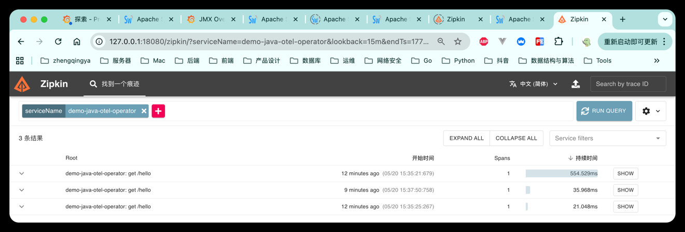

# k8s 通过 OpenTelemetry Operator 自动注入验证 OTel 快速接入

本目录用于验证：

```text
K8s Java Pod
  -> OpenTelemetry Operator 自动注入 opentelemetry-javaagent
  -> host.docker.internal:4317
  -> 宿主机 Docker 中的 OTel Collector
  -> SkyWalking OAP
```

### 1、安装 cert-manager

```shell
# 安装 cert-manager   https://cert-manager.io/docs/installation/
# 最新版本
# kubectl apply -f https://github.com/cert-manager/cert-manager/releases/latest/download/cert-manager.yaml
# 指定版本
kubectl apply -f https://github.com/cert-manager/cert-manager/releases/download/v1.20.2/cert-manager.yaml

# 验证：等待 pod 都 Running
kubectl get pods -n cert-manager
# NAME                                      READY   STATUS    RESTARTS   AGE
# cert-manager-68756bcf6f-4r2h9             1/1     Running   0          31s
# cert-manager-cainjector-c664cf9b8-xsflq   1/1     Running   0          31s
# cert-manager-webhook-5749c6dc95-lkwvx     1/1     Running   0          31s
```

### 2、安装 OpenTelemetry Operator

前提：集群中已经安装 `cert-manager`。

```shell
# 安装 OpenTelemetry Operator
kubectl apply -f https://github.com/open-telemetry/opentelemetry-operator/releases/latest/download/opentelemetry-operator.yaml

# 验证 Operator 状态
kubectl get pods -n opentelemetry-operator-system
kubectl get crd | grep -i opentelemetry
kubectl get mutatingwebhookconfigurations | grep -i opentelemetry
```

### 3、部署自动注入配置

`instrumentation-java-otel.yaml` 负责统一配置 OTel Java Agent：

- `exporter.endpoint`：OTel Collector 地址。
- `OTEL_SERVICE_NAME`：通过 Downward API 从 Pod 的 `app` 标签动态获取。
- `OTEL_TRACES_EXPORTER` / `OTEL_METRICS_EXPORTER` / `OTEL_LOGS_EXPORTER`：统一使用 `otlp`。

```shell
kubectl apply -f instrumentation-java-otel.yaml
```

### 4、部署 Java 示例服务

`demo-java-otel-operator.yaml` 使用新的服务名，避免和 SWCK 示例混在一起：

- Deployment：`demo-java-otel-operator`
- Service：`demo-java-otel-operator`
- OTel 服务名：`demo-java-otel-operator`

```shell
kubectl apply -f demo-java-otel-operator.yaml
# kubectl delete -f demo-java-otel-operator.yaml
```

### 5、验证注入是否生效

```shell
kubectl get pods -n zq
kubectl describe pod -n zq <pod-name>
```

重点看业务容器环境变量中是否出现：

```text
JAVA_TOOL_OPTIONS
OTEL_SERVICE_NAME=demo-java-otel-operator
OTEL_EXPORTER_OTLP_ENDPOINT=http://host.docker.internal:4317
```

### 6、请求接口

```shell
curl http://127.0.0.1:30082/hello
```

如果本地 `LoadBalancer` 访问不稳定，可以使用端口转发：

```shell
kubectl port-forward -n zq svc/demo-java-otel-operator 30083:30082
curl http://127.0.0.1:30083/hello
```

### 7、SkyWalking 中查看

OTel 方式接入后，优先查看：

- `http://127.0.0.1:18080/zipkin`
- SkyWalking 常规服务中的 `demo-java-otel-operator`

JVM / Runtime Metrics 建议继续使用 Prometheus + Grafana 查看。


