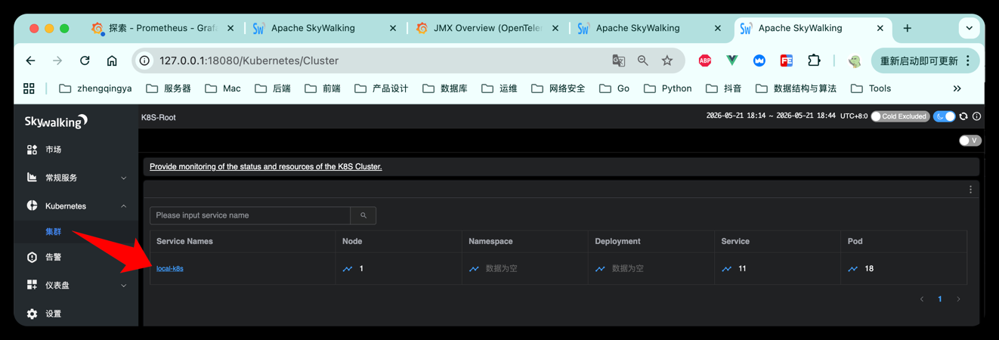
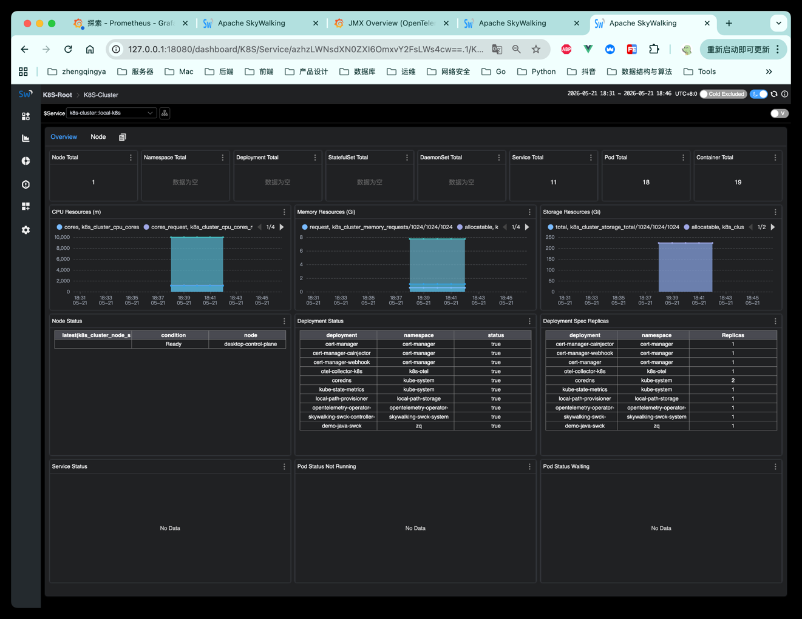
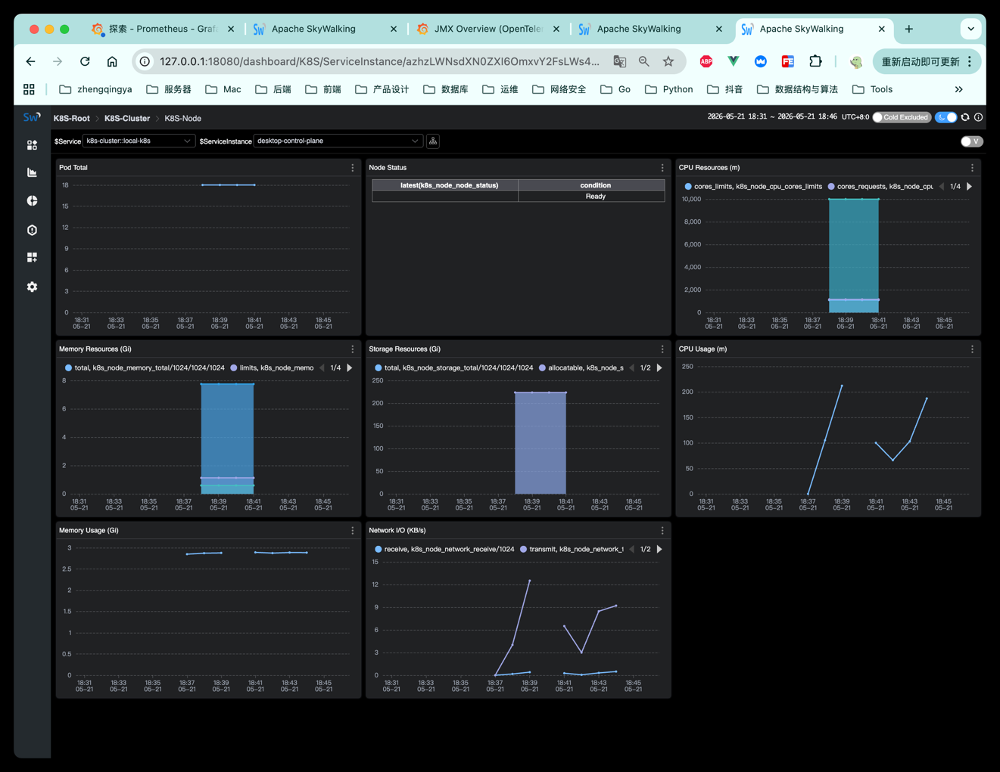
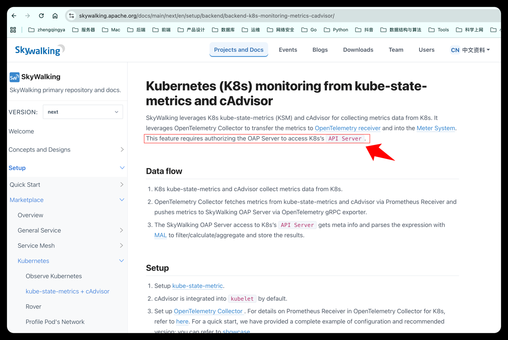

# K8s Monitoring 接入 SkyWalking

https://skywalking.apache.org/docs/main/next/en/setup/backend/backend-k8s-monitoring/

> 注：docker部署的oap不要尝试，通过k8s部署oap后再尝试。

本次要在 K8s 中部署 `kube-state-metrics` 和 `otel-collector`，在不修改业务 Pod 的前提下采集 K8s 基础资源指标，并通过现有 Docker 部署的 OTel Collector 上报到 SkyWalking。

当前方案用于验证 SkyWalking 的 Kubernetes Monitoring，也就是集群、节点、Namespace、Deployment、Service、Pod 等资源监控；它不等同于业务 APM 链路监控。业务接口耗时、Trace、调用链仍然需要 Java Agent / OTel Agent 接入。

### 1、验证目标

本目录用于验证不改业务 Pod 的 K8s 基础指标采集：

```text
kube-state-metrics
  + kubelet cAdvisor
  -> K8s 内 otel-collector
  -> host.docker.internal:4317
  -> 宿主机 Docker 中的 OTel Collector
  -> SkyWalking OAP
```

Collector 会采集两类指标：

- `kube-state-metrics`：Namespace、Pod、Deployment、Service 等对象状态指标。
- `kubelet cAdvisor`：Node / Pod / Container 的 CPU、内存、网络等运行资源指标。

### 2、前置条件

宿主机 Docker 中的 [SkyWalking OTel](../../10.4.0-banyandb-lite-otel) 部署需要已经启动，并暴露 OTel Collector：

```text
host.docker.internal:4317
```

SkyWalking OAP 需要开启 OTel metrics receiver，并启用 `k8s/*` 规则。

注意：官方文档中完整 K8s Monitoring 还要求 OAP 能访问 K8s API Server 获取元数据。当前 OAP 是 Docker 部署在 K8s 外部，能看到基础聚合数据；如果要完整展示 K8s Service / Node / Pod 明细，推荐后续把 OAP 部署到 K8s 内并绑定 RBAC，或者为 Docker OAP 单独配置访问 K8s API Server 的能力。

### 3、部署 kube-state-metrics

如果集群中还没有 `kube-state-metrics`，先安装：

```shell
kubectl apply -k https://github.com/kubernetes/kube-state-metrics/examples/standard
# kubectl delete -k https://github.com/kubernetes/kube-state-metrics/examples/standard
```

验证：

```shell
kubectl get pods -A | grep kube-state-metrics
kubectl get svc -A | grep kube-state-metrics
```

当前 `otel-collector-k8s.yaml` 使用 `kubernetes_sd_configs` 自动发现 `kube-state-metrics`，不再写死单个 Service 地址。它会匹配下面这个 Service 标签：

```text
app.kubernetes.io/name=kube-state-metrics
```

官方 `examples/standard` 安装方式默认会带这个标签。

### 4、部署 K8s OTel Collector

```shell
kubectl apply -f namespace.yaml
kubectl apply -f otel-collector-k8s.yaml
# kubectl delete -f otel-collector-k8s.yaml
```

查看状态：

```shell
kubectl get pods -n k8s-otel
# kubectl describe pod -n k8s-otel otel-collector-k8s-f87f97bcf-2dqqp
kubectl logs -n k8s-otel deploy/otel-collector-k8s
```

正常日志中应该能看到：

```text
Scrape job added ... jobName="kube-state-metrics"
Scrape job added ... jobName="kubernetes-cadvisor"
Everything is ready. Begin running and processing data.
```

### 5、验证 host.docker.internal 连通性

如果 Collector 日志显示无法导出到 `host.docker.internal:4317`，可以先在集群内启动临时容器验证宿主机 OTel Collector 是否可达：

```shell
kubectl run tmp-curl -n k8s-otel --rm -it --image=curlimages/curl -- sh
```

进入容器后测试 HTTP 端口：

```shell
curl http://host.docker.internal:4318
# 404 page not found
nc -vz host.docker.internal 4317
# host.docker.internal (192.168.65.254:4317) open
```

`4317` 是 OTLP/gRPC 端口，不适合直接用 curl 验证；如果 `4318` 可达，通常说明 Pod 到宿主机网络是通的。

### 6、SkyWalking 中查看

进入 SkyWalking UI：`Kubernetes` -> `集群`

```text
http://127.0.0.1:18080
```

能看到 `Node`、`Namespace`、`Deployment`、`Service`、`Pod` 等数据，说明 K8s Monitoring 已经有数据进入 SkyWalking。






如果只看到部分数据，通常排查： 
Docker 部署的 OAP 是否能访问 K8s API Server。完整 K8s 元数据关联依赖这一步。

如果oap无法访问k8s api server，会报如下问题：访问 K8s API 时 TLS 握手失败。

```shell
retagByK8sMeta('service', K8sRetagType.Pod2Service, 'pod', 'namespace')
KubernetesClientException: get Pod zq/demo-java-swck-...
SSLHandshakeException: Remote host terminated the handshake
```

官方文档里要求：This feature requires authorizing the OAP Server to access K8s’s API Server.


