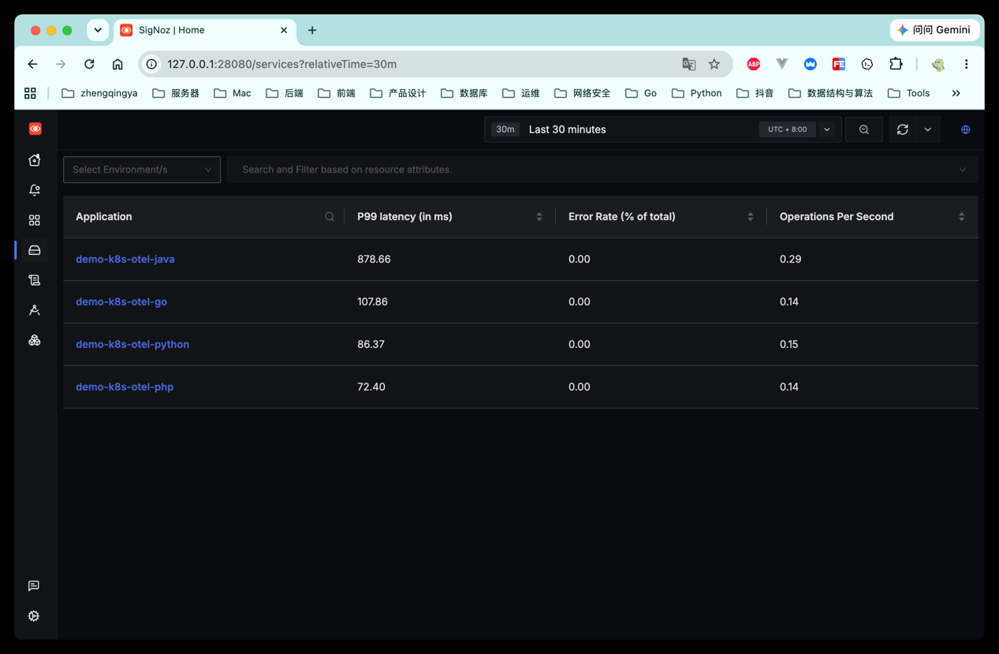
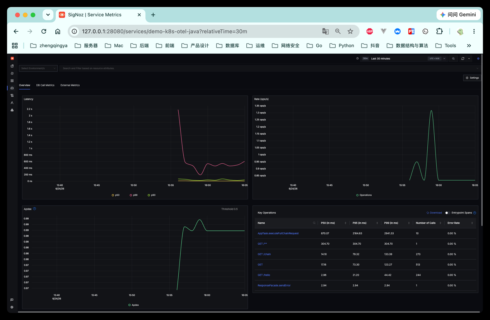
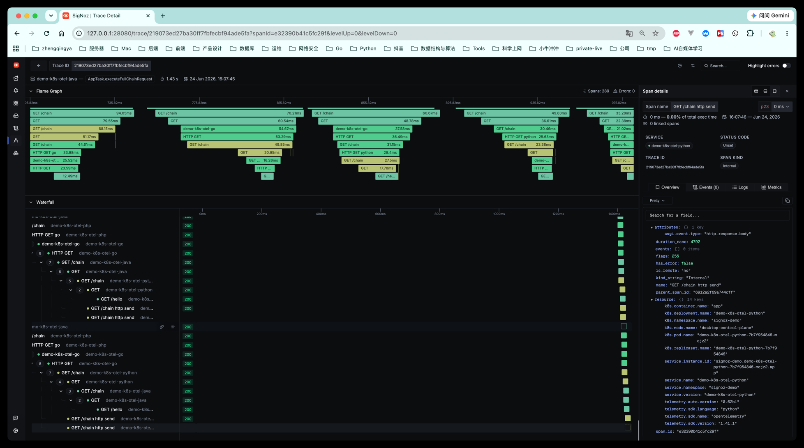
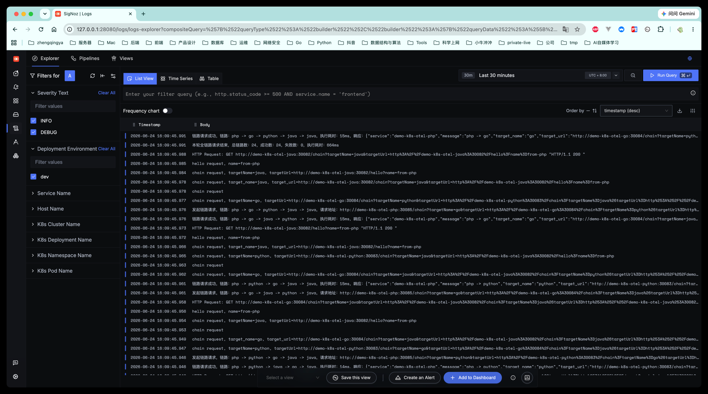

# SigNoz 0.129.0 K8s 异构 APM 验证

本目录用于在 Docker Desktop Kubernetes 中独立部署：

- SigNoz `0.129.0`
- SigNoz OTel Collector
- ClickHouse
- ZooKeeper
- Java / Python / Go / PHP OpenTelemetry 示例服务

这套环境不依赖 SkyWalking，也不会向 SkyWalking 双写数据。

## 一、架构

```text
Java / Python / Go / PHP
  -> SigNoz OTel Collector(4317/4318)
  -> ClickHouse
  -> SigNoz UI(28080)
```

命名空间：

```text
signoz       SigNoz、Collector、ClickHouse、ZooKeeper
signoz-demo  Java、Python、Go、PHP 示例服务
```

## 二、前置条件

### 1、检查 Kubernetes 和 Helm

```shell
kubectl config current-context
kubectl get nodes
kubectl get storageclass
helm version --short
```

预期：

- Kubernetes context 为 `docker-desktop`。
- 默认 StorageClass 为 `standard`。
- Helm 版本为 `v3.18.0` 或兼容版本。
- Docker Desktop 建议分配至少 `6 CPU / 8GB` 内存。

### 2、检查 cert-manager

本环境使用 cert-manager `v1.20.2`：

```shell
kubectl get pods -n cert-manager
```

未安装时执行：

```shell
kubectl apply -f https://github.com/cert-manager/cert-manager/releases/download/v1.20.2/cert-manager.yaml
kubectl get pods -n cert-manager -w
```

### 3、检查 OpenTelemetry Operator

本环境使用 OpenTelemetry Operator `v0.151.0`：

```shell
kubectl get pods -n opentelemetry-operator-system
kubectl get crd | grep -i opentelemetry
```

未安装时执行：

```shell
kubectl apply -f https://github.com/open-telemetry/opentelemetry-operator/releases/download/v0.151.0/opentelemetry-operator.yaml
kubectl get pods -n opentelemetry-operator-system -w
```

## 三、部署 SigNoz

### 1、添加 Helm 仓库

```shell
helm repo add signoz https://charts.signoz.io
helm repo update signoz
```

### 2、部署固定版本

```shell
helm upgrade --install signoz signoz/signoz \
  --namespace signoz \
  --create-namespace \
  --version 0.129.0 \
  --values values.yaml \
  --wait \
  --timeout 15m
```

部署后按以下顺序观察和排查：

```shell
# 1. 持续观察 Pod 的启动状态，按 Ctrl+C 退出
kubectl get pods -n signoz -w

# 2. 查看 namespace 中最近发生的事件，快速定位调度、镜像、存储和健康检查问题
kubectl get events -n signoz --sort-by=.lastTimestamp | tail -30

# 3. 深入查看具体 Pod 的容器状态、镜像、环境变量、挂载和事件
kubectl describe pod -n signoz <pod-name>

# 4. 容器已经启动过时，查看应用内部的运行日志
kubectl logs -n signoz <pod-name>
```

首次部署需要拉取多个镜像并初始化 ClickHouse，等待时间通常比普通应用长。

### 3、暴露 SigNoz UI

官方 Chart 内部 Service 保持 `8080`，额外使用 LoadBalancer 将宿主机访问端口映射为 `28080`：

```shell
kubectl apply -f signoz-ui.yaml
```

### 4、查看状态

```shell
helm list -n signoz
kubectl get pods -n signoz
kubectl get svc -n signoz
kubectl get pvc -n signoz
```

等待所有常驻 Pod 进入 `Running`，初始化 Job 进入 `Completed`。

## 四、访问 SigNoz

SigNoz UI：

```text
http://127.0.0.1:28080
```

Docker Desktop 的 `LoadBalancer` 通常将 `EXTERNAL-IP` 显示为 `localhost`。如果无法直接访问，先查看：

```shell
kubectl get svc signoz -n signoz
```

备用端口转发：

```shell
kubectl port-forward -n signoz svc/signoz-ui 28080:28080
```

健康检查：

```shell
curl http://127.0.0.1:28080/api/v1/health
```

## 五、部署异构 Demo

### 1、一键部署

```shell
kubectl apply -f namespace.yaml
kubectl apply -f instrumentation-java.yaml
kubectl apply -f instrumentation-python.yaml
kubectl apply -f demo-k8s-otel-java.yaml
kubectl apply -f demo-k8s-otel-python.yaml
kubectl apply -f demo-k8s-otel-go.yaml
kubectl apply -f demo-k8s-otel-php.yaml
```

### 2、查看状态

```shell
kubectl get instrumentation -n signoz-demo
kubectl get pods -n signoz-demo -o wide
kubectl get svc -n signoz-demo
```

确认 Java、Python Pod 已被 Operator 注入：

```shell
kubectl describe pod -n signoz-demo -l app=demo-k8s-otel-java
kubectl describe pod -n signoz-demo -l app=demo-k8s-otel-python
```

### 3、一键重启

```shell
kubectl rollout restart deployment/demo-k8s-otel-java -n signoz-demo
kubectl rollout restart deployment/demo-k8s-otel-python -n signoz-demo
kubectl rollout restart deployment/demo-k8s-otel-go -n signoz-demo
kubectl rollout restart deployment/demo-k8s-otel-php -n signoz-demo
```

## 六、应用地址

```text
Java:   http://127.0.0.1:30082
Python: http://127.0.0.1:30083
Go:     http://127.0.0.1:30084
PHP:    http://127.0.0.1:30085
```

集群内 Collector：

```text
OTLP gRPC: signoz-otel-collector.signoz.svc.cluster.local:4317
OTLP HTTP: http://signoz-otel-collector.signoz.svc.cluster.local:4318
```

宿主机应用临时接入时执行：

```shell
kubectl port-forward -n signoz svc/signoz-otel-collector 4317:4317 4318:4318
```

宿主机应用随后使用：

```text
OTLP gRPC: http://127.0.0.1:4317
OTLP HTTP: http://127.0.0.1:4318
```

## 七、生成链路数据

### 1、单服务请求

```shell
curl "http://127.0.0.1:30082/hello?name=java"
curl "http://127.0.0.1:30083/hello?name=python"
curl "http://127.0.0.1:30084/hello?name=go"
curl "http://127.0.0.1:30085/hello?name=php"
```

### 2、双服务链路

```shell
curl "http://127.0.0.1:30082/chain?targetName=python&targetUrl=http://demo-k8s-otel-python:30083/hello?name=from-java"
curl "http://127.0.0.1:30083/chain?targetName=go&targetUrl=http://demo-k8s-otel-go:30084/hello?name=from-python"
curl "http://127.0.0.1:30084/chain?targetName=php&targetUrl=http://demo-k8s-otel-php:30085/hello?name=from-go"
curl "http://127.0.0.1:30085/chain?targetName=java&targetUrl=http://demo-k8s-otel-java:30082/hello?name=from-php"
```

### 3、四语言嵌套链路

Java -> Python -> Go -> PHP -> Java

```shell
curl -s "http://127.0.0.1:30082/chain?targetName=python&targetUrl=http%3A%2F%2Fdemo-k8s-otel-python%3A30083%2Fchain%3FtargetName%3Dgo%26targetUrl%3Dhttp%253A%252F%252Fdemo-k8s-otel-go%253A30084%252Fchain%253FtargetName%253Dphp%2526targetUrl%253Dhttp%25253A%25252F%25252Fdemo-k8s-otel-php%25253A30085%25252Fchain%25253FtargetName%25253Djava%252526targetUrl%25253Dhttp%2525253A%2525252F%2525252Fdemo-k8s-otel-java%2525253A30082%2525252Fhello%2525253Fname%2525253Dfrom-php"
```

### 4、生成接口统计数据

连续请求用于形成吞吐量和 P95/P99 数据：

```shell
for i in {1..30}; do
  curl -s "http://127.0.0.1:30082/chain?targetName=python&targetUrl=http://demo-k8s-otel-python:30083/hello?name=load-$i" >/dev/null
done
```

## 八、SigNoz APM 验证

访问：

```text
http://127.0.0.1:28080
```

### 1、Services

进入 `APM -> Services`，确认出现：

- `demo-k8s-otel-java`
- `demo-k8s-otel-python`
- `demo-k8s-otel-go`
- `demo-k8s-otel-php`

查看各服务的请求量、错误率和延迟。



### 2、Operations

进入服务详情的 `Operations`：

- 确认 `/hello`、`/chain` 等接口已聚合。
- 按 P95、P99 或平均耗时降序查看慢接口。
- 点击 operation 下钻对应 traces。



### 3、Traces

进入 `Traces`：

- 按 `service.name`、operation、duration 或 HTTP 状态码筛选。
- 按耗时降序查看慢链路。
- 打开四语言嵌套 trace，确认上下游 span 使用同一个 trace id。




### 4、Logs

进入 `Logs`：

- 按 `service.name` 筛选四个 Demo。
- 从 trace 详情下钻日志，检查 trace id 和 span id 关联。
- 如果日志已上报但无法关联，检查应用日志是否包含 OTel trace 上下文。




## 九、排查

### 1、查看 SigNoz 日志

```shell
kubectl logs -n signoz statefulset/signoz --tail=200
kubectl logs -n signoz deployment/signoz-otel-collector --tail=200
kubectl get pods -n signoz | grep clickhouse
kubectl logs -n signoz <clickhouse-pod-name> --tail=200
```

实际资源名不一致时先执行：

```shell
kubectl get deploy,statefulset -n signoz
```

### 2、查看 Demo 日志

```shell
kubectl logs -n signoz-demo deploy/demo-k8s-otel-java --tail=100
kubectl logs -n signoz-demo deploy/demo-k8s-otel-python --tail=100
kubectl logs -n signoz-demo deploy/demo-k8s-otel-go -c app --tail=100
kubectl logs -n signoz-demo deploy/demo-k8s-otel-php -c app --tail=100
```

### 3、Collector 连通性

```shell
kubectl get endpoints -n signoz signoz-otel-collector
kubectl get svc -n signoz signoz-otel-collector
```

如果服务没有出现在 SigNoz，优先检查：

- Demo Pod 是否正常运行。
- Java、Python 自动注入是否成功。
- Collector Service 是否开放 `4317/4318`。
- Demo 环境变量是否指向 `signoz-otel-collector.signoz.svc.cluster.local`。
- Collector 日志中是否存在 OTLP 接收或 ClickHouse 写入错误。

## 十、清理

### 1、删除 Demo

```shell
kubectl delete -f demo-k8s-otel-php.yaml
kubectl delete -f demo-k8s-otel-go.yaml
kubectl delete -f demo-k8s-otel-python.yaml
kubectl delete -f demo-k8s-otel-java.yaml
kubectl delete -f instrumentation-python.yaml
kubectl delete -f instrumentation-java.yaml
kubectl delete -f namespace.yaml
```

### 2、卸载 SigNoz 并检查 PVC

```shell
kubectl delete -f signoz-ui.yaml
helm uninstall signoz -n signoz
kubectl get pvc -n signoz
```

是否保留 PVC 以实际查询结果为准；需要保留数据时不要删除 `signoz` namespace。

### 3、彻底删除 SigNoz 和数据

以下命令会删除 ClickHouse 和 SigNoz PVC 中的全部数据：

```shell
kubectl delete -f signoz-ui.yaml --ignore-not-found
helm uninstall signoz -n signoz --ignore-not-found
kubectl delete namespace signoz
```
