# 手动配置飞书 ERROR 日志告警示例

配置效果：
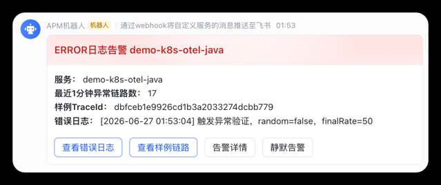

```shell
10s 评估一次
查询最近 1 分钟 ERROR
按 service_name + trace_id + error_message 聚合
发飞书通知
```

配置步骤简述：

1. `Contact point`：配置飞书 Webhook 接收方和消息卡片模板，决定飞书最终收到什么内容、按钮跳转到哪里。
2. `Alert rule`：配置 Loki 查询和触发条件，决定什么样的 ERROR 日志会变成 Grafana 告警。
3. `Notification policy`：配置告警路由、聚合和重复提醒频率，决定哪些告警发到飞书以及多久发一次。
4. `验证`：通过 Java Demo 主动制造 ERROR 日志，确认 Loki、Grafana 告警和飞书推送链路全部打通。


### 一、配置 Contact point

Alerting -> Notification configuration -> Contact points -> New contact point

```text
Name: 测试推送-feishu
Integration: Webhook
URL: 飞书群机器人 Webhook 地址
HTTP Method: POST
Disable resolved message: 开启
```

`Custom Payload` 选择 `Enter custom payload template`，填入：

```gotemplate
{{- $first := index .Alerts.Firing 0 -}}
{{- $serviceName := index .CommonLabels "service_name" -}}
{{- $traceId := index $first.Labels "trace_id" -}}
{{- $errorMessage := index $first.Labels "error_message" -}}
{{- if not $errorMessage -}}{{- $errorMessage = "无" -}}{{- end -}}
{{- $logUrl := printf "http://127.0.0.1:30080/explore?schemaVersion=1&panes=%%7B%%22errorLogs%%22%%3A%%7B%%22datasource%%22%%3A%%22loki%%22%%2C%%22queries%%22%%3A%%5B%%7B%%22refId%%22%%3A%%22A%%22%%2C%%22datasource%%22%%3A%%7B%%22type%%22%%3A%%22loki%%22%%2C%%22uid%%22%%3A%%22loki%%22%%7D%%2C%%22editorMode%%22%%3A%%22code%%22%%2C%%22expr%%22%%3A%%22%%7Bservice_name%%3D%%5C%%22%s%%5C%%22%%7D%%20%%7C%%20detected_level%%20%%3D%%20%%5C%%22ERROR%%5C%%22%%20%%7C%%20trace_id%%20%%3D%%20%%5C%%22%s%%5C%%22%%22%%7D%%5D%%2C%%22range%%22%%3A%%7B%%22from%%22%%3A%%22now-5m%%22%%2C%%22to%%22%%3A%%22now%%22%%7D%%7D%%7D&orgId=1" $serviceName $traceId -}}
{{- $traceUrl := printf "http://127.0.0.1:30080/explore?schemaVersion=1&panes=%%7B%%22trace%%22%%3A%%7B%%22datasource%%22%%3A%%22tempo%%22%%2C%%22queries%%22%%3A%%5B%%7B%%22refId%%22%%3A%%22A%%22%%2C%%22datasource%%22%%3A%%7B%%22type%%22%%3A%%22tempo%%22%%2C%%22uid%%22%%3A%%22tempo%%22%%7D%%2C%%22query%%22%%3A%%22%s%%22%%2C%%22queryType%%22%%3A%%22traceql%%22%%7D%%5D%%2C%%22range%%22%%3A%%7B%%22from%%22%%3A%%22now-5m%%22%%2C%%22to%%22%%3A%%22now%%22%%7D%%7D%%7D&orgId=1" $traceId -}}
{{ coll.Dict
  "msg_type" "interactive"
  "card" (coll.Dict
    "config" (coll.Dict "wide_screen_mode" true)
    "header" (coll.Dict
      "template" "red"
      "title" (coll.Dict "tag" "plain_text" "content" (printf "ERROR日志告警 %s" $serviceName))
    )
    "elements" (coll.Slice
      (coll.Dict
        "tag" "div"
        "text" (coll.Dict
          "tag" "lark_md"
          "content" (printf "**服务：** %s\n**最近1分钟异常链路数：** %d\n**样例TraceId：** %s\n**错误日志：** %s" $serviceName (len .Alerts.Firing) $traceId $errorMessage)
        )
      )
      (coll.Dict
        "tag" "action"
        "actions" (coll.Slice
          (coll.Dict "tag" "button" "type" "primary" "text" (coll.Dict "tag" "plain_text" "content" "查看错误日志") "url" $logUrl)
          (coll.Dict "tag" "button" "type" "primary" "text" (coll.Dict "tag" "plain_text" "content" "查看样例链路") "url" $traceUrl)
          (coll.Dict "tag" "button" "text" (coll.Dict "tag" "plain_text" "content" "告警详情") "url" $first.GeneratorURL)
          (coll.Dict "tag" "button" "text" (coll.Dict "tag" "plain_text" "content" "静默告警") "url" $first.SilenceURL)
        )
      )
    )
  )
| data.ToJSON }}
```

Save contact point

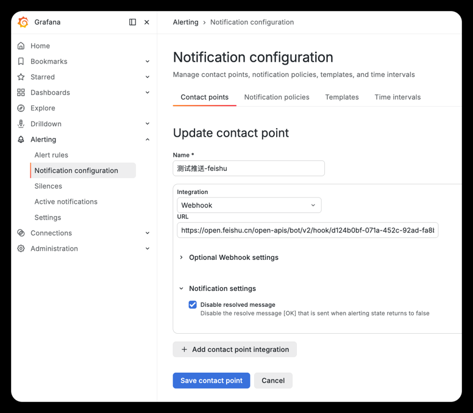
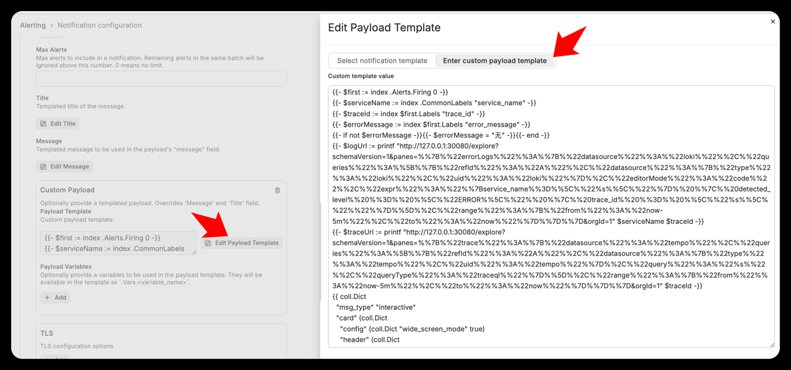


### 二、配置 Alert rule

Alerting -> Alert rules -> New alert rule

#### 1. Enter alert rule name

ERROR日志聚合告警

#### 2. Define query and alert condition

查询选择 `Loki`，查询类型选择 `Instant`。

说明：

1. `Loki`：从日志库中查询应用上报的 OTel 日志，本规则基于 ERROR 日志触发告警。
2. `Instant`：每次评估只取当前时刻的查询结果，适合告警规则判断是否立即满足触发条件。

LogQL：返回 最近 1 分钟内，每个服务、每条 Trace、每类错误日志出现了多少条 ERROR 日志

```logql
sum by (service_name, trace_id, error_message) (
  count_over_time({service_name=~"demo-k8s-otel-.*"} | detected_level = "ERROR" | trace_id != "" | regexp `(?P<error_message>.{1,120}).*` [1m])
)
```

告警条件：`WHEN QUERY A IS ABOVE 0`

> 当查询 A 的结果大于 0 时，触发告警。

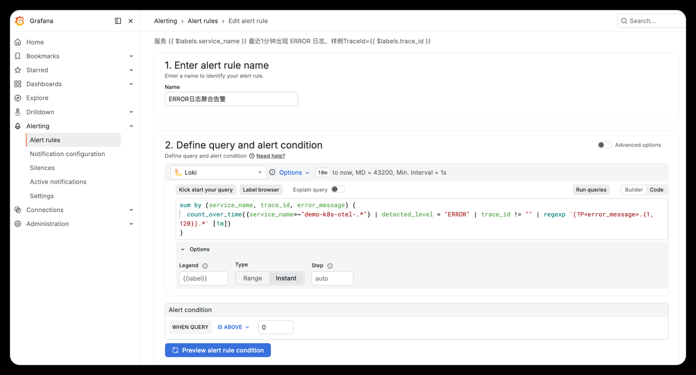

#### 3. Add folder and labels

1. New folder: OTel告警
2. Labels：
  ```text
  source = loki
  type = error_log
  severity = P2
  ```

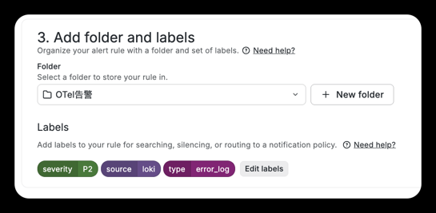

作用：

1. `Folder`：用于在 Grafana 中归类管理告警规则，方便后续查找和维护。
2. `Labels`：用于标识告警来源、类型和级别，也可被 Notification policy 用来匹配路由到飞书。

#### 4. Set evaluation behavior

```shell
Evaluation group name: otel-error-log-10s
Evaluation interval: 10s      # 控制 Grafana 多久执行一次 LogQL 查询，间隔越短，发现 ERROR 日志越快。
Pending period: None          # 控制条件满足后是否等待一段时间再触发告警，选择 `None` 表示立即触发。
Keep firing for: None         # 控制条件恢复后告警继续保持 Firing 的时间，选择 `None` 表示恢复后立即回到正常。
No data: Normal               # 控制查不到数据时的告警状态，`Normal` 表示没有 ERROR 日志时保持正常。
Error: Keep Last State        # 控制查询报错或超时时的告警状态，`Keep Last State` 表示保持上一次状态，避免数据源短暂抖动导致误告警。
```

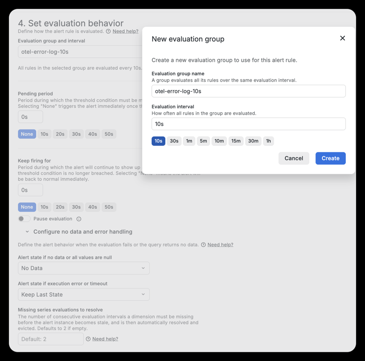

#### 5. Configure notifications

作用：配置当前告警规则触发后直接通知哪个 Contact point。这里选择 `测试推送-feishu`，表示该规则进入 Firing 后会交给飞书 Webhook 发送。

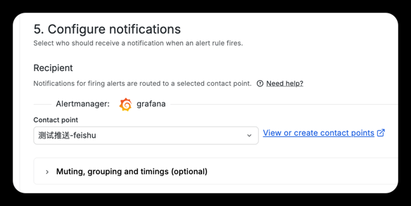

#### 6. Configure notification message

作用：配置告警摘要和描述信息，用于 Grafana 告警详情、通知内容上下文和排查说明。
这里通过 `$labels.service_name`、`$labels.trace_id` 引用 LogQL 聚合出来的服务名和 TraceId。

```text
summary = 服务 {{ $labels.service_name }} 最近1分钟出现 ERROR 日志，样例TraceId={{ $labels.trace_id }}
description = 最近1分钟检测到 ERROR 日志，请进入 Loki 查询日志或通过样例 TraceId 跳转 Tempo 链路。
```

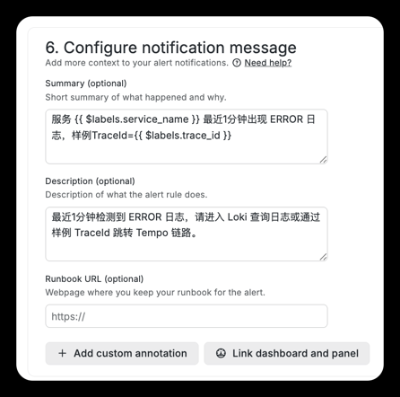

Save

### 三、配置 Notification policy

Alerting -> Notification configuration -> Notification policies

> 作用：配置告警通知路由和聚合策略，决定哪些告警发给哪个 Contact point，以及同一类告警如何合并、多久重复提醒一次。这里用于把 ERROR 日志告警路由到飞书，并控制推送频率，避免短时间内大量错误日志刷屏。

New notification policy：

```text
Contact point: 测试推送-feishu     # 指定告警最终发送到哪个联络点，这里发送到飞书 Webhook。

Group by:
  grafana_folder              # 按 Grafana 告警目录分组，避免不同目录的规则混在一起。
  alertname                   # 按告警名称分组，避免不同告警规则混在一起。
  service_name                # 按服务名分组，同一服务的 ERROR 日志会聚合到同一条通知。
  trace_id                    # 按 TraceId 分组，每条异常链路单独推送，适合实时验证；验证后可删除以减少刷屏。

Group wait: 5s                # 新告警组出现后等待多久发送第一条通知，时间越短推送越及时。
Group interval: 30s           # 同一告警组已有通知后，组内有新变化时至少间隔多久再发送更新通知。
Repeat interval: 1m           # 告警一直未恢复且没有新变化时，多久重复提醒一次。
```

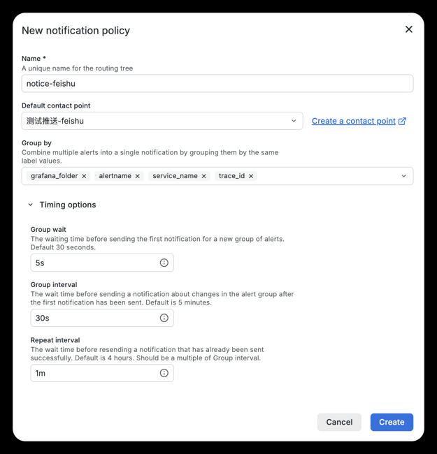
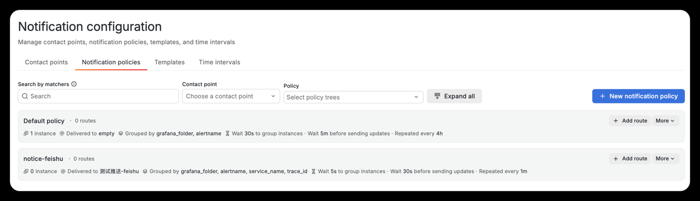

### 四、验证

触发真实 ERROR 日志：

```shell
curl "http://127.0.0.1:30082/error?random=false"
```

确认 Loki 有数据：

```logql
{service_name=~"demo-k8s-otel-.*"} | detected_level = "ERROR" | trace_id != ""
```

查看飞书消息
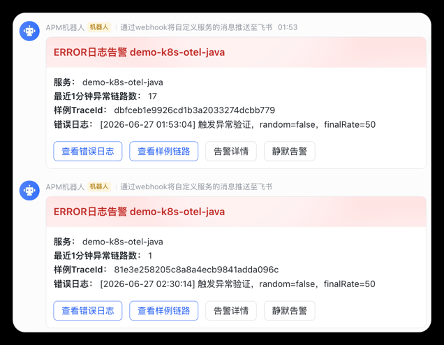
