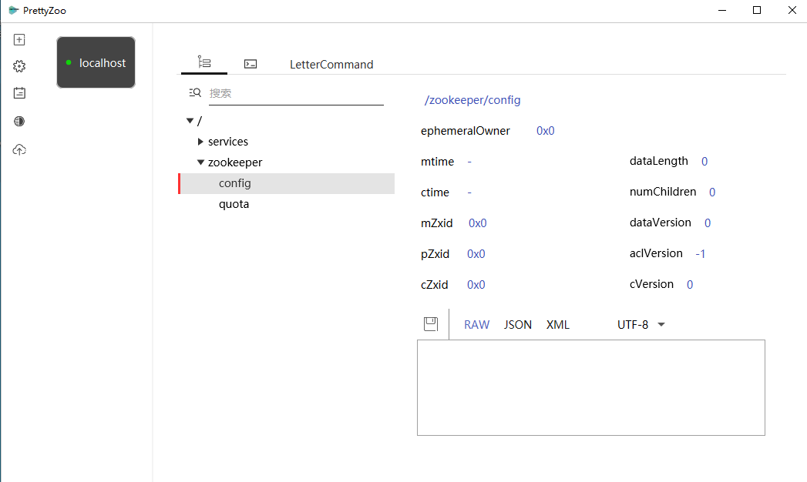
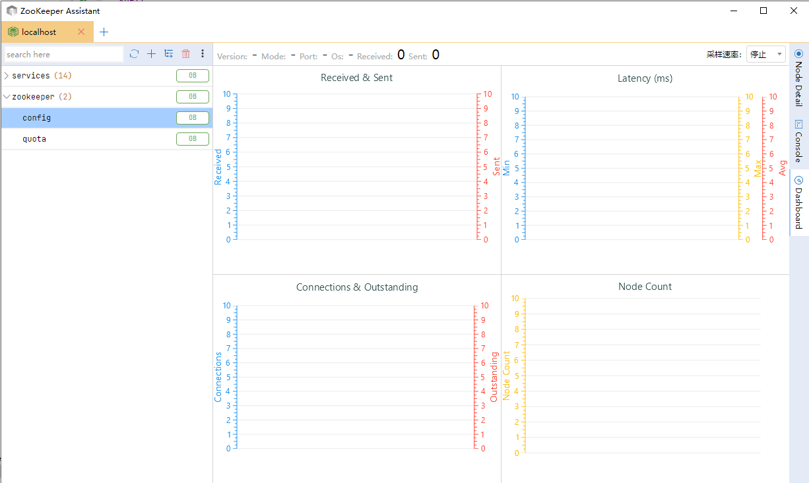

### Zookeeper

```shell
docker-compose -f docker-compose-zookeeper.yml -p zookeeper up -d
```

可视化界面访问地址：[`http://ip地址:9090`](http://www.zhengqingya.com:9090)

### 可视化工具

#### PrettyZoo

> 免费

https://github.com/vran-dev/PrettyZoo




#### ZooKeeper Assistant

> 收费

http://www.redisant.cn/za



