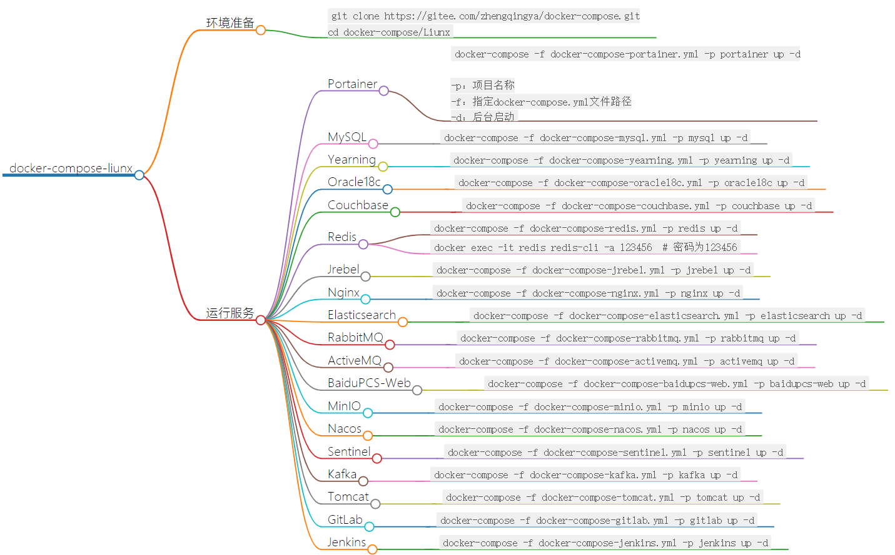
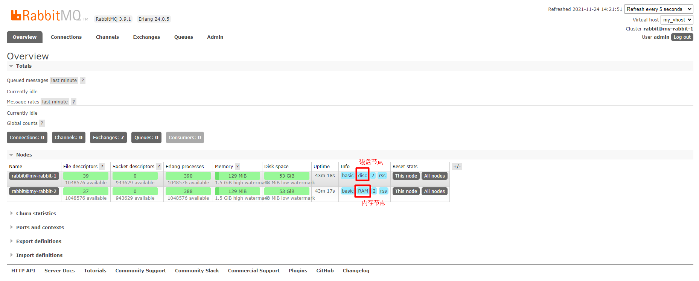
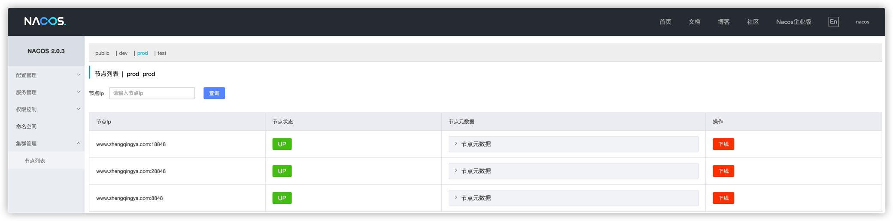
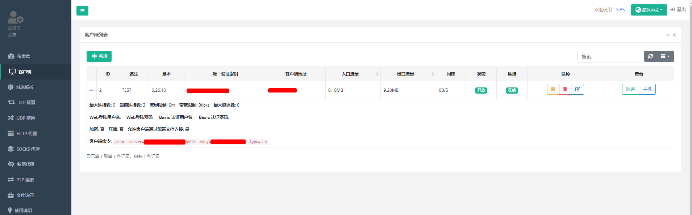

# docker-compose-liunx

通过docker-compose编排一系列环境进行一键快速部署运行，小白运维神器。




---


## 环境准备

```shell
# 安装git命令： yum install -y git
git clone https://gitee.com/zhengqingya/docker-compose.git
cd docker-compose/Liunx
```

====================================================================================\
========================= ↓↓↓↓↓↓ 环境部署 start ↓↓↓↓↓↓ ====================================\
====================================================================================\

## 运行服务

### Portainer

> docker可视化管理界面工具

```shell
docker-compose -f docker-compose-portainer.yml -p portainer up -d

# -p：项目名称
# -f：指定docker-compose.yml文件路径
# -d：后台启动
```

访问地址：[`ip地址:9000`](www.zhengqingya.com:9000)

### MySQL

```shell
# 5.7
docker-compose -f docker-compose-mysql5.7.yml -p mysql5.7 up -d
# 8.0
docker-compose -f docker-compose-mysql8.0.yml -p mysql8.0 up -d
```

### MySQL - 主从同步

```shell
docker-compose -f docker-compose-mysql-master-slave.yml -p mysql-master-slave up -d
```

```shell
# ================== ↓↓↓↓↓↓ 配置主库 ↓↓↓↓↓↓ ==================
# 进入主库
docker exec -it mysql_master /bin/bash
# 登录mysql
mysql -uroot -proot
#  创建用户slave，密码123456
CREATE USER 'slave'@'%' IDENTIFIED BY '123456';
# 授予slave用户 `REPLICATION SLAVE`权限和`REPLICATION CLIENT`权限，用于在`主` `从` 数据库之间同步数据
GRANT REPLICATION SLAVE, REPLICATION CLIENT ON *.* TO 'slave'@'%';
# 授予所有权限则执行命令: GRANT ALL PRIVILEGES ON *.* TO 'slave'@'%';
# 使操作生效
FLUSH PRIVILEGES;
# 查看状态
show master status;
# 注：File和Position字段的值slave中将会用到，在slave操作完成之前不要操作master，否则将会引起状态变化，即File和Position字段的值变化 !!!
# +------------------+----------+--------------+------------------+-------------------+
# | File             | Position | Binlog_Do_DB | Binlog_Ignore_DB | Executed_Gtid_Set |
# +------------------+----------+--------------+------------------+-------------------+
# | mysql-bin.000003 |      769 |              |                  |                   |
# +------------------+----------+--------------+------------------+-------------------+
# 1 row in set (0.00 sec)


# ================== ↓↓↓↓↓↓ 配置从库 ↓↓↓↓↓↓ ==================
# 进入从库
docker exec -it mysql_slave /bin/bash
# 登录mysql
mysql -uroot -proot
change master to master_host='www.zhengqingya.com',master_port=3306, master_user='slave', master_password='123456', master_log_file='mysql-bin.000003', master_log_pos= 769, master_connect_retry=30;
# 开启主从同步过程  【停止命令：stop slave;】
start slave;
# 查看主从同步状态
show slave status \G
# Slave_IO_Running 和 Slave_SQL_Running 都是Yes的话，就说明主从同步已经配置好了！
# 如果Slave_IO_Running为Connecting，SlaveSQLRunning为Yes，则说明配置有问题，这时候就要检查配置中哪一步出现问题了哦，可根据Last_IO_Error字段信息排错或谷歌…
# *************************** 1. row ***************************
#                Slave_IO_State: Waiting for master to send event
#                   Master_Host: www.zhengqingya.com
#                   Master_User: slave
#                   Master_Port: 3306
#                 Connect_Retry: 30
#               Master_Log_File: mysql-bin.000003
#           Read_Master_Log_Pos: 769
#                Relay_Log_File: c598d8402b43-relay-bin.000002
#                 Relay_Log_Pos: 320
#         Relay_Master_Log_File: mysql-bin.000003
#              Slave_IO_Running: Yes
#             Slave_SQL_Running: Yes
#               Replicate_Do_DB:
```

###### 解决主从同步数据不一致问题

```shell
# 注意：操作的时候停止主库数据写入

# 在从库查看主从同步状态
docker exec -it mysql_slave /bin/bash
mysql -uroot -proot
show slave status \G
#              Slave_IO_Running: Yes
#             Slave_SQL_Running: No

# 1、手动同步主从库数据
# 先在从库停止主从同步
stop slave;
# 导出主库数据
mysqldump -h www.zhengqingya.com -P 3306 -uroot -proot --all-databases > /tmp/all.sql
# 导入到从库
mysql -uroot -proot
source /tmp/all.sql;

# 2、开启主从同步
# 查看主库状态 => 拿到File和Position字段的值
docker exec -it mysql_master /bin/bash
mysql -uroot -proot
show master status;
# 从库操作
change master to master_host='www.zhengqingya.com',master_port=3306, master_user='slave', master_password='123456', master_log_file='mysql-bin.000004', master_log_pos= 488117, master_connect_retry=30;
start slave;
# 查看主从同步状态
show slave status \G
#              Slave_IO_Running: Yes
#             Slave_SQL_Running: Yes
```

### Mycat

> Java语言编写的MySQL数据库网络协议的开源中间件
> 部署可参考 https://zhengqing.blog.csdn.net/article/details/104700437

```shell
docker-compose -f docker-compose-mycat.yml -p mycat up -d
```

Navicat可视化工具连接参数

> mysql -hwww.zhengqingya.com -P8066 -uroot -proot

| 名称           | 值                  |
| -------------- | ------------------- |
| 连接名         | mycat_8066          |
| 主机名或IP地址 | www.zhengqingya.com |
| 端口           | 8066                |
| 用户名         | root                |
| 密码           | root                |


### Mycat-web

> Mycat可视化运维的管理和监控平台

```shell
docker-compose -f docker-compose-mycat-web.yml -p mycat-web up -d
```

访问地址：[`ip地址:8082/mycat`](www.zhengqingya.com:8082/mycat)

### Yearning

```shell
docker-compose -f docker-compose-yearning.yml -p yearning up -d
```

访问地址：[`ip地址:8000`](www.zhengqingya.com:8000)
默认登录账号密码：`admin/Yearning_admin`

### Oracle18c

```shell
docker-compose -f docker-compose-oracle18c.yml -p oracle18c up -d
```

> 配置参考：[Docker(9) 安装Oracle18c](https://zhengqing.blog.csdn.net/article/details/103296040)

### Couchbase

```shell
docker-compose -f docker-compose-couchbase.yml -p couchbase up -d
```

管理平台地址：[`ip地址:8091`](www.zhengqingya.com:8091)
默认登录账号密码：`Administrator/password`

### Redis

```shell
# 当前目录下所有文件赋予权限(读、写、执行)
chmod -R 777 ./redis
chmod -R 777 ./redis-master-slave
chmod -R 777 ./redis-master-slave-sentinel
chmod -R 777 ./redis-cluster
# 运行 -- 单机模式
docker-compose -f docker-compose-redis.yml -p redis up -d
# 运行 -- 主从复制模式（主写从读）
docker-compose -f docker-compose-redis-master-slave.yml -p redis up -d
# 运行 -- 哨兵模式（sentinel监视redis主从服务，当某个master服务下线时，自动将该master下的某个从服务升级为master服务替代已下线的master服务继续处理请求 -- 即主节点切换）
docker-compose -f docker-compose-redis-master-slave-sentinel.yml -p redis up -d
# 运行 -- Redis Cluster 集群
docker-compose -f docker-compose-redis-cluster.yml -p redis up -d
```

###### 连接redis

```shell
docker exec -it redis redis-cli -a 123456  # 密码为123456
```

###### 哨兵模式查看

```shell
# 连接
docker exec -it redis-sentinel-1 redis-cli -p 26379 -a 123456
# 查看redis主信息
sentinel master mymaster
# 查看redis从信息
sentinel slaves mymaster
```

###### Redis Cluster 集群

redis.conf中主要新增了如下配置

```
cluster-enabled yes
cluster-config-file nodes-6379.conf
cluster-node-timeout 15000
```

创建集群

```shell
docker exec -it redis-6381 redis-cli -h 172.22.0.11 -p 6381 -a 123456 --cluster create 172.22.0.11:6381 redis-6382:6382 redis-6383:6383 redis-6384:6384 redis-6385:6385 redis-6386:6386 --cluster-replicas 1
```

查看集群

```shell
# 连接集群某个节点
docker exec -it redis-6381 redis-cli -c -h redis-6381 -p 6381 -a 123456
# 查看集群信息
cluster info
# 查看集群节点信息
cluster nodes
# 查看slots分片
cluster slots
```

### Redis Manager

> Redis 一站式管理平台，支持集群（cluster、master-replica、sentinel）的监控、安装（除sentinel）、管理、告警以及基本的数据操作功能

```shell
docker-compose -f docker-compose-redis-manager.yml -p redis-manager up -d
```

web管理端：[`ip地址:8182`](www.zhengqingya.com:8182)
登录账号密码：`admin/admin`

### Jrebel

```shell
docker-compose -f docker-compose-jrebel.yml -p jrebel up -d
```

默认反代`idea.lanyus.com`, 运行起来后

1. 激活地址： `ip地址:8888/UUID` -> 注：UUID可以自己生成，并且必须是UUID才能通过验证 -> [UUID在线生成](http://www.uuid.online/)
2. 邮箱随意填写

### Nginx

```shell
# 运行
docker-compose -f docker-compose-nginx.yml -p nginx up -d

# 进入容器
docker exec -it nginx /bin/bash

# nginx修改配置后重载
nginx -s reload
```

访问地址：[`ip地址:80`](www.zhengqingya.com:80)

### Elasticsearch

```shell
# 当前目录下所有文件赋予权限(读、写、执行)
chmod -R 777 ./elasticsearch
# 运行
docker-compose -f docker-compose-elasticsearch.yml -p elasticsearch up -d
# 运行后，再次给新创建的文件赋予权限
chmod -R 777 ./elasticsearch
```

1. ES访问地址：[`ip地址:9200`](www.zhengqingya.com:9200)
   默认账号密码：`elastic/123456`
2. kibana访问地址：[`ip地址:5601/app/dev_tools#/console`](www.zhengqingya.com:5601/app/dev_tools#/console)
   默认账号密码：`elastic/123456`

#### 设置ES密码

```shell
# 进入容器
docker exec -it elasticsearch /bin/bash
# 设置密码-随机生成密码
# elasticsearch-setup-passwords auto
# 设置密码-手动设置密码
elasticsearch-setup-passwords interactive
# 访问
curl 127.0.0.1:9200 -u elastic:123456
```


#### 修改ES密码

```shell
# 修改elastic密码为123456 (注：执行命令时会让认证之前账号密码)
curl -H "Content-Type:application/json" -XPOST -u elastic 'http://127.0.0.1:9200/_xpack/security/user/elastic/_password' -d '{ "password" : "123456" }'
```

### ELK

```shell
# 当前目录下所有文件赋予权限(读、写、执行)
chmod -R 777 ./elk
# 运行
docker-compose -f docker-compose-elk.yml -p elk up -d
# 若运行之后启动日志再次报相关权限问题，再次给新产生的文件赋予权限
chmod -R 777 ./elk
```

1. ES访问地址：[`ip地址:9200`](www.zhengqingya.com:9200)
   默认账号密码：`elastic/123456`
2. kibana访问地址：[`ip地址:5601`](www.zhengqingya.com:5601)
   默认账号密码：`elastic/123456`
   
#### 设置ES密码

```shell
# 进入容器
docker exec -it elasticsearch /bin/bash
# 设置密码-随机生成密码
# elasticsearch-setup-passwords auto
# 设置密码-手动设置密码
elasticsearch-setup-passwords interactive
```


### Filebeat

> 轻量型日志采集器，可以将指定日志转发到Logstash、Elasticsearch、Kafka、Redis等中。

```shell
docker-compose -f docker-compose-filebeat.yml -p filebeat up -d
```

### RabbitMQ

```shell
# 当前目录下所有文件赋予权限(读、写、执行)
chmod -R 777 ./rabbitmq
# 运行 [ 注：如果之前有安装过，需要清除浏览器缓存和删除rabbitmq相关的存储数据(如:这里映射到宿主机的data数据目录)，再重装，否则会出现一定问题！ ]
docker-compose -f docker-compose-rabbitmq.yml -p rabbitmq up -d

# 运行3.7.8-management版本
# docker-compose -f docker-compose-rabbitmq-3.7.8-management.yml -p rabbitmq up -d

# 进入容器
docker exec -it rabbitmq /bin/bash
# 启用延时插件
rabbitmq-plugins enable rabbitmq_delayed_message_exchange
# 查看已安装插件
rabbitmq-plugins list
```

web管理端：[`ip地址:15672`](www.zhengqingya.com:15672)
登录账号密码：`admin/admin`

### RabbitMQ - 集群

```shell
# 当前目录下所有文件赋予权限(读、写、执行)
chmod -R 777 ./rabbitmq-cluster
# 设置Erlang Cookie文件权限(cookie文件必须只允许拥有者有权操作)
chmod 600 ./rabbitmq-cluster/.erlang.cookie
# 运行 [ 注：如果之前有安装过，需要清除浏览器缓存和删除rabbitmq相关的存储数据(如:这里映射到宿主机的data数据目录)，再重装，否则会出现一定问题！ ]
docker-compose -f docker-compose-rabbitmq-cluster.yml -p rabbitmq-cluster up -d

# 启用延迟插件(注：如果节点类型为内存节点，则无法启用延迟插件)
docker exec rabbitmq-1 /bin/bash -c 'rabbitmq-plugins enable rabbitmq_delayed_message_exchange'
docker exec rabbitmq-2 /bin/bash -c 'rabbitmq-plugins enable rabbitmq_delayed_message_exchange'

# 执行脚本 => 配置集群
sh ./rabbitmq-cluster/init-rabbitmq.sh

# 配置镜像队列(允许内建双活冗余选项，与普通队列不同，镜像节点在集群中的其他节点拥有从队列拷贝，一旦主节点不可用，最老的从队列将被选举为新的主队列)
docker exec -it rabbitmq-1 /bin/bash
rabbitmqctl set_policy -p my_vhost ha-all "^" '{"ha-mode":"all"}' --apply-to all
# 查看镜像队列`ha-all`
rabbitmqctl list_policies -p my_vhost
# 删除镜像队列`ha-all`
rabbitmqctl clear_policy -p my_vhost ha-all
```

web管理端：[`ip地址:15672`](www.zhengqingya.com:15672)
登录账号密码：`admin/admin`



### ActiveMQ

```shell
docker-compose -f docker-compose-activemq.yml -p activemq up -d
```

访问地址：[`ip地址:8161`](www.zhengqingya.com:8161)
登录账号密码：`admin/admin`

### BaiduPCS-Web

```shell
docker-compose -f docker-compose-baidupcs-web.yml -p baidupcs-web up -d
```

访问地址：[`ip地址:5299`](www.zhengqingya.com:5299)

### MinIO

```shell
docker-compose -f docker-compose-minio.yml -p minio up -d
```

访问地址：[`ip地址:9000/minio`](www.zhengqingya.com:9000/minio)
登录账号密码：`root/password`

### Nacos

```shell
# 普通单机模式版本  注：需要修改docker-compose-nacos.yml 中相关数据库连接信息和JVM参数相关信息
docker-compose -f docker-compose-nacos.yml -p nacos up -d

# mysql数据库版 【 需自己建库`nacos_config`, 并执行`/Liunx/nacos_xxx/nacos-mysql.sql`脚本 】
# nacos1.4.1版本
docker-compose -f docker-compose-nacos-1.4.1.yml -p nacos_v1.4.1 up -d
# nacos2.0.3版本
docker-compose -f docker-compose-nacos-2.0.3.yml -p nacos_v2.0.3 up -d
# nacos集群2.0.3版本
# java客户端连接 "-Dspring.cloud.nacos.discovery.server-addr=www.zhengqingya.com:8880 -Dspring.cloud.nacos.discovery.username=nacos -Dspring.cloud.nacos.discovery.password=nacos"
docker-compose -f docker-compose-nacos-cluster-2.0.3.yml -p nacos_cluster_v2.0.3 up -d
```

访问地址：[`ip地址:8848/nacos`](www.zhengqingya.com:8848/nacos)
登录账号密码默认：`nacos/nacos`

> 注：`docker-compose-nacos-xxx.yml`已开启连接密码安全认证，在java连接时需新增配置如下

```yml
spring:
  cloud:
    nacos:
      discovery:
        username: nacos
        password: nacos
      config:
        username: ${spring.cloud.nacos.discovery.username}
        password: ${spring.cloud.nacos.discovery.password}
```

集群


nginx配置修改生效

```shell
# 进入容器
docker exec -it nacos_nginx /bin/bash
# nginx修改配置后重载
nginx -s reload
```

### Sentinel

```shell
# 普通版
docker-compose -f docker-compose-sentinel.yml -p sentinel up -d

# 监控数据持久化到mysql版
# docker-compose -f docker-compose-sentinel-mysql.yml -p sentinel up -d

# 规则持久化到nacos
# docker-compose -f docker-compose-sentinel-nacos.yml -p sentinel up -d
```

访问地址：[`ip地址:8858`](www.zhengqingya.com:8858)
登录账号密码：`sentinel/sentinel`

#### SpringCloud中规则持久化到nacos

```xml
<!-- Sentinel规则持久化至Nacos -->
<dependency>
   <groupId>com.alibaba.csp</groupId>
   <artifactId>sentinel-datasource-nacos</artifactId>
</dependency>
```

```yml
spring:
  application:
    name: demo # 应用名称
  cloud:
    sentinel:
      enabled: true # 自动化配置是否生效
      eager: true   # 禁用控制台懒加载
      web-context-unify: false # 关闭调用链路收敛 => 实现链路流控
      transport:
        dashboard: www.zhengqingya.com:8858 # 控制台地址
        client-ip: ${spring.cloud.client.ip-address} # 获取本机IP地址
        port: 18719 # 启动该服务，会在应用程序的相应服务器上启动HTTP Server，并且该服务器将与Sentinel dashboard进行交互
      # ============== ↓↓↓↓↓↓ 增加规则持久化配置到nacos ↓↓↓↓↓↓ ==============
      datasource:
        # 流控规则
        flow:
          nacos:
            server-addr: ${spring.cloud.nacos.config.server-addr}
            username: ${spring.cloud.nacos.config.username}
            password: ${spring.cloud.nacos.config.password}
            namespace: ${spring.cloud.nacos.config.namespace}
            group-id: sentinel-group
            data-id: ${spring.application.name}-sentinel-flow-rules
            # 规则类型：flow、degrade、param-flow、system、authority
            rule-type: flow
        # 熔断降级
        degrade:
          nacos:
            server-addr: ${spring.cloud.nacos.config.server-addr}
            username: ${spring.cloud.nacos.config.username}
            password: ${spring.cloud.nacos.config.password}
            namespace: ${spring.cloud.nacos.config.namespace}
            group-id: sentinel-group
            data-id: ${spring.application.name}-sentinel-degrade-rules
            rule-type: degrade
        # 热点规则
        param-flow:
          nacos:
            server-addr: ${spring.cloud.nacos.config.server-addr}
            username: ${spring.cloud.nacos.config.username}
            password: ${spring.cloud.nacos.config.password}
            namespace: ${spring.cloud.nacos.config.namespace}
            group-id: sentinel-group
            data-id: ${spring.application.name}-sentinel-param-flow-rules
            rule-type: param-flow
        # 系统规则
        system:
          nacos:
            server-addr: ${spring.cloud.nacos.config.server-addr}
            username: ${spring.cloud.nacos.config.username}
            password: ${spring.cloud.nacos.config.password}
            namespace: ${spring.cloud.nacos.config.namespace}
            group-id: sentinel-group
            data-id: ${spring.application.name}-sentinel-system-rules
            rule-type: system
        # 授权规则
        authority:
          nacos:
            server-addr: ${spring.cloud.nacos.config.server-addr}
            username: ${spring.cloud.nacos.config.username}
            password: ${spring.cloud.nacos.config.password}
            namespace: ${spring.cloud.nacos.config.namespace}
            group-id: sentinel-group
            data-id: ${spring.application.name}-sentinel-authority-rules
            rule-type: authority
```

### Kafka

```shell
docker-compose -f docker-compose-kafka.yml -p kafka up -d
```

集群管理地址：[`ip地址:9000`](www.zhengqingya.com:9000)

### Tomcat

```shell
docker-compose -f docker-compose-tomcat.yml -p tomcat up -d
```

访问地址：[`ip地址:8081`](www.zhengqingya.com:8081)

### GitLab

```shell
docker-compose -f docker-compose-gitlab.yml -p gitlab up -d
```

访问地址：[`ip地址:10080`](www.zhengqingya.com:10080)
默认root账号，密码访问页面时需自己设置

### Jenkins

```shell
# 当前目录下所有文件赋予权限(读、写、执行)
chmod -R 777 ./jenkins
# 运行
docker-compose -f docker-compose-jenkins.yml -p jenkins up -d
```

访问地址：[`ip地址:8080`](www.zhengqingya.com:8080)

###### 查看密码

```shell
# 普通权限进入到docker容器
docker exec -it jenkins /bin/bash
# 使用root权限进入到docker容器
docker exec -it -u root jenkins /bin/bash
# 查看密码
cat /var/jenkins_home/secrets/initialAdminPassword
```

###### jenkins升级问题

```shell
# docker下jenkins升级只要需要替换容器中的jenkins.war文件并重启docker容器
# 1.进入docker容器，其中-u root是使用root权限登录
docker exec -u root -it jenkins /bin/bash 
# 2.使用wget命令下载最新版本的jenkins.war文件
# 3.使用whereis jenkins命令查看jenkins的安装路径       `/usr/share/jenkins/jenkins.war`
# 4.使用cp命令将新的war包覆盖旧文件即可
# 5.浏览器访问ip:8080/restart 重启即可升级成功
# 备注：在进行容器部署时可以将容器的【/user/share/jenkins】目录挂载在宿主机上，以后升级只需替换jenkins.war文件即可。此种方式存在一个问题，在部署后由于宿主机的挂载文件夹为空，所以在部署后无法正常启动容器，放入jenkins.war与ref文件即可正常启动。
```

###### jenkins时区设置问题
```shell script
# 1.进入系统管理->脚本命令行，执行下面命令设置为上海时间(该方式重启后失效)
System.setProperty('org.apache.commons.jelly.tags.fmt.timeZone', 'Asia/Shanghai') 
# 2.在部署容器时添加参数，-e JAVA_OPTS=-Duser.timezone=Asia/Shanghai（一直有效）
```

### Nextcloud - 多端同步网盘

```shell
docker-compose -f docker-compose-nextcloud.yml -p nextcloud up -d
```

访问地址：[`ip地址:81`](www.zhengqingya.com:81) , 创建管理员账号

### Walle - 支持多用户多语言部署平台

```shell
docker-compose -f docker-compose-walle.yml -p walle up -d && docker-compose -f docker-compose-walle.yml logs -f
```

访问地址：[`ip地址:80`](www.zhengqingya.com:80)
初始登录账号如下：

```
超管：super@walle-web.io \ Walle123
所有者：owner@walle-web.io \ Walle123
负责人：master@walle-web.io \ Walle123
开发者：developer@walle-web.io \ Walle123
访客：reporter@walle-web.io \ Walle123
```

### Grafana - 开源数据可视化工具(数据监控、数据统计、警报)

```shell
docker-compose -f docker-compose-grafana.yml -p grafana up -d
```

访问地址：[`http://ip地址:3000`](www.zhengqingya.com:3000)
默认登录账号密码：`admin/admin`

### Grafana Loki - 一个水平可扩展，高可用性，多租户的日志聚合系统

```shell
# 先授权，否则会报错：`cannot create directory '/var/lib/grafana/plugins': Permission denied`
chmod 777 $PWD/grafana_promtail_loki/grafana/data
chmod 777 $PWD/grafana_promtail_loki/grafana/log

# 运行
docker-compose -f docker-compose-grafana-promtail-loki.yml -p grafana_promtail_loki up -d
```

访问地址：[`http://ip地址:3000`](www.zhengqingya.com:3000)
默认登录账号密码：`admin/admin`

### Graylog - 日志管理工具

```shell
docker-compose -f docker-compose-graylog.yml -p graylog_demo up -d
```

访问地址：[`http://ip地址:9001`](www.zhengqingya.com:9001)
默认登录账号密码：`admin/admin`

### FastDFS - 分布式文件系统

```shell
docker-compose -f docker-compose-fastdfs.yml -p fastdfs up -d
```

###### 测试

```shell
# 等待出现如下日志信息：
# [2020-07-24 09:11:43] INFO - file: tracker_client_thread.c, line: 310, successfully connect to tracker server 39.106.45.72:22122, as a tracker client, my ip is 172.16.9.76

# 进入storage容器
docker exec -it fastdfs_storage /bin/bash
# 进入`/var/fdfs`目录
cd /var/fdfs
# 执行如下命令,会返回在storage存储文件的路径信息,然后拼接上ip地址即可测试访问
/usr/bin/fdfs_upload_file /etc/fdfs/client.conf test.jpg
# ex:
http://www.zhengqingya.com:8888/group1/M00/00/00/rBEAAl8aYsuABe4wAAhfG6Hv0Jw357.jpg
```

### YApi - 高效、易用、功能强大的api管理平台

```shell
docker-compose -f docker-compose-yapi.yml -p yapi up -d
```

如下运行成功：

```shell
 log: mongodb load success...
 初始化管理员账号成功,账号名："admin@admin.com"，密码："ymfe.org"
部署成功，请切换到部署目录，输入： "node vendors/server/app.js" 指令启动服务器, 然后在浏览器打开 http://127.0.0.1:3000 访问
log: -------------------------------------swaggerSyncUtils constructor-----------------------------------------------
log: 服务已启动，请打开下面链接访问: 
http://127.0.0.1:3000/
log: mongodb load success...
```

访问地址：[`http://ip地址:3000`](www.zhengqingya.com:3000)
默认登录账号密码：`admin@admin.com/ymfe.org`

### RocketMQ

> 注：修改 `xx/rocketmq/rocketmq_broker/conf/broker.conf`中配置`brokerIP1`为`宿主机IP`

```shell
docker-compose -f docker-compose-rocketmq.yml -p rocketmq up -d
```

访问地址：[`http://ip地址:9002`](www.zhengqingya.com:9002)

### XXL-JOB - 分布式任务调度平台

```shell
docker-compose -f docker-compose-xxl-job.yml -p xxl-job up -d
```

访问地址：[`http://ip地址:9003/xxl-job-admin`](www.zhengqingya.com:9003/xxl-job-admin)
默认登录账号密码：`admin/123456`

### MongoDB - 基于文档的通用分布式数据库

```shell
docker-compose -f docker-compose-mongodb.yml -p mongodb up -d
```

访问地址：[`http://ip地址:1234`](www.zhengqingya.com:1234)
Connection string：`mongodb://admin:123456@ip地址:27017`

### Zookeeper

```shell
docker-compose -f docker-compose-zookeeper.yml -p zookeeper up -d
```

可视化界面访问地址：[`http://ip地址:9090`](www.zhengqingya.com:9090)

> 桌面可视化工具PrettyZoo: [https://github.com/vran-dev/PrettyZoo](https://github.com/vran-dev/PrettyZoo)

### Flowable - 业务流程引擎

```shell
docker-compose -f docker-compose-flowable.yml -p flowable up -d
```

可视化界面访问地址：[`http://ip地址:9004/flowable-ui`](www.zhengqingya.com:9004/flowable-ui)
默认登录账号密码：`admin/test`

### Prometheus - 开源的系统监控和报警系统

> `docker-compose-prometheus.yml` 需修改grafana中配置的mysql连接信息
> `prometheus.yml` 自行配置

```shell
# 运行
docker-compose -f docker-compose-prometheus.yml -p prometheus up -d
# 查看grafana日志
docker logs -fn10 prometheus-grafana
```

1. grafana访问地址：[`http://ip地址:3000`](www.zhengqingya.com:3000)
   默认登录账号密码：`admin/admin`
2. prometheus访问地址: [`http://ip地址:9090`](www.zhengqingya.com:9090)
3. exporter访问地址: [`http://ip地址:9100/metrics`](www.zhengqingya.com:9100/metrics)


#### 其它

grafana面板资源 https://grafana.com/grafana/dashboards

node-exporter =》 https://grafana.com/grafana/dashboards/8919

### Zipkin - 分布式追踪系统

> 它有助于收集对服务架构中的延迟问题进行故障排除所需的计时数据。功能包括收集和查找这些数据。
> 注：记得创建相应zipkin库和表

```shell
docker-compose -f docker-compose-zipkin.yml -p zipkin up -d
```

启动成功日志如下：

```
                  oo
                 oooo
                oooooo
               oooooooo
              oooooooooo
             oooooooooooo
           ooooooo  ooooooo
          oooooo     ooooooo
         oooooo       ooooooo
        oooooo   o  o   oooooo
       oooooo   oo  oo   oooooo
     ooooooo  oooo  oooo  ooooooo
    oooooo   ooooo  ooooo  ooooooo
   oooooo   oooooo  oooooo  ooooooo
  oooooooo      oo  oo      oooooooo
  ooooooooooooo oo  oo ooooooooooooo
      oooooooooooo  oooooooooooo
          oooooooo  oooooooo
              oooo  oooo
     ________ ____  _  _____ _   _
    |__  /_ _|  _ \| |/ /_ _| \ | |
      / / | || |_) | ' / | ||  \| |
     / /_ | ||  __/| . \ | || |\  |
    |____|___|_|   |_|\_\___|_| \_|
:: version 2.23.2 :: commit 7bf3aab ::
2021-08-30 16:33:27.414  INFO [/] 1 --- [oss-http-*:9411] c.l.a.s.Server                           : Serving HTTP at /[0:0:0:0:0:0:0:0%0]:9411 - http://127.0.0.1:9411/
```

可视化界面访问地址：[`http://ip地址:9411/zipkin`](www.zhengqingya.com:9411/zipkin)


### Rancher - 开源容器管理平台

```shell
# 运行
docker-compose -f docker-compose-rancher.yml -p rancher up -d
# 查看密码
docker logs rancher 2>&1 | grep "Bootstrap Password:"
# 2022/04/04 11:39:52 [INFO] Bootstrap Password: 4jtd9fw2dt9t9qs5ffrs4srvf5xl95z6jbgm2qqpb97276qg8jgkgl
# Server URL
https://www.zhengqingya.com
```

访问地址：[`http://ip地址:80`](www.zhengqingya.com:80)

### Seata - 分布式事务

> 1. config.txt => https://github.com/seata/seata/blob/develop/script/config-center/config.txt
> 2. nacos-config.sh => https://github.com/seata/seata/blob/develop/script/config-center/nacos/nacos-config.sh
> 3. seata.sql => https://github.com/seata/seata/blob/develop/script/server/db/mysql.sql

```shell
# 运行
docker-compose -f docker-compose-seata.yml -p seata up -d
# 查看日志
docker exec -it seata_server sh
```

### SonarQube

一款静态代码质量分析工具，支持Java、Python、PHP、JavaScript、CSS等25种以上的语言，而且能够集成在IDE、Jenkins、Git等服务中，方便随时查看代码质量分析报告。

```shell
docker-compose -f docker-compose-sonarqube.yml -p sonarqube up -d
# mysql配置版
# docker-compose -f docker-compose-sonarqube6.7.1.yml -p sonarqube up -d
```

访问地址：[`http://ip地址:9005`](www.zhengqingya.com:9005)
默认登录账号密码：`admin/admin`


### canal

阿里巴巴 MySQL binlog 增量订阅&消费组件

```shell
# 导入初始化SQL
Liunx/canal/canal_admin/canal_manager.sql

# 运行  (tips:先修改配置文件信息)
docker-compose -f docker-compose-canal.yml -p canal up -d
```

访问地址：[`http://ip地址:8089`](www.zhengqingya.com:8089)
默认登录账号密码：`admin/123456`


### NPS

一款轻量级、高性能、功能强大的内网穿透代理服务器。支持tcp、udp、socks5、http等几乎所有流量转发，可用来访问内网网站、本地支付接口调试、ssh访问、远程桌面，内网dns解析、内网socks5代理等等……，并带有功能强大的web管理端。

```shell
# 运行服务端
docker-compose -f docker-compose-nps.yml -p nps up -d
```

访问地址：[`http://ip地址:8080`](www.zhengqingya.com:8080)
默认登录账号密码：`admin/123`

#### 服务端配置

新增客户端



新增TCP隧道


#### 客户端

```shell
docker run -d --name npc --net=host ffdfgdfg/npc:v0.26.10 -server=服务端ip地址:8024 -vkey=唯一验证密钥 -type=tcp
```

### OpenSumi

一款帮助你快速搭建本地和云端 IDE 的框架。

```shell
docker-compose -f docker-compose-opensumi-web.yml -p opensumi-web up -d
```

访问地址：[`http://ip地址:20000`](www.zhengqingya.com:20000)


==============================================================================\
======================== ↑↑↑↑↑↑ 环境部署 end ↑↑↑↑↑↑ ================================\
==============================================================================\
