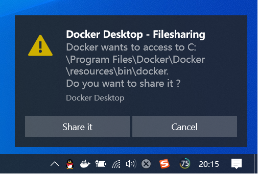

### 安装Docker可视化界面工具`Portainer`

> 挂载宿主机目录的时候可能会出现如下问题，点击`Share it`即可
> 

```shell
docker-compose -f docker-compose-portainer.yml -p portainer up -d
```

然后访问 [http://127.0.0.1:9000/](http://127.0.0.1:9000/) 创建用户账号密码


打开docker设置


然后回到浏览器填写如下信息即可~
> local_zq ->  docker.for.win.localhost:2375


如果连接出现问题，可尝试设置2375端口转发

```
# 将127.0.0.1的2375端口转发到192.16.0.88的2375上
netsh interface portproxy add v4tov4 listenport=2375 connectaddress=127.0.0.1 connectport=2375 listenaddress=ip protocol=tcp
# ex: netsh interface portproxy add v4tov4 listenport=2375 connectaddress=127.0.0.1 connectport=2375 listenaddress=192.16.0.88 protocol=tcp

# 再次连接
# Name: local_zq
# Endpoint URL: 192.16.0.88:2375
```
